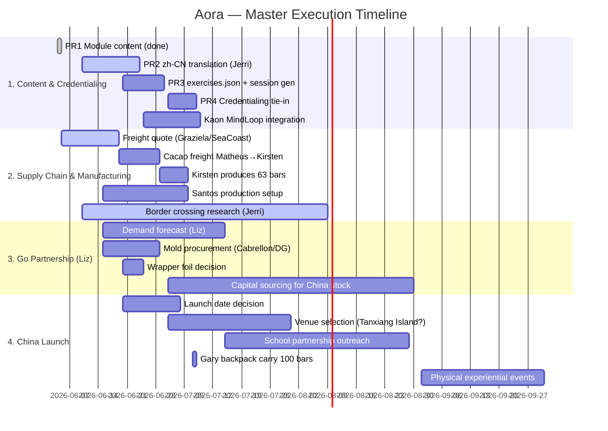

# Aora Experience — master execution roadmap

**Owner:** Gary Teh · **Started:** 2026-06-04 · **Last updated:** 2026-06-10 · **Status:** ACTIVE

Aora is the front-of-house name (China launch with Mr. Cao's GO/Nucleus network, led by **Elizabeth Wong**); the
engine is Agroverse Lineage ([truesight.me/lineage.html](https://truesight.me/lineage.html) — experiential-learning
credentialing). Online piece will eventually sit at **experience.agroverse.shop**,
following the [capoeira.agroverse.shop](https://capoeira.agroverse.shop) pattern (setting-aware session generator).

**Context:** Mr. Cao (Liz's friend) is the founder of the GO/Nucleus network. Gary offered to
generate two learning modules — **1. Agroforestry** and **2. Supply Chain** — for the Aora
pilot program, based on his firsthand experience in Brazil among the farmers. The program is
for mentors + children co-creating; "TED for children", content a 6-year-old can grasp;
senses: see/smell/taste/hear/create.
Jerri (China team, reports to Liz) needs initial ideas + a rough timeline to line up events.

**Kaon** (partner brought in by Liz) is building the **MindLoop engine** — a platform for
publishing experiential learning modules. Aora modules will be published on MindLoop;
completion triggers a record on TrueSight DAO's credentialing layer (Lineage).

**Pilot scope:** The Aora/Go collaboration is focused on **chocolate bars only** (50g, 81%
cacao, Cabrellon mold). Initial pilot: 100 bars. Beans, nibs, mass, tea, and other SKUs
are existing DAO inventory for other channels — not part of Aora/Go at this phase.
Future phases may expand the SKU range.

**Available for Go collaboration (stays in Brazil):** The **La do Sitio cacao beans**
(Paulo's farm, Pará) — ~274 kg on AGL8 ledger — can be converted to chocolate bars
for Go/Aora. These are NOT on the current freight to Kirsten.

---

## PERT chart — workstream dependencies



- **Critical path:** Freight quote → cacao arrives at Kirsten → produce 63 bars → Gary backpack carry to China
- **Parallel track:** Liz demand forecast → capital sourcing → mold quantity → production throughput

---

## 🚨 Critical blockers

These are the gates that must clear before the pilot can launch. Surfaced here so everyone referencing this plan sees them immediately.

| # | Blocker | Owner | Status | Unblocks |
|---|---------|-------|--------|----------|
| 🔴 | **Liz's demand forecast** — annual volume from China retailers/distributors | Liz | no visibility yet | Mold quantity, freight cadence, capital planning, pre-stock |
| 🔴 | **Kaon's MindLoop engine** — experiential learning platform for publishing Aora modules | Kaon | in development, not started | Experiential learning track, credentialing tie-in, GO app integration |
| 🔴 | **Capital source for China stocking** — ~$5,626.93 available after freight; beyond that needs new AGL round | Liz / Gary | no investor visibility | Scaling beyond initial 100 bars, pre-stock warehouse |
| 🟡 | **Border crossing / customs clearance** — cacao import into China | Jerri | in progress (1-2 months typical) | Shipping chocolate bars to China |
| 🟡 | **Launch date decision** — July shifted, new target TBD | Liz / Jerri | ~Jul 1 | Venue booking, school outreach, Gary's travel |
| 🟢 | **Freight quote** — airline revalidation from Graziela/SeaCoast | Graziela | blocked (awaiting airline) | Cacao arriving at Kirsten → bar production |

---

## China final package — what the consumer receives

When a Chinese consumer buys an Aora experience, here's what the assembled package looks like:

### Physical components
- **1 × 50g chocolate bar** — 81% cacao, Cabrellon mold, wrapped in **generic foil** (DAO delivers)
- **Final consumer packaging** — provided by Liz's side (Go/Nucleus), branded for Chinese market
- **Retail price:** $10/bar (Gary recommended)
- **DAO return:** $6/bar flows back to TrueSight DAO after bars are sold

### Digital components
- **QR code** on packaging → links to Aora module on MindLoop engine
- **Two learning modules:** Agroforestry (forest→dried bean) + Supply Chain (bag→bar→you)
- **Credentialing:** Module completion triggers a record on TrueSight DAO's Lineage layer
- **AORA ledger:** All transactions (production, shipping, sales, DAO return) tracked via managed ledger

### Experience components
- **Venue:** Tanxiang Island (Dongguan) or similar natural setting — no immersive projection equipment
- **Format:** Two-part physical workshop (mentors + children co-creating)
- **Senses:** see/smell/taste/hear/create — content a 6-year-old can grasp
- **School partnerships:** BBK Xiaotiancai School mentioned; aligns with Pakistan program (4 schools)

### Revenue flow
```
Consumer pays $10 → Liz/Go collects retail → $6/bar flows to TrueSight DAO → funds Agroverse operations
```

---

## Pricing model

Gary recommended:
- **Retail price:** **$10/bar** (final consumer price in China, collected by Liz/Go)
- **DAO return:** **$6/bar** (flows back to TrueSight DAO after bars are sold — includes tree planting component)
- **Revenue flow:** Liz/Go collects full $10 retail → $6 per bar made available to TrueSight DAO (operates Agroverse project)

All transactions leading up to sales and delivery are tracked via the **AORA ledger** — a managed ledger by TrueSight DAO.

---

## Cash position & capital available

### Current USD cash earmarked for inventory deployment (from [treasury-cache](https://github.com/TrueSightDAO/treasury-cache/blob/main/dao_offchain_treasury.json), 2026-06-11)

| Ledger | Amount (USD) |
|--------|-------------|
| [Main Ledger (Gary Teh)](https://docs.google.com/spreadsheets/d/1GE7PUq-UT6x2rBN-Q2ksogbWpgyuh2SaxJyG_uEK6PU) | $3,172.29 |
| [AGL15 (Gary Teh)](https://docs.google.com/spreadsheets/d/1tXgDss-AAdAFgBWVcW4ESRzRTodRmXyp7JxwBb0A-fE/edit?gid=2133986329#gid=2133986329) | $5,279.73 |
| **Total deployable** | **$8,452.02** |

### Current freight cost (Matheus → Kirsten)

From the shipping manifest (4/6/2026):

| Cost Component | Amount (USD) |
|----------------|-------------|
| Air Freight (airport to airport) | $1,261.20 |
| Export Documentation | $95.00 |
| Inland Transport (Brazil) | $697.81 |
| Brazil Airport Charges | $250.00 |
| US Airline Terminal Fee | $212.50 |
| US Import Handling Fee | $125.00 |
| US Customs Clearance | $150.00 |
| MPF (Merchandise Processing Fee) | $33.58 |
| **Total Freight Cost** | **$2,825.09** |

> ⚠️ **War risk note:** This freight cost is tentative. The escalating Iran/USA conflict is driving up global air freight rates. Actual cost may shift upward.

### Available for Aora/Go collaboration

After deducting the current freight from Main Ledger + AGL15 (the ledgers Gary manages directly):
- Main Ledger: $3,172.29
- AGL15: $5,279.73
- **Subtotal:** $8,452.02
- **Less freight:** -$2,825.09
- **Remaining:** **~$5,626.93**

This is what's available to finance Aora/Go collaboration follow-up needs (molds, foil, packaging materials, etc.).

**Beyond this:** Any additional capital requires a new AGL round with investors. No visibility on who that would be.

### Graziela's freight pricing (Omega/5CL, Ilhéus → SF)

Tiered air freight rates per kg (from [freight_lanes.json](https://github.com/TrueSightDAO/agroverse-freight-audit/blob/main/pointers/freight_lanes.json)):

| Weight Tier | Rate (USD/kg) |
|-------------|--------------|
| 200 kg | $3.50 |
| 300 kg | $3.40 |
| 500 kg | $3.30 |
| 750 kg | $3.30 |
| 1,000 kg | $3.20 |

Plus ancillary costs:
- Inland transport (Brazil): $695 + 0.15% of cargo value
- Airport charges (Brazil): $0.30/kg, min $250
- US airline terminal fee: ~$200–212.50
- US import handling: $125
- US customs clearance: $150
- Door delivery: $295

---

## Decisions locked

### 2026-06-04 (original)

1. **Documents-first** — md + PDF for the two modules now; site/session-generator is a fast follow. Don't block Jerri on software.
2. **Repo = `TrueSightDAO/aora`** (local `~/Applications/aora`). "Aora" is the brand.
3. **Module boundary is engine-agnostic** — exercises are atomic tagged units any engine (Kaon's GO app or our own LLM-built one) can recompose; Agroforestry = forest→dried bean, Supply Chain = bag→bar→you, QR provenance as Supply Chain finale (runs on Agroverse QR + ledger stack, no Kaon dependency).
4. **Bilingual** — EN canonical authored by us; Jerri's team owns zh-CN translations in the same repo (`index.zh-CN.md` next to each `index.md`).
5. **PDFs versioned in the `aora` repo** next to source md (generated, committed). PDF is the China-proof artifact (GitHub/Pages unreliable behind GFW; share PDFs via WhatsApp/Feishu).

### 2026-06-10 (this session)

6. **Mold spec:** Cabrellon Italian polycarbonate mold (27.5×17.5cm, 4 cavities × 50g) — same as Kirsten uses in SF. Santos's 40g mold is not used for Aora. Jerri also found a Dongguan factory with MHC-CL082 model in stock (closest match to Cabrellon dimensions) — quotation received.
7. **Packaging boundary:** DAO delivers bars in **generic foil** only. Liz's side (Go/Nucleus) provides the **final consumer packaging** for the Chinese market.
8. **Jerri's team:** Currently repackaging cacao for the Chinese market (border-crossing-ready format).
9. **Capital deployed:** DAO capital has been and continues to be deployed to the USA-bound freight (AGL15 + Main Ledger). Zero visibility on China demand volume until Liz provides a forecast.
10. **Elizabeth Wong (Liz):** Leads the Go/Nucleus partnership. Previously purchased 37 bars (April 2026). Now needs **100 bars total** — 63 outstanding to be produced by Kirsten once the freight arrives.
11. **July launch likely shifted** — parents/students have summer plans booked. Gary's I Ching + QMDJ draw also suggested not rushing July. Aligns with Evan's feedback. Target shifts to a more organic date (likely Sep–Oct 2026 or later).
12. **Venue direction:** Tanxiang Island (Dongguan) recommended by Evan — natural setting, no immersive projection equipment needed. Jerri concerned about summer rain/mosquitoes/chikungunya. Decision pending site visit / seasonality check.
13. **School partnerships:** Aligns with existing Pakistan school program (4 schools). BBK Xiaotiancai School mentioned as potential partner.
14. **Brazil shipping address:** R. Cel. Paiva, 46 - Centro, Ilhéus - BA, 45653-310, Brazil.
15. **Company entity:** Currently using another community member's registered company for exports. DAO is setting up a dedicated entity — will update Jerri when ready.
16. **Capital constraint for China:** Beyond current bean stock in Matheus's warehouse (Ilhéus), any additional China-dedicated stocking requires **new capital**. No visibility on source yet — this is a blocker for scaling beyond the initial 100 bars.
17. **Pilot scope:** Aora/Go collaboration is **chocolate bars only** (50g, 81% cacao). Beans, nibs, mass, tea, and other SKUs are existing DAO inventory for other channels. Future phases may expand.
18. **Available for Go:** The **La do Sitio cacao beans** (~274 kg on AGL8, Paulo's farm, Pará) stay in Brazil and can be converted to chocolate bars for Go/Aora. They are NOT on the current freight to Kirsten.
19. **100-bar delivery method:** Gary carries them in his backpack to China. If July shifts, bars stay at Kirsten's until Gary's next China trip.
20. **Pricing:** Retail $10/bar (Gary recommended). DAO return $6/bar (includes trees). Liz/Go collects retail; $6 flows back to DAO after bars sold.
21. **AORA ledger:** All transactions tracked via a managed ledger by TrueSight DAO.
22. **Available cash after freight:** ~$5,626.93 (Main Ledger + AGL15 - $2,825.09 freight). Beyond that needs new AGL round — no investor visibility.

---

## Workstream 1: Content & Credentialing

**Lead:** Gary · **Partner:** Kaon (MindLoop engine), Jerri (zh-CN)

| Unit | What | Owner | Status |
|------|------|-------|--------|
| **PR0** | This roadmap (agentic_ai_context) | Gary | merged ☑ ([#285](https://github.com/TrueSightDAO/agentic_ai_context/pull/285)) |
| **PR1** | `TrueSightDAO/aora` repo: README, modules, zh-CN stubs, PDF build scripts | Gary | merged ☑ ([aora#1](https://github.com/TrueSightDAO/aora/pull/1)) |
| **PR2** | zh-CN intake — Jerri's team translates; we review structure only | Jerri | in progress (theirs) |
| **PR3** | `data/exercises.json` (1:1 with module exercise tables) + session-generator scaffold + GitHub Pages → experience.agroverse.shop CNAME | Gary | not started |
| **PR4** | Credentialing tie-in: `programs/<aora>/manifest.json` on credentialing platform, `experience.agroverse.shop` in `source_pages[]` | Gary | not started |
| **MindLoop** | Kaon completes MindLoop engine; Aora modules published as MindLoop experiences; completion triggers Lineage credential | Kaon | **blocker** — not started |
| **Evan feedback** | Venue (Tanxiang Island), school partnerships, July timing — incorporated into launch planning | Jerri / Gary | received |

**RESUME HERE → PR3** (or fold in Jerri/Evan feedback on the v0.1 module docs first if it has arrived — that takes precedence over the generator scaffold).

---

## Workstream 2: Supply Chain & Manufacturing

**Lead:** Gary · **Partners:** Kirsten (production), Matheus (warehouse), Graziela/SeaCoast (freight), Santos (Brazil production), Jerri (border crossing)

**Pilot scope:** Chocolate bars only (50g, 81% cacao). All other SKUs (beans, nibs, mass, tea) are existing DAO inventory for other channels.

### 2a. Current freight: Matheus → Kirsten (in progress)

Shipping manifest dated 4/6/2026, managed by Matheus Reis:

| Line Item | Qty | Unit Wt (kg) | Total Wt (kg) |
|-----------|-----|-------------|---------------|
| 8 oz Cacao Nibs Kraft Pouch [Main Inventory] | 137 | 0.227 | 31.07 |
| Cacao Husk (KG) [Main Inventory] | 20 | 1.000 | 20.00 |
| Cacao Mass Bar (500g) [Main Inventory] | 38 | 0.500 | 19.00 |
| Cacao Nibs (KG) [Main Inventory] | 80 | 1.000 | 80.00 |
| Cacao Almonds (KG) [AGL8] | 10 | 1.000 | 10.00 |
| Cacao Tea (KG) [AGL8] | 12 | 0.001 | 0.01 |
| Ceremonial Cacao Pouch 200g (Paulo) [AGL8] | 170 | 0.200 | 34.00 |
| Cacao Almonds KG (Vivi's farm) [AGL13] | 15 | 1.000 | 15.00 |
| Cacao Nibs (KG) Santos [AGL13] | 100 | 1.000 | 100.00 |
| Cacao Tea (KG) Santos [AGL13] | 21 | 1.000 | 21.00 |
| Cacao Almonds KG (Oscar's farm) [AGL14] | 10 | 1.000 | 10.00 |
| Pallet packaging | 1 | 35.000 | 35.00 |
| **TOTAL** | **613** | | **375.08 kg** |

**Freight cost:** $2,825.09 (see Cash Position section for full breakdown)

> ⚠️ **War risk note:** This freight cost is tentative. The escalating Iran/USA conflict is driving up global air freight rates. Actual cost may shift upward.

### 2b. 100 bars for Liz — production & delivery

| Step | What | Owner | Status |
|------|------|-------|--------|
| **Freight quote** | Airline revalidation from Graziela (SeaCoast) — pending since June 5 | Graziela | blocked (awaiting airline) |
| **Cacao freight** | Matheus warehouse (Ilhéus) → Kirsten warehouse (SF) — manifest above | Gary / Graziela | in progress |
| **Production** | Kirsten produces remaining 63 bars (37 already purchased) using Cabrellon mold | Kirsten | waiting on freight arrival |
| **Foil wrap** | Bars delivered in generic foil (no consumer branding) | Kirsten | ready |
| **Delivery to China** | Gary carries 100 bars in his backpack to China | Gary | pending launch decision |

**Numbers:**
- Elizabeth Wong purchased: **37 bars** (20 Oscar 2024 + 17 Santa Ana 2023) — April 2026
- Total needed: **100 bars**
- Outstanding: **63 bars**
- **Delivery method:** Gary's backpack (5 kg total, fits easily in carry-on)
- **If July shifts:** Bars stay at Kirsten's warehouse until Gary's next China trip

### 2c. Available for Go/Aora collaboration (stays in Brazil)

The following inventory stays in Matheus's warehouse (Ilhéus) and is **NOT on the current freight**. These can be converted to chocolate bars for Go/Aora:

| Item | Qty | Ledger | Notes |
|------|-----|--------|-------|
| **Cacao Almonds (KG) — La do Sitio, Paulo's farm, Pará** | **~274 kg** | AGL8 | Main source for Go/Aora bar production. Can be converted to 50g bars |
| Cacao Tea (KG) — Paulo 2024 | ~14.7 kg | AGL8 | Not in scope for pilot |
| Ceremonial Cacao Pouch 200g (Paulo) | 170 units | AGL8 | Already on freight to Kirsten |

**Conversion math:** 274 kg of cacao almonds → ~2,740 × 50g bars (at 81% cacao content, accounting for sugar + processing loss, roughly ~2,000–2,200 finished bars). This is the ceiling for Go/Aora production from existing stock without new capital.

### 2d. Brazil production (Santos) — future scale

| Step | What | Owner | Status |
|------|------|-------|--------|
| **Recipe** | 81% cacao / 19% sugar (Gary's suggestion; may adjust when Liz has market visibility) | Gary / Liz | Gary suggested |
| **Mold** | Cabrellon Italian (27.5×17.5cm, 4×50g cavities) — same as SF. Dongguan factory also has MHC-CL082 in stock (quotation received from Jerri) | Gary | decided |
| **Santos pricing** | R$130/kg for 70% bars; Santos willing to try 50g bars | Santos | quoted |
| **Mold quantity** | Depends on Liz's demand forecast (annual kg → mold count → throughput) | Liz | **blocked** — no forecast yet |
| **Wrapper foil** | Who provides? | Liz / Gary | open |
| **Border crossing** | Jerri consulting freight forwarder on cacao import requirements for China | Jerri | in progress |

### 2e. Weight/volume estimates for Jerri's freight forwarder

Since the Aora/Go pilot is **chocolate bars only**, here are the precise estimates:

| Item | Est. Weight | Est. Volume | HS Code | Notes |
|------|-------------|-------------|---------|-------|
| **Chocolate bars (100 × 50g)** | **5 kg** | **~0.03 m³** | 1806.31 | Pilot batch. Gary carries in backpack — no freight needed |
| **Chocolate bars (full batch from La do Sitio, ~2,000 bars)** | **~100 kg** | **~0.5 m³** | 1806.31 | Ceiling from existing stock without new capital. Would need freight |

**Brazil shipping address:** R. Cel. Paiva, 46 - Centro, Ilhéus - BA, 45653-310, Brazil
**Export entity:** Currently using another community member's registered company. DAO setting up a dedicated entity — will update when ready.
**Freight partners:** Omega Serviços (Brazil forwarder, contact Isis Ribeiro) + 5cl.rs / Graziela Vedana (international air freight broker)

---

## Workstream 3: Go Partnership (Liz)

**Lead:** Elizabeth Wong · **Partners:** Gary (DAO), Kaon (MindLoop), Jerri (China ops)

| Item | What | Owner | Status |
|------|------|-------|--------|
| **Demand forecast** | Annual expected volume from China retailers/distributors → informs mold quantity, freight cadence, pre-stock, capital needs | Liz | **critical blocker** — no visibility yet |
| **Consumer packaging** | Liz's side provides final packaging for Chinese market; DAO delivers bars in generic foil | Liz | decided |
| **Pricing** | Retail $10/bar (Gary recommended). DAO return $6/bar after bars sold | Gary / Liz | Gary suggested |
| **AORA ledger** | All transactions tracked via managed ledger by TrueSight DAO | Gary | decided |
| **MindLoop engine** | Experiential learning platform for publishing Aora modules | Kaon | **blocker** — in development |
| **GO app integration** | Exercise schema contract between Aora's `exercises.json` and GO's session recomposition | Kaon / Gary | not started |
| **Border crossing** | Cacao import regulations, labeling, customs for China | Jerri | in progress |
| **Pre-stock warehouse** | If demand justifies, pre-stock chocolate bars in China warehouse to minimize freight frequency (Omega = high friction) | Liz / Gary | pending forecast + capital |
| **Capital source** | Where does China-dedicated stocking capital come from? | Liz / Gary | **open** — ~$5,626.93 available after freight; beyond that needs new AGL round |

**Key principle:** Omega services are high-friction. Fewer, larger freights are better than frequent small ones. Pre-stocking is preferred once demand is known and capital is secured.

---

## Workstream 4: China Launch

**Lead:** Liz / Jerri · **Partners:** Gary, Kaon, Evan (venue consultant)

| Item | What | Owner | Status |
|------|------|-------|--------|
| **Launch timing** | July likely not feasible — parents/students have summer plans. Gary's I Ching + QMDJ draw also suggested not rushing. Target: more organic date (Sep–Oct 2026 or later) | Liz / Jerri | **shifted** |
| **Venue** | Tanxiang Island (Dongguan) recommended by Evan — natural setting, no projection equipment. Jerri concerned about summer rain/mosquitoes/chikungunya. Decision pending site visit | Jerri / Evan | under evaluation |
| **School partnerships** | BBK Xiaotiancai School mentioned. Aligns with existing Pakistan school program (4 schools) | Jerri | early stage |
| **Gary in China** | ~Jul 7 – end Jul 2026 (tentative — may still travel for relationship building even if launch shifts) | Gary | tentative |
| **Carry bars** | Gary carries 100 bars in his backpack to China if/when launch proceeds | Gary | pending production + launch decision |
| **Salon events** | ~25 ppl in Guangzhou/Shenzhen/Dongguan/Changsha/Shanghai | Jerri | pending date |
| **Main event** | ≤100 ppl in Shenzhen or Songshan Lake | Jerri | pending date |
| **Experiential format** | Two-part physical experience (Agroforestry + Supply Chain modules) using MindLoop engine | Gary / Kaon | pending engine |
| **Facilitator session plans** | Pilot-ready plans for workshop + kitchen settings | Gary | due ~1 month before launch |

**If July launch is cancelled:** The 100 bars still need to be produced (Liz already paid for 37). They stay at Kirsten's warehouse until Gary's next China trip. The MindLoop + credentialing work continues independently of launch timing.

---

## Open decisions

| # | Question | Who decides | Deadline |
|---|----------|-------------|----------|
| 1 | **Launch date:** When is the new target? (Sep–Oct 2026 or later) | Liz / Jerri | ~Jul 1 |
| 2 | **Venue:** Tanxiang Island or alternative? | Jerri / Evan | ~Jul 15 |
| 3 | **Demand forecast:** Annual volume from China retailers/distributors | Liz | ASAP — blocks everything downstream |
| 4 | **Capital source:** Where does China-dedicated stocking capital come from? (~$5,626.93 available; beyond that needs new AGL round) | Liz / Gary | after #3 |
| 5 | **Wrapper foil:** Who provides the foil for generic-wrapped bars? | Liz / Gary | ~Jun 20 |
| 6 | **Border crossing:** Freight forwarder feedback on cacao import into China | Jerri | ongoing |
| 7 | **Santos mold quantity:** How many molds needed for throughput? | Liz (via forecast) | after #3 |
| 8 | **Cacao percentage:** 81% default or adjust based on market feedback? | Liz | after market visibility |
| 9 | **Next AGL investor:** Who finances the next round when current cash is exhausted? | Gary | unknown |

---

## Timeline (revised — post-July shift)

- **~Jun 11:** v0.1 module outlines (md + PDF, EN) to Jerri ✅
- **Jun 12–25:** Revise w/ Jerri+Evan; exercises.json + generator scaffold; zh-CN pass (Jerri's team)
- **~Jun 15:** Provide weight/volume estimates to Jerri for freight forwarder (chocolate bars only)
- **~Jun 20:** Launch date decision from Liz/Jerri
- **~Jul 1:** Venue decision
- **~Jul 7–end Jul:** Gary in China (relationship building even if launch shifts)
- **Jul–Aug:** School partnership outreach; administrative clearance (1–2 months typical)
- **~Sep–Oct 2026 (or later):** Pilot launch at selected venue

---

## Related

- [capoeira/](https://github.com/TrueSightDAO/capoeira) — session-generator pattern + moves.json schema to mirror
- [truesight.me/lineage.html](https://truesight.me/lineage.html) — credentialing pitch this program instantiates
- [OPEN_FOLLOWUPS.md](https://github.com/TrueSightDAO/agentic_ai_context/blob/main/OPEN_FOLLOWUPS.md) — Graziela/SeaCoast airline quote pending (poke Monday)
- [notes/claude_serialized_qr_sales_2026-04-29.md](https://github.com/TrueSightDAO/agentic_ai_context/blob/main/notes/claude_serialized_qr_sales_2026-04-29.md) — Elizabeth Wong's 37-bar purchase record
- [fda_fsvp/suppliers/black_king/entity.json](https://github.com/TrueSightDAO/fda_fsvp/blob/main/suppliers/black_king/entity.json) — Matheus Reis / Black King entity profile
- [agroverse-freight-audit/pointers/freight_partners.json](https://github.com/TrueSightDAO/agroverse-freight-audit/blob/main/pointers/freight_partners.json) — Omega, 5cl.rs, Matheus contact details
- [agroverse-freight-audit/pointers/freight_lanes.json](https://github.com/TrueSightDAO/agroverse-freight-audit/blob/main/pointers/freight_lanes.json) — Graziela's tiered pricing snapshot
- [agroverse.shop/js/products.js](https://agroverse.shop/js/products.js) — full SKU list with GTINs, weights, HS codes
