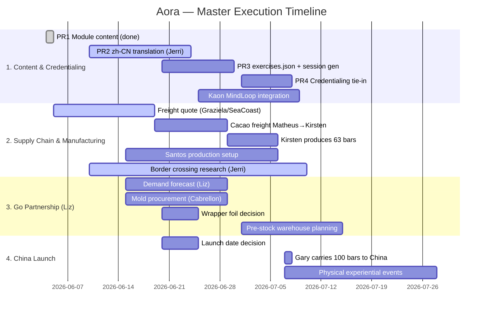

# Aora Experience — master execution roadmap

**Owner:** Gary Teh · **Started:** 2026-06-04 · **Last updated:** 2026-06-10 · **Status:** ACTIVE

Aora is the front-of-house name (China launch with Mr. Cao's GO/Nucleus network, led by **Elizabeth Wong**); the
engine is Agroverse Lineage (`truesight.me/lineage.html` — experiential-learning
credentialing). Online piece will eventually sit at **experience.agroverse.shop**,
following the `capoeira.agroverse.shop` pattern (setting-aware session generator).

**Context:** Mr. Cao asked Gary to design two learning modules — **1. Agroforestry**
and **2. Supply Chain** — for the Aora pilot program (mentors + children co-creating;
"TED for children", content a 6-year-old can grasp; senses: see/smell/taste/hear/create).
Jerri (China team, reports to Liz) needs initial ideas + a rough timeline to line up events
(salons of ~25 in Guangzhou/Shenzhen/Dongguan/Changsha/Shanghai; main launch
≤100 ppl Shenzhen or Songshan Lake). Gary in China ~Jul 7 – end Jul 2026.

**Kaon** (partner brought in by Liz) is building the **MindLoop engine** — a platform for
publishing experiential learning modules. Aora modules will be published on MindLoop;
completion triggers a record on TrueSight DAO's credentialing layer (Lineage).

---

## PERT chart — workstream dependencies

**Critical path:** Freight quote → cacao arrives at Kirsten → produce 63 bars → Gary carries to China.
Parallel track: Liz demand forecast → mold quantity → production throughput.

---

## Decisions locked

### 2026-06-04 (original)

1. **Documents-first** — md + PDF for the two modules now; site/session-generator is a fast follow. Don't block Jerri on software.
2. **Repo = `TrueSightDAO/aora`** (local `~/Applications/aora`). "Aora" is the brand.
3. **Module boundary is engine-agnostic** — exercises are atomic tagged units any engine (Kaon's GO app or our own LLM-built one) can recompose; Agroforestry = forest→dried bean, Supply Chain = bag→bar→you, QR provenance as Supply Chain finale (runs on Agroverse QR + ledger stack, no Kaon dependency).
4. **Bilingual** — EN canonical authored by us; Jerri's team owns zh-CN translations in the same repo (`index.zh-CN.md` next to each `index.md`).
5. **PDFs versioned in the `aora` repo** next to source md (generated, committed). PDF is the China-proof artifact (GitHub/Pages unreliable behind GFW; share PDFs via WhatsApp/Feishu).

### 2026-06-10 (this session)

6. **Mold spec:** Cabrellon Italian polycarbonate mold (27.5×17.5cm, 4 cavities × 50g) — same as Kirsten uses in SF. Santos's 40g mold is not used for Aora.
7. **Packaging boundary:** DAO delivers bars in **generic foil** only. Liz's side (Go/Nucleus) provides the **final consumer packaging** for the Chinese market.
8. **Jerri's team:** Currently repackaging cacao for the Chinese market (border-crossing-ready format).
9. **Capital deployed:** DAO capital has been and continues to be deployed to the USA-bound freight (AGL15 + Main Ledger). Zero visibility on China demand volume until Liz provides a forecast.
10. **Elizabeth Wong (Liz):** Leads the Go/Nucleus partnership. Previously purchased 37 bars (April 2026). Now needs **100 bars total** — 63 outstanding to be produced by Kirsten once the freight arrives.

---

## Workstream 1: Content & Credentialing

**Lead:** Gary · **Partner:** Kaon (MindLoop engine), Jerri (zh-CN)

| Unit | What | Owner | Status |
|------|------|-------|--------|
| **PR0** | This roadmap (agentic_ai_context) | Gary | merged ☑ ([#285](https://github.com/TrueSightDAO/agentic_ai_context/pull/285)) |
| **PR1** | `TrueSightDAO/aora` repo: README, modules, zh-CN stubs, PDF build scripts | Gary | merged ☑ ([aora#1](https://github.com/TrueSightDAO/aora/pull/1)) |
| **PR2** | zh-CN intake — Jerri's team translates; we review structure only | Jerri | in progress (theirs) |
| **PR3** | `data/exercises.json` (1:1 with module exercise tables) + session-generator scaffold + GitHub Pages → experience.agroverse.shop CNAME | Gary | not started |
| **PR4** | Credentialing tie-in: `programs/<aora>/manifest.json` on credentialing platform, `experience.agroverse.shop` in `source_pages[]` | Gary | not started |
| **MindLoop** | Kaon completes MindLoop engine; Aora modules published as MindLoop experiences; completion triggers Lineage credential | Kaon | not started |

**RESUME HERE → PR3** (or fold in Jerri/Evan feedback on the v0.1 module docs first if it has arrived — that takes precedence over the generator scaffold).

---

## Workstream 2: Supply Chain & Manufacturing

**Lead:** Gary · **Partners:** Kirsten (production), Matheus (warehouse), Graziela/SeaCoast (freight), Santos (Brazil production), Jerri (border crossing)

### 2a. USA-bound: 100 bars for Liz

| Step | What | Owner | Status |
|------|------|-------|--------|
| **Freight quote** | Airline revalidation from Graziela (SeaCoast) — pending since June 5 | Graziela | blocked (awaiting airline) |
| **Cacao freight** | Matheus warehouse (Ilhéus) → Kirsten warehouse (SF) via Omega/SeaCoast | Gary / Graziela | pending quote |
| **Production** | Kirsten produces remaining 63 bars (37 already purchased) using Cabrellon mold | Kirsten | waiting on freight |
| **Foil wrap** | Bars delivered in generic foil (no consumer branding) | Kirsten | ready |
| **Delivery to Gary** | Bars ready for Gary to carry to China (or ship if no July launch) | Kirsten | waiting on production |

**Numbers:**
- Elizabeth Wong purchased: **37 bars** (20 Oscar 2024 + 17 Santa Ana 2023) — April 2026
- Total needed: **100 bars**
- Outstanding: **63 bars**

### 2b. Brazil production (Santos) — future scale

| Step | What | Owner | Status |
|------|------|-------|--------|
| **Recipe** | 81% cacao / 19% sugar (default; may adjust when Liz has market visibility) | Gary / Liz | decided |
| **Mold** | Cabrellon Italian (27.5×17.5cm, 4×50g cavities) — same as SF | Gary | decided |
| **Santos pricing** | R$130/kg for 70% bars; Santos willing to try 50g bars | Santos | quoted |
| **Mold quantity** | Depends on Liz's demand forecast (annual kg → mold count → throughput) | Liz | **blocked** — no forecast yet |
| **Wrapper foil** | Who provides? | Liz / Gary | open |
| **Border crossing** | Jerri researching cacao import requirements for China | Jerri | in progress |

### 2c. Capital deployed

DAO capital already committed:
- **AGL15:** $5,279.73
- **Main Ledger:** $3,172.29 (USD) + additional freight costs
- Allocated to USA-bound freight (Matheus → Kirsten)
- No additional capital allocated for China market until Liz provides demand forecast

---

## Workstream 3: Go Partnership (Liz)

**Lead:** Elizabeth Wong · **Partners:** Gary (DAO), Kaon (MindLoop), Jerri (China ops)

| Item | What | Owner | Status |
|------|------|-------|--------|
| **Demand forecast** | Annual expected volume from China retailers/distributors → informs mold quantity, freight cadence, pre-stock | Liz | **critical blocker** — no visibility yet |
| **Consumer packaging** | Liz's side provides final packaging for Chinese market; DAO delivers bars in generic foil | Liz | decided |
| **MindLoop engine** | Experiential learning platform for publishing Aora modules | Kaon | in development |
| **GO app integration** | Exercise schema contract between Aora's `exercises.json` and GO's session recomposition | Kaon / Gary | not started |
| **Border crossing** | Cacao import regulations, labeling, customs for China | Jerri | in progress |
| **Pre-stock warehouse** | If demand justifies, pre-stock chocolate bars in China warehouse to minimize freight frequency (Omega = high friction) | Liz / Gary | pending forecast |

**Key principle:** Omega services are high-friction. Fewer, larger freights are better than frequent small ones. Pre-stocking is preferred once demand is known.

---

## Workstream 4: China Launch

**Lead:** Liz / Jerri · **Partners:** Gary, Kaon

| Item | What | Owner | Status |
|------|------|-------|--------|
| **Launch date** | July uncertain — parents/students may not be available | Liz / Jerri | **open** |
| **Gary in China** | ~Jul 7 – end Jul 2026 (if launch happens) | Gary | tentative |
| **Carry bars** | Gary physically carries 100 bars to China if July launch proceeds | Gary | pending production + launch decision |
| **Salon events** | ~25 ppl in Guangzhou/Shenzhen/Dongguan/Changsha/Shanghai | Jerri | pending date |
| **Main event** | ≤100 ppl in Shenzhen or Songshan Lake | Jerri | pending date |
| **Experiential format** | Two-part physical experience (Agroforestry + Supply Chain modules) using MindLoop engine | Gary / Kaon | pending engine |
| **Facilitator session plans** | Pilot-ready plans for workshop + kitchen settings | Gary | due Jul 4 |

**If July launch is cancelled:** The 100 bars still need to be produced (Liz already paid for 37). They can be stored at Kirsten's warehouse or shipped later. The MindLoop + credentialing work continues independently of launch timing.

---

## Open decisions

| # | Question | Who decides | Deadline |
|---|----------|-------------|----------|
| 1 | **July launch: happening or shifted?** Parents/students availability in July | Liz / Jerri | ~Jun 20 |
| 2 | **Demand forecast:** Annual kg volume from China retailers/distributors | Liz | ASAP — blocks mold quantity + freight planning |
| 3 | **Wrapper foil:** Who provides the foil for generic-wrapped bars? | Liz / Gary | ~Jun 20 |
| 4 | **Border crossing:** Status of cacao import into China | Jerri | ongoing |
| 5 | **Santos mold quantity:** How many molds needed for throughput? | Liz (via forecast) | after #2 |
| 6 | **Cacao percentage:** 81% default or adjust based on market feedback? | Liz | after market visibility |

---

## Timeline communicated to Jerri

- ~Jun 11: v0.1 module outlines (md + PDF, EN) to Jerri
- Jun 12–25: revise w/ Jerri+Evan; exercises.json + generator scaffold; zh-CN pass (Jerri's team)
- By Jul 4: pilot-ready facilitator session plans for workshop + kitchen settings
- Jul 7–end Jul: run salons live in China (if launch confirmed); freeze main-event content ~1 wk prior

---

## Related

- `capoeira/` — session-generator pattern + moves.json schema to mirror
- `truesight_me/lineage.html` — credentialing pitch this program instantiates
- `OPEN_FOLLOWUPS.md` — Graziela/SeaCoast airline quote pending (poke Monday)
- `notes/claude_serialized_qr_sales_2026-04-29.md` — Elizabeth Wong's 37-bar purchase record
