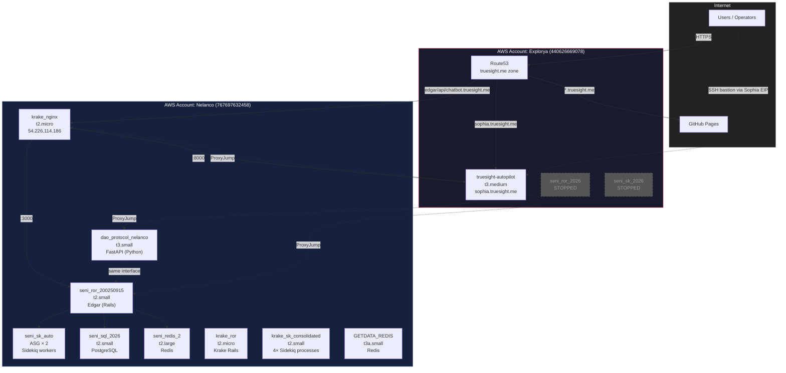
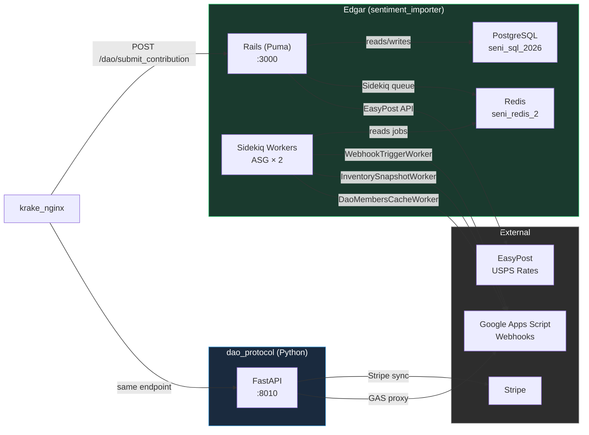

# AWS Digital Infrastructure — Deployment Setup

This document describes the **production AWS infrastructure** for TrueSight DAO / Agroverse. Read this before making assumptions about where services run, how traffic is routed, or which EC2 instance hosts what.

---

## 0. Architecture Overview

### 0.1 High-Level Account Architecture



### 0.2 Edgar Service Topology



---

## 1. AWS Accounts

| Account | Label | Owner ID | Purpose |
|---------|-------|----------|---------|
| **Explorya** | `explorya` | `440626669078` | TrueSight DAO / Agroverse production. Contains the autopilot, old Edgar instances (stopped), and Route53 DNS for `truesight.me`, `agroverse.shop`. |
| **Nelanco** | `nelanco` | `767697632458` | Krake / GetData.io production + **new Edgar** + **dao_protocol**. Contains the nginx reverse proxy, ALB, Sidekiq workers, Redis, PostgreSQL, and the new `dao_protocol` FastAPI server. |

**Key insight:** The old `seni_ror_2026` / `seni_sk_2026` instances in Explorya were **stopped 2026-05-28**. Edgar was migrated to a fresh host in Nelanco. The autopilot remains in Explorya.

---

## 2. EC2 Instance Inventory

### 2.1 Nelanco Account (767697632458) — `us-east-1`

| Name | Instance ID | Type | State | Private IP | Public IP | Purpose |
|------|-------------|------|-------|------------|-----------|---------|
| **krake_nginx** | `i-05a041b6956aa7154` | t2.micro | running | 172.31.26.102 | 54.226.114.186 | **Nginx reverse proxy.** Terminates HTTPS for `edgar.truesight.me`, `api.truesight.me`, `chatbot.truesight.me`. Proxies to backend Rails/Python services. |
| **seni_ror_200250915** | `i-063dc4a3be90bd630` | t2.small | running | 172.31.19.78 | 54.211.179.126 | **Edgar (Rails).** `sentiment_importer` — DAO API server. Receives signed event submissions, verifies signatures, logs to Google Sheets, dispatches GAS webhooks. DNS: `edgar.truesight.me` → this host (via nginx proxy). |
| **dao_protocol_nelanco** | `i-05f8770a932b76649` | t3.small | running | 172.31.23.207 | 98.93.94.86 | **dao_protocol FastAPI server.** Python port of Edgar's submission + dispatch logic. Runs on port 8010. Accepts `POST /dao/submit_contribution`. |
| **dao-protocol-beta** | `i-0b8c6d989594fb229` | t3.small | running | 172.31.20.96 | 54.162.175.189 | **Beta sandbox dao_protocol.** Isolated test instance for Stripe test-mode subscription E2E tests. systemd `dao-protocol-beta.service`, port 8010. DNS: `beta.edgar.truesight.me`. SG: `dao-protocol-beta-sg` (443 open, 22 restricted to autopilot). Keypair: `dao-protocol-beta-key`. |
| **seni_sk_auto** (ASG — 2 instances) | `i-0dfeb7a93f1f78e8e` / `i-09883a010a52509f6` | t2.small | running | 172.31.50.44 / 172.31.84.218 | 34.234.193.80 / 100.53.89.222 | **Sidekiq worker** for Edgar (sentiment_importer). ASG-managed; deploy script targets `100.53.89.222` as `seni_sk_nelanco`. Processes background jobs (webhook triggers, inventory snapshots). |
| **krake_ror** | `i-0df7a9e513dc537a6` | t2.micro | running | 172.31.19.151 | 18.205.20.43 | Krake Rails backend (getdata.io). Behind ALB `krake-ror-1`. |
| **krake_sk_consolidated** | `i-09d97cc0780fc8363` | t2.small | running | 172.31.48.178 | 54.160.89.135 | **Consolidated Krake Sidekiq.** Runs 4 Sidekiq processes (general, webhook, crawler, scaler) on one box. Replaces 4 separate krake_sk* instances. Upstart scripts at `/etc/init/krake_sk*.conf`. |
| ~~krake_sk~~ | ~~i-0b82138aa45b4029a~~ | ~~t2.nano~~ | **stopped** | — | — | Replaced by krake_sk_consolidated. |
| ~~krake_sk_webhook~~ | ~~i-02599e3b3a03e38e4~~ | ~~t2.small~~ | **stopped** | — | — | Replaced by krake_sk_consolidated. |
| ~~krake_sk_crawler~~ | ~~i-06fc0dd44fa9cdbf2~~ | ~~t2.small~~ | **stopped** | — | — | Replaced by krake_sk_consolidated. |
| ~~krake_sk_scaler~~ | ~~i-03224db5f5a49709c~~ | ~~t2.micro~~ | **stopped** | — | — | Replaced by krake_sk_consolidated. |
| **krake_data** | `i-07c76510b231d787f` | t3.medium | running | 172.31.19.2 | 52.5.179.48 | Krake data processing. |
| **GETDATA_REDIS** | `i-030c1452b197c920a` | t3a.small | running | 172.31.19.183 | 52.1.162.134 | Redis for Krake. |
| **GETDATA_CACHE** | `i-0d63b472d8a8893f8` | t2.micro | running | 172.31.19.80 | 98.84.169.188 | Krake cache worker. |
| **seni_sql_2026** | `i-08ebe96afbc649a95` | t2.small | running | 172.31.20.143 | 44.193.55.205 | PostgreSQL database for Edgar (sentiment_importer). |
| **seni_redis_2** | `i-09ecc8ecc91d09206` | t2.large | running | 172.31.56.185 | 54.234.59.188 | Redis for Edgar (Sidekiq, caching). |

### 2.2 Explorya Account (440626669078) — `us-east-1`

| Name | Instance ID | Type | State | Private IP | Public IP | Purpose |
|------|-------------|------|-------|------------|-----------|---------|
| **truesight-autopilot** | `i-02c699d3d7efbdc82` | t3.small | running | 10.0.0.158 | 52.200.38.206 | **Autopilot server.** FastAPI service for governor chat + autonomous SRE. Code at `/opt/truesight_autopilot`, systemd `truesight-autopilot.service`. DNS: `sophia.truesight.me` → this host. |
| **seni_ror_2026** | `i-0ac8462aa6bb54986` | t2.small | **stopped** | 10.0.0.162 | — | **Old Edgar (Rails).** Stopped 2026-05-28. Replaced by `seni_ror_200250915` in Nelanco. |
| **seni_sk_2026** | `i-0bb43299c84c5ccd5` | t2.small | **stopped** | 10.0.0.14 | — | **Old Sidekiq.** Stopped 2026-05-28. Replaced by new `seni_sk_auto` in Nelanco. |

---

## 3. DNS & Traffic Routing

### 3.1 Route53 — `truesight.me` Zone (Explorya)

| Record | Type | Target | Notes |
|--------|------|--------|-------|
| `edgar.truesight.me` | A | `54.211.179.126` | Points to **krake_nginx** (Nelanco). Nginx proxies to `seni_ror_200250915` (Rails Edgar) on the internal network. |
| `beta.edgar.truesight.me` | A | `54.162.175.189` | Points directly to **dao-protocol-beta** (Nelanco). Standalone beta sandbox for Stripe test-mode E2E tests. |
| `api.truesight.me` | A | `54.226.114.186` | Also krake_nginx. |
| `chatbot.truesight.me` | A | `54.226.114.186` | Also krake_nginx. Proxies to `seni_ror_200250915:8000` (governor chatbot / autopilot). |
| `sophia.truesight.me` | A | `52.200.38.206` | Points directly to **truesight-autopilot** (Explorya). |
| `dapp.truesight.me` | CNAME | `truesightdao.github.io` | GitHub Pages. |
| `beta.dapp.truesight.me` | CNAME | `truesightdao.github.io` | GitHub Pages (beta). |
| `truesight.me` | A | `185.199.108.153` + 3 more | GitHub Pages. |
| `www.truesight.me` | CNAME | `TrueSightDAO.github.io` | GitHub Pages. |
| `agroverse.shop` | — | (separate zone) | Route53 zone `Z03648011LL9LLYA2X5F5` in Explorya. |

### 3.2 Traffic Flow

```
Internet → Route53 → krake_nginx (54.226.114.186)
  ├── edgar.truesight.me/ → seni_ror_200250915:3000 (Rails Edgar)
  ├── api.truesight.me/   → seni_ror_200250915:3000
  └── chatbot.truesight.me/ → seni_ror_200250915:8000 (governor chatbot)

Internet → Route53 → sophia.truesight.me → truesight-autopilot (52.200.38.206:8000)

Internet → Route53 → GitHub Pages
  ├── truesight.me
  ├── dapp.truesight.me
  └── agroverse.shop
```

### 3.3 Nginx (krake_nginx)

The nginx reverse proxy on `krake_nginx` (54.226.114.186) terminates HTTPS and routes:

- `edgar.truesight.me` → `seni_ror_200250915:3000` (Rails Edgar, port 3000)
- `api.truesight.me` → `seni_ror_200250915:3000`
- `chatbot.truesight.me` → `seni_ror_200250915:8000` (governor chatbot FastAPI)

The ALB `krake-ror-1` handles `getdata.io` traffic to the Krake Rails app (port 3002).

---

## 4. Service Architecture

### 4.1 Edgar (DAO API) — `sentiment_importer`

```
krake_nginx (54.226.114.186:443)
  └── seni_ror_200250915 (54.211.179.126:3000) — Rails (Puma)
        ├── seni_sql_2026 (44.193.55.205) — PostgreSQL
        ├── seni_redis_2 (54.234.59.188) — Redis (Sidekiq, cache)
        └── seni_sk_auto (34.234.193.80) — Sidekiq workers
              └── WebhookTriggerWorker → GAS webhooks
              └── AgroverseInventorySnapshotPublishWorker → GAS
              └── DaoMembersCacheRefreshWorker → GAS
```

**Key endpoints:**
- `POST /dao/submit_contribution` — signed event intake (multipart form)
- `POST /dao/express_submit_contribution` — invoice/UPC workflow
- `GET /dao/check_digital_signature` — public key lookup
- `GET /agroverse_shop/shipping_rates` — USPS rates via EasyPost
- `GET /newsletter/open.gif` — email open tracking pixel
- `GET /newsletter/click` — email click tracking redirect
- `GET /proxy/gas/<name>` — GAS proxy for regions blocking script.google.com

### 4.2 dao_protocol (FastAPI) — Python Port

```
dao_protocol_nelanco (98.93.94.86:8010)
  └── POST /dao/submit_contribution — same interface as Rails Edgar
  └── GET /healthz — health check
  └── GET /proxy/gas/<name> — GAS proxy
  └── GET /agroverse_shop/shipping_rates — USPS rates
  └── GET /qr-code-check — QR code lookup
  └── POST /stripe/order-sync — Stripe order sync
```

The `dao_protocol` server is a **Python port** of Edgar's core submission + dispatch logic. It runs independently and can accept submissions. Currently both the Rails Edgar and `dao_protocol` are live, but `edgar.truesight.me` DNS still points to the Rails instance via nginx.

### 4.3 Autopilot (Governor Chat + SRE)

```
truesight-autopilot (52.200.38.206:8000)
  └── POST /chat — governor chat (RSA-signed or JWT)
  └── POST /fix — autonomous fix PR agent
  └── GET /health — health check
  └── Background: Gmail poller, AWS monitor
```

Runs on a **dedicated EC2** separate from Edgar to protect critical infrastructure. Code at `/opt/truesight_autopilot`, systemd service `truesight-autopilot.service`.

**Telegram identifiers (Sophia):**
- Bot: **`@truesight_autopilot_bot`** (id `8217115914`).
- **Working group: `TrueSight DAO Ops` = `-1003919341801`** (forum/topics enabled; the bot is a **group admin with Manage Topics**). This is `TELEGRAM_HOME_GROUP_ID` in the box `.env` — where `create_telegram_topic` opens topics for execution handoffs triggered off-Telegram.
- Watchdog user-session = Gary's account `garyjob` (id `2102593402`) — read-only nudges (see §4.5 / OPEN_FOLLOWUPS).

**Execution-handoff path (local LLM → Sophia):** a governor crafts a plan + roadmap with a local LLM and commits the roadmap to `agentic_ai_context` (the baton), then runs **`truesight-dao-ping-sophia`** (`dao_client`/`dao_protocol` module `ping_sophia`, governor-signed → Sophia `/chat-blocking`, **governor-only, 403 otherwise**) telling Sophia to open a topic + load the plan + post a kickoff. Sophia uses the `create_telegram_topic` tool; the governor steps into that topic in `TrueSight DAO Ops` and monitors execution (one autopilot session per topic). Validated end-to-end 2026-06-07.

### 4.4 GitHub Pages (Static Sites)

| Site | Repo | Domain |
|------|------|--------|
| TrueSight DAO landing | `truesight_me_prod` | `truesight.me` |
| DApp | `dapp_prod` (fork of `dapp_beta`) | `dapp.truesight.me` |
| DApp (beta) | `dapp_beta` | `beta.dapp.truesight.me` |
| Agroverse Shop | `agroverse_shop_prod` | `agroverse.shop` |
| Capoeira practice | `capoeira` | `capoeira.agroverse.shop` |
| Tribo Mirim Bahia ledger | `tribomirimbahia` | `mirim-bahia.truesight.me` |
| Oracle | `oracle` | `oracle.truesight.me` |
| Butterfly Effect Club | `butterfly-effect-club` | `butterfly-effect-club.truesight.me` |

---

## 4.5 Autopilot (Sophia) Upgrade & Disaster Recovery — EIP blue-green + AMI

**The autopilot box has an Elastic IP** — `eipalloc-04772e4a20f10c1c4` (`52.200.38.206`) — and
`sophia.truesight.me` points to it. That stable EIP is the enabler: you can swap the underlying EC2 box
and **Route53 never changes**. Point Route53 at the EIP **once** (done); thereafter every upgrade/replace
is just "move the EIP."

### Replace / upgrade the box (blue-green, near-zero downtime, rollback-able)
1. Have a recent **AMI** of the current box (cadence below).
2. **Launch the new box** at the target size (e.g. `t3.medium`) from the latest AMI — or fresh Ubuntu 22.04 + `scripts/user-data.sh`.
3. On the new box: `git pull` + `scripts/deploy.sh` (AMIs are point-in-time — always pull latest code), restore `.env`, start services, **health-check** `:8001/health` + Telegram adapter + `dao_protocol :8010` + Monit `:2812`.
4. **Reassociate the EIP** to the new instance: `aws ec2 associate-address --allocation-id eipalloc-04772e4a20f10c1c4 --instance-id <new-id>` (Explorya creds, `us-east-1`). `sophia.truesight.me` flips instantly; **no Route53 edit needed.**
5. Verify, then **stop** (don't terminate) the old box for a few days as rollback; terminate once confident.
6. **Rollback** = reassociate the EIP back to the old instance.

> The Telegram adapter is **outbound-polling**, so it doesn't depend on the inbound IP — the EIP matters for SSH, the web API (`:8001`/`:443`), Monit, and `sophia.truesight.me`.

### AMI backup cadence (DR + source for step 2)
- **Weekly AMI — AUTOMATED 2026-06-07** via GitHub Action **`Cypher-Defense/.github/workflows/snapshot_autopilot_ami.yml`** (Sundays 03:00 UTC + `workflow_dispatch`), script **`scripts/aws/snapshot_autopilot_ami.py`**. Resolves the instance by **Name tag `truesight-autopilot`** (not a hardcoded ID — survives resizes / blue-green), `create-image --no-reboot`, tags AMI + snapshots `ManagedBy=snapshot_autopilot_ami`, **retains newest 8 (~2 months)** and prunes older AMIs + their backing snapshots. Repo secrets `TRUESIGHT_DAO_AUTOPILOT_AWS_KEY/SECRET` (account that owns the instance). First validated run: `ami-0dae91c5216989753`.
- ⚠️ The AMI contains the on-disk **`.env` (secrets)** → keep it **private** (default in-account); never share cross-account/publicly.
- AMI ≠ latest code — a new box still runs `deploy.sh` to pull current code.

### Known issues this addresses / to watch
- **Deploy OOM (2026-06-06):** `pip install dao_client` was OOM-killed (SIGTERM) on the 2 GB box (it runs two services). Immediate fix: **t3.medium (4 GB) + 2 GB swap** (Sophia's `infrastructure/autopilot_upgrade_proposal_2026-06-06.pdf`). Since the EIP exists, do it **blue-green** (launch t3.medium from AMI → deploy → reassociate EIP) for zero downtime + rollback, not an in-place resize. Also consider lightening deploy memory (prebuilt wheels / `pip --no-cache-dir`).
- **dao_protocol is NOT on this box** (verified 2026-06-06 — no `:8010` listener). It runs on `dao_protocol_nelanco` (Nelanco, `98.93.94.86`). The proposal's "two services / co-located" claim was wrong — the autopilot box is single-service (autopilot + telegram + watchdog).
- **Self-deploy restarts all units** as of `truesight_autopilot#107` (main + telegram + watchdog); a fresh box must run the same `deploy.sh`.

### Post-cutover verification — run on EVERY resize / new box / EC2 event
After a stop/start resize, an EIP reassociate, or a fresh box, confirm before walking away (the units auto-start on boot, but given session-duplication stakes, verify explicitly):
- [ ] `describe-instances` → expected `InstanceType`, `State=running`
- [ ] `ssh sophia` reachable on the EIP (`52.200.38.206`)
- [ ] **All three units active:** `systemctl is-active truesight-autopilot truesight-autopilot-telegram truesight-autopilot-watchdog` → all `active`. **Confirm the watchdog especially** — it must reconnect cleanly.
- [ ] `free -m` shows expected RAM; `swapon --show` shows the 2 GB swap (re-add on a fresh box)
- [ ] `curl localhost:8001/health` → `status: ok` (give the heavy app ~10–20 s after a restart)
- [ ] Monit `:2812` listening
- [ ] `git pull` to current `main` + restart all units (AMIs / stopped boxes lag the repo)

### Status
- **2026-06-06:** resized in-place **t3.small → t3.medium** (4 GB) + **2 GB swap**; all units (incl. watchdog) verified active; box pulled to current `main` (incl. PDF house style). Pre-resize backup AMI `ami-0e1f8559e760c5fd9`. EIP held → no Route53 change.
- **2026-06-07:** weekly-AMI TODO **DONE** — automated via the Cypher-Defense GitHub Action above (first AMI `ami-0dae91c5216989753`). Also shipped (`truesight_autopilot#114`): Sophia can now run sudo / install packages on her **own** box via `ssh_run(host='autopilot', …)` (loopback self-host; `sophia_infra.pub` self-trusted in the box's own `authorized_keys` by `deploy.sh`); the system prompt embeds a live **host-identity block** (instance id/type/region via IMDS) so she stops hallucinating her location; `GROK_API_KEY` added to the box `.env` (`/health` → `grok_key_set: true`).

---

## 5. Edgar Migration (2026-05-28)

The old Edgar infrastructure in the **Explorya** account was **stopped** on 2026-05-28:

| Old (Explorya — stopped) | New (Nelanco — running) |
|--------------------------|--------------------------|
| `seni_ror_2026` (t2.small) | `seni_ror_200250915` (t2.small) |
| `seni_sk_2026` (t2.small) | `seni_sk_auto` (t2.small, new ASG) |
| — | `dao_protocol_nelanco` (t3.small, new) |

The DNS `edgar.truesight.me` was updated to point to `krake_nginx` (54.226.114.186), which proxies to the new Rails host.

---

## 6. Key Configuration Files

### 6.1 Edgar (sentiment_importer)

- **`config/application.rb`** — All webhook URLs, API keys, secrets
- **`config/tsd_configuration.rb`** — DAO-specific configuration
- **`deploy.sh`** — Deploy script (pre-compiles assets, migrates DB, restarts systemd)
- **`app/controllers/dao_controller.rb`** — Main submission + dispatch logic
- **`app/services/dao_email_registration_service.rb`** — Email verification flow
- **`app/workers/webhook_trigger_worker.rb`** — GAS webhook dispatcher

### 6.2 dao_protocol

- **`truesight_dao_client/server/dispatch.py`** — Event dispatch routing (port of Rails `trigger_immediate_processing`)
- **`truesight_dao_client/server/routes/dao.py`** — `POST /dao/submit_contribution` handler
- **`truesight_dao_client/server/jobs/webhook_trigger.py`** — GAS webhook HTTP client
- **`.env`** — Server-side env vars (webhook URLs, secrets)

### 6.3 Autopilot

- **`app/main.py`** — FastAPI app
- **`app/fix_agent.py`** — Autonomous fix PR agent
- **`app/email_poller.py`** — Gmail monitoring
- **`app/aws_monitor.py`** — AWS CloudWatch/Cost monitoring
- **`scripts/deploy.sh`** — Deploy to EC2

---

## 7. SSH Access

| Host | SSH Alias | Key | User |
|------|-----------|-----|------|
| krake_nginx | `krake_nginx` | `GETDATA_IO_PAIR_20201122` | ubuntu |
| seni_ror_200250915 | `seni_ror` | `GETDATA_IO_PAIR_20201122` | ubuntu |
| dao_protocol_nelanco | — | `GETDATA_IO_PAIR_20201122` | ubuntu |
| dao-protocol-beta | — | `dao-protocol-beta-key` (ed25519, on autopilot) | ubuntu |
| seni_sk_auto | `seni_sk` | `GETDATA_IO_PAIR_20201122` | ubuntu |
| seni_sql_2026 | `seni_sql` | `GETDATA_IO_PAIR_20201122` | ubuntu |
| seni_redis_2 | — | `GETDATA_IO_PAIR_20201122` | ubuntu |
| truesight-autopilot | — | `garyjob_aws` | ubuntu |

### 7.1 Reaching Nelanco hosts from a non-allowlisted network — **bastion via Sophia**

**Symptom:** `ssh ubuntu@54.211.179.126` (or any Nelanco host) **times out** from a
laptop / phone-hotspot / café network, even though the key is correct.

**Why:** the Nelanco Security Group allowlists inbound SSH (22) and ICMP to a short
list of source IPs — it is *allow-only*, so any source not on the list is **silently
dropped** (hence *timeout*, not *connection refused*). The **autopilot/Sophia Elastic
IP `52.200.38.206` is on that allowlist**; arbitrary dynamic IPs (e.g. T-Mobile
cellular) are not. This is cross-account (Explorya ↔ Nelanco) over the public
internet, so gating is purely source-IP based — there is no VPC peering.

**Fix — use Sophia as a ProxyJump bastion** (the TCP hop to the target then
originates from `52.200.38.206`, which *is* allowlisted; auth to the target still
uses your **local** Nelanco key):

```bash
KEY=~/Applications/aws_keypairs/NELANCO_aws_20201122.pem
ssh -J sophia -i "$KEY" ubuntu@54.211.179.126   # Edgar (seni_ror, sentiment_importer)
ssh -J sophia -i "$KEY" ubuntu@98.93.94.86       # dao_protocol (FastAPI + DAO secrets)
```

`sophia` is a working `~/.ssh/config` alias (`HostName sophia.truesight.me`). This is
the **standard, durable way** for any operator / LLM to reach the Nelanco boxes — do
**not** widen the SG to `0.0.0.0/0` to avoid it (these are treasury-grade hosts; see §9).

**Secrets stay on the box.** The GAS web apps are public (`ANYONE_ANONYMOUS`); only the
shared secret is gated. DAO secrets (e.g. `DAO_PROTOCOL_EMAIL_VERIFICATION_GAS_SECRET`,
`..._WEBHOOK_URL`) live in `~/dao_protocol/.env` on the dao_protocol box. Run any
secret-bearing call **from that box** (`set -a; . ~/dao_protocol/.env; set +a; curl …`)
so the secret never lands in a local shell history or transcript. Example — force a
`dao_members.json` cache refresh:

```bash
ssh -J sophia -i "$KEY" ubuntu@98.93.94.86 \
  'set -a; . ~/dao_protocol/.env; set +a;
   curl -s "${DAO_PROTOCOL_EMAIL_VERIFICATION_GAS_WEBHOOK_URL}?action=refresh_dao_members_cache&secret=${DAO_PROTOCOL_EMAIL_VERIFICATION_GAS_SECRET}&force=1"'
```

---

## 8. Monitoring

| Service | URL |
|---------|-----|
| Edgar health | `https://edgar.truesight.me/ping` |
| dao_protocol health | `http://98.93.94.86:8010/healthz` |
| Beta dao_protocol health | `https://beta.edgar.truesight.me/ping` |
| Autopilot health | `http://52.200.38.206:8000/health` |
| Governor chatbot | `https://chatbot.truesight.me` |
| Monit (Rails) | `http://54.211.179.126:2812/seni_ror` |
| Monit (Sidekiq) | `http://3.83.175.151:2812/sidekiq` (old — verify) |

---

## 9. Security Groups

| Group | Name | Used By |
|-------|------|---------|
| `sg-4314630c` | `default` (Nelanco) | All Nelanco instances. Allows SSH, HTTP/HTTPS, internal traffic. |
| `sg-e98f788e` | `default` (Explorya) | Autopilot. |
| `sg-093be54e48c6478e8` | `edgar-2026-05-10` | Old Edgar instances (stopped). |

> **SSH/ICMP are source-IP allowlisted, not open.** The Sophia/autopilot EIP
> `52.200.38.206` is allowlisted; random operator IPs are not — reach these hosts via
> the **Sophia bastion** (§7.1), not by widening the SG. The crown-jewel host is
> **`dao_protocol`** (`98.93.94.86`) — it holds the DAO submit/dispatch logic and the
> GAS/Stripe/webhook secrets in `~/dao_protocol/.env`; Edgar/`seni_ror` runs only the
> `sentiment_importer` Rails app. Do **not** expose either to `0.0.0.0/0`; prefer SSM
> Session Manager if direct access is ever needed.

---

## 10. Common Pitfalls

1. **Edgar is NOT `getdata.io`.** `edgar.truesight.me` = `sentiment_importer` (Rails). `getdata.io` = `krake_ror` (different codebase, different server). Do not conflate.

2. **Two Edgar backends exist.** The Rails Edgar (`sentiment_importer`) and the Python `dao_protocol` both accept `POST /dao/submit_contribution`. DNS still points to Rails. The `dao_protocol` server is the newer port.

3. **Old Edgar instances are stopped.** `seni_ror_2026` and `seni_sk_2026` in Explorya were stopped 2026-05-28. Do not try to SSH into them or deploy to them.

4. **Nginx proxies Edgar.** `edgar.truesight.me` → krake_nginx → `seni_ror_200250915:3000`. The nginx config is on `krake_nginx` (54.226.114.186), not on the Rails host itself.

5. **Webhook URLs are env-configured.** The `dao_protocol` server reads webhook URLs from `DAO_PROTOCOL_WEBHOOK_*` env vars. The Rails Edgar reads from `config/application.rb`. They are independent — a change to one does not affect the other.
