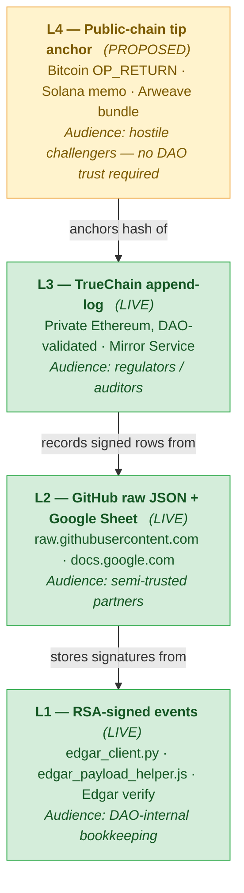
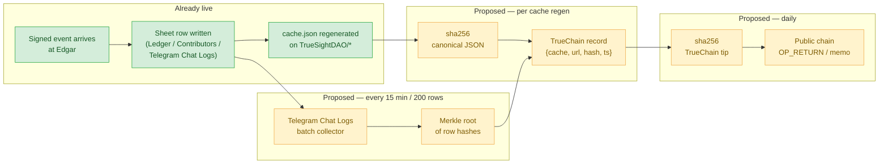

# Blockchain anchoring — interim proposal (v0.2)

**Status:** DRAFT · internal future-direction · **NOT** in any public whitepaper yet
**Last reviewed:** 2026-04-22
**Owner:** TrueSight DAO governors (Gary + AI assist)

**Promote to whitepaper when:** A prototype anchors at least one DAO cache's SHA-256 + one Telegram-Chat-Logs batch Merkle root to TrueChain, and we've sanity-checked one public-chain tip anchor end-to-end. Until then the proposal stays here — public whitepapers are harder to retract than internal notes.

---

## 1. One-sentence purpose

Extend the DAO's existing audit trail (RSA-signed events + Google Sheet + GitHub JSON caches + TrueChain mirror) so that third parties without DAO-operator access can **independently verify** that what the DAO reported on a given day matches what the ledger actually said that day.

## 2. What's already in place

The DAO already ships most of the primitives this proposal extends; blockchain anchoring is a **capstone**, not a foundation rewrite.



Each layer strengthens the guarantees of the one below — but only for audiences that don't already trust the lower layer. **See §3 for an honest assessment of whether L3 (TrueChain) is worth running for audit anchoring alone, or whether a plain batched-timestamping path from L2 directly to L4 is strictly better.** Table view of the same:

| Primitive | Gives us | Limit it has |
|-----------|----------|--------------|
| **RSA-signed events** on every `[CONTRIBUTION EVENT]`, `[INVENTORY MOVEMENT]`, etc. Verified by `sentiment_importer` (Edgar) via SPKI public key stored in `Contributors Digital Signatures` column E. | Per-submission non-repudiation: the contributor can't credibly deny signing. | Signatures alone don't prove **global ordering** ("was this submission T1 before or after T2?"). |
| **Google Sheet ledger** on `1GE7PUq…`. Tabs include `Ledger history`, `Contributors Digital Signatures`, `Contributors voting weight`, `offchain asset location`, `Telegram Chat Logs`. | Single source of truth for DAO state; writable by operators + GAS triggers. | Operators with sheet write access can edit historical rows retroactively. Outsiders have no way to check. |
| **GitHub JSON caches** — `TrueSightDAO/treasury-cache/dao_offchain_treasury.json`, `…/dao_members.json`, `TrueSightDAO/agroverse-freight-audit/pointers/freight_lanes.json`, `TrueSightDAO/agroverse-inventory/currency-compositions/*.json`. | Public read surface for downstream tools (`dao_client/cache/*.py`, `dapp/scripts/dao_members_cache.js`). Git history = implicit timeline. | Anyone with repo write access can force-push and rewrite the git history. Outsiders can't detect it without an independent hash anchor. |
| **TrueChain** — private Ethereum network. Mirror Service copies sheet rows → TrueChain. Block explorer via GAS. | Existing DAO-controlled chain; current value for audit anchoring alone is marginal — see §3. | "Tamper-evident" only to the extent that a majority of TrueChain validators don't collude. No external oracle. |

## 3. Is TrueChain worth running? — conditional framing

An honest assessment: **the audit-anchoring value proposition in this proposal alone does not justify running a private Ethereum network.** A plain batched-timestamping service (Chainpoint-style: collect events → compute a Merkle root every N minutes → submit one public-chain tx) would be cheaper to operate and would give the same external-verifiability guarantees without the TrueChain consensus machinery. In that simpler model L2 anchors **directly** to L4 and L3 drops out entirely.

TrueChain earns its keep **only if one of these conditions becomes true**:

1. **TDG (or any crypto) becomes the on-chain settlement medium for DAO commerce.** Today most TrueSight commerce — Agroverse retail, consignment payouts, Sunmint pledges — settles in **USD via Stripe / bank transfer**. Signed sheet rows + the Python library (`dao_client/modules/*.py`) + GAS rules can model those agreements and drive settlement perfectly well; no chain tx is needed to move USD. If TDG ever becomes the actual settlement asset (buyer pays TDG → seller receives TDG atomically in the same tx), then smart contracts holding and transferring those tokens earn their place. Until then, on-chain commerce is a solution looking for a problem.

2. **Governance outcomes need to be externally provable without trusting DAO operators.** Current voting is tallied by GAS from the `Contributors voting weight` tab — cheap, fast, and entirely sufficient if regulators / partners / challengers accept the DAO's own attestation. If an outside audience ever needs to prove "resolution Y passed on date Z" **without trusting the DAO's word**, smart-contract voting with on-chain event emission provides that. Until an actual external-verifiability requirement appears, quadratic voting in GAS is a valid implementation.

Most of what the DAO might reach for a smart contract to do — counterparty agreements, voting, multi-sig approvals, conditional payouts — is already expressible as **signed sheet rows + GAS rules + Python CLI**. That stack has per-agreement non-repudiation via RSA, operator-verifiable execution via GAS, and (once this audit-anchoring proposal ships) tamper-evident history via periodic hash anchors. Roughly 80% of B2B commerce today runs on less.

**Implication for this proposal:** do **not** justify TrueChain-the-infrastructure by audit anchoring alone. If the DAO decides it wants on-chain commerce or externally-provable governance, those are separate roadmap items that should be evaluated on their own merits — and if either lands, audit anchoring piggybacks on TrueChain's already-paid-for blockspace nearly for free. If neither lands, the simpler **L2-direct-to-L4** path (cache hash + Merkle batcher on an Edgar Sidekiq worker, submitting one periodic public-chain tx) is strictly better for the DAO's verifiability goals and should be the default. §5 onwards describes the full three-tier flow for completeness; the three-tier shape collapses to two tiers trivially by dropping the TrueChain step if that's where the DAO lands.

## 4. Audiences for this (be explicit before scoping)

| Audience | Currently served by | Gap this proposal closes |
|----------|--------------------|---------------------------|
| DAO-internal bookkeeping ("did Gary sign this?") | RSA signatures + sheet | Already strong. Marginal win. |
| Semi-trusted partners (agroverse retailers, cacao farms) | GitHub public URLs + whitepaper claims | Partners have to trust DAO operators didn't rewrite history. |
| Regulators / auditors | Whitepaper + external attestations | They need cryptographic proof, not prose claims. |
| Hostile governance challengers | Git blame + Telegram archives | No global, tamper-evident ordering they can reference. |

**Headline:** the real value is for audiences **without** DAO-operator trust. Internal integrity is already strong.

## 5. The proposal

Extend the existing Mirror Service to also write two new kinds of records:



Everything in green is already shipped. Everything in yellow is this proposal.

### 5.1 Cache snapshot anchors

Every time a `cache.json` is written to a `TrueSightDAO/*` repo (treasury-cache, agroverse-freight-audit, agroverse-inventory, future dao_members.json), the Mirror Service computes:

```
sha256( canonical(json_body) )
```

…and writes `{ cache_name, raw_url, sha256, generated_at, git_commit_sha }` as one TrueChain record. **Do not write the JSON body itself.** Rationale:

- 32-byte hash vs 64 KB body — chain storage is ~2000× cheaper.
- Privacy: if any field ever needs to be scrubbed from the public URL (e.g. a contributor opts out of being named), the hash anchor is still meaningful for snapshots that did include them without revealing them.
- Full integrity guarantee: any tampering — on GitHub **or** on-chain — shows up as a hash mismatch.

### 5.2 Telegram Chat Logs batch anchors

`Telegram Chat Logs` grows at thousands of rows / week. One chain write per row is expensive; per-row latency is unnecessary. Pattern:

- Every N minutes (e.g. 15) OR every M rows (e.g. 200), whichever comes first, the Mirror Service collects all new rows.
- Compute a Merkle tree over `sha256(canonicalised row)` for each row.
- Write `{ start_row_id, end_row_id, merkle_root, row_count, ts }` as one TrueChain record.
- Any auditor can later fetch the sheet rows (via GAS export or a public JSON mirror), rebuild the tree, and verify individual-row inclusion with a log₂(N) proof.

**Privacy:** anchor **hashes only**, never raw row text. Some Telegram Chat Logs rows contain phone numbers, draft messages, operational notes not intended for public release. A Merkle root leaks nothing about content.

### 5.3 Two-tier chain anchoring

TrueChain validators are DAO-controlled — so "tamper-evident" holds only under honest-majority assumptions. For audiences that trust nobody inside the DAO, add a periodic public-chain anchor:

- Daily (or weekly): take `sha256(TrueChain_tip_block_hash + ts)` and post it as an `OP_RETURN` on Bitcoin (or an equivalent memo on Solana / Arweave — exact choice intentionally left open, see §7).
- One public-chain write per day / week covers **all** TrueChain commits in that window.
- External auditors can follow the chain of hashes: public-chain memo → TrueChain tip → cache anchor → GitHub raw JSON → Google Sheet row.

This gives continuous-stream speed on the private chain + externally-anchored finality. Standard "anchoring" pattern used by Chainpoint, OriginStamp, et al.

## 6. Scope boundaries for the first prototype

**In:**
- One cache (start with `dao_offchain_treasury.json` — already publishes on every inventory movement, high-signal).
- One Telegram Chat Logs batch anchor (daily).
- TrueChain writes only. No public-chain anchor yet.

**Out until the first prototype works:**
- Anchoring every cache. Avoid building multi-source Merkle trees until there's one working path.
- Public-chain anchors. Prove the private-chain pipeline first; public anchors are a checklist item, not a research problem.
- New on-chain contracts beyond append-only log. Don't invent governance-on-chain while you're solving verifiability-on-chain.

## 7. Design calls worth deferring until prototype time

| Call | Why we're deferring |
|------|--------------------|
| Public chain choice (Bitcoin OP_RETURN vs Solana memo vs Arweave bundle vs Ethereum calldata). | Tool choice; depends on anchor frequency, cost sensitivity, and who we want as the authoritative external tip. Committing now in prose locks us in. |
| Canonical-JSON algorithm (JCS / RFC 8785, or a simpler sort-keys + no-whitespace approach). | Matters for hash stability but the specific choice is reversible if we tag `schema_version` in the anchor record. |
| Merkle hash function (SHA-256 vs BLAKE3). | SHA-256 default; only revisit if batch sizes grow beyond ~10⁴ rows per batch where BLAKE3's speed wins matter. |
| Who signs the anchor transactions. | TrueChain has existing validators; public-chain writes will need a dedicated signing key. Both are ops decisions, not architecture. |

## 8. What NOT to do

1. **Don't write JSON bodies on-chain.** Always a hash or a Merkle root.
2. **Don't make TrueChain the primary store.** Google Sheet + GitHub raw stay primary; TrueChain is the verification layer on top.
3. **Don't block user-facing requests on chain writes.** Same pattern as `DaoMembersCacheRefreshWorker` ([`sentiment_importer#1028`](https://github.com/TrueSightDAO/sentiment_importer/pull/1028)) — enqueue async via Sidekiq; retries cover transient chain 5xx.
4. **Don't anchor raw Telegram rows.** Merkle roots only; some fields are sensitive.
5. **Don't promise specific tools in the whitepaper before a prototype.** "Will anchor to Bitcoin" is a commitment; "may anchor TrueChain tips into a public chain" is a direction.
6. **Don't ship without a verification script.** For every anchor path you add, ship a script that takes `(anchor_record, primary_source_url)` and returns `verified: true | false`. Without that, the anchor is theatre.

## 9. Promotion criteria — when this moves into the whitepaper

Promote to the main [`truesight_me` whitepaper](https://github.com/TrueSightDAO/truesight_me/blob/main/whitepaper/index.html) as a **committed future direction** when:

1. At least one cache (proposed: `dao_offchain_treasury.json`) has its SHA-256 anchored to TrueChain for ≥ 30 days with no manual intervention.
2. At least one Telegram Chat Logs batch Merkle anchor has been independently verified end-to-end (auditor rebuilds tree from sheet export → matches chain record).
3. One public-chain tip anchor has landed successfully (even if not yet on a schedule).
4. A verification script lives in `TrueSightDAO/dao_client` or a sibling repo that anyone can run with no DAO-operator credentials.

Until then, the whitepaper's audit-trail section should continue to describe only what's **already** true (RSA signatures, GitHub public caches, TrueChain mirror). Prose promises outlive memory; shipped artifacts don't.

## 10. Related artifacts

- [`reference_dao_client_cli.md`](reference_dao_client_cli.md) — Python CLI + cache consumers that would be anchored.
- [`project_edgar_multiple_active_keys.md`](project_edgar_multiple_active_keys.md) — why `dao_members.json` is contributor-keyed (relevant to Merkle-over-rows design for the Contributors tab).
- [`WORKSPACE_CONTEXT.md`](WORKSPACE_CONTEXT.md) + [`PROJECT_INDEX.md`](PROJECT_INDEX.md) — TrueChain project location + Mirror Service reference.
- PR trail that shipped the precursors this proposal builds on:
  - [`TrueSightDAO/tokenomics#236`](https://github.com/TrueSightDAO/tokenomics/pull/236) / [`#237`](https://github.com/TrueSightDAO/tokenomics/pull/237) — `dao_members_cache_publisher.gs` + `dao_totals` at snapshot root.
  - [`TrueSightDAO/sentiment_importer#1028`](https://github.com/TrueSightDAO/sentiment_importer/pull/1028) — Sidekiq `DaoMembersCacheRefreshWorker` (pattern the TrueChain writer should mirror).
  - [`TrueSightDAO/dao_client#3`](https://github.com/TrueSightDAO/dao_client/pull/3) / [`#6`](https://github.com/TrueSightDAO/dao_client/pull/6) — `cache/` Python reader package (reference canonicalisation target).

## 11. Changelog

- **2026-04-22** — v0.2: inserted §3 "Is TrueChain worth running?" reframing TrueChain's value as **conditional** on either TDG-as-on-chain-settlement-medium or externally-provable-governance becoming real requirements. Honest about the alternative: signed sheet rows + GAS rules + Python CLI (what the DAO already has) cover most counterparty agreements, votes, and conditional payouts without any chain. If neither condition becomes true, the simpler L2→L4 path (Edgar Sidekiq Merkle-batcher → one periodic public-chain tx) is strictly better. The three-tier flow in §5 stays described for completeness; drops to two tiers trivially by skipping the TrueChain step. Sections §3–§10 renumbered to §4–§11; §5.3 cross-ref to old §6 updated to §7. Mermaid diagrams in §2 / §5 retain existing LIVE vs PROPOSED colouring.
- **2026-04-22** — v0.1 drafted from conversation with Gary. Captures the anchor-hashes-not-bodies pattern, Merkle-batch for Telegram Chat Logs, two-tier TrueChain-plus-public-chain proposal, explicit audience framing, and promotion criteria for moving into the public whitepaper.
