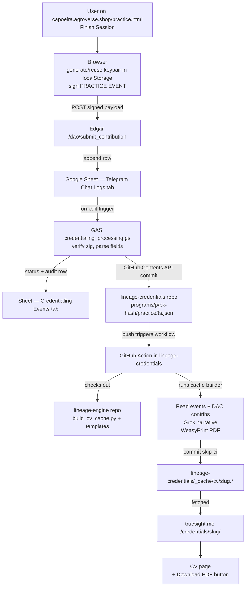

# Credentialing Platform — implementation document

**Status:** DESIGN draft, 2026-05-14. Pending Gary's review before any PRs land beyond capoeira-PR#27.

---

## 1. Why this exists (context from the 2026-05-14 Bilal conversation)

As the open internet floods with AI-generated slop, **authentic, lineage-validated work becomes scarce and valuable**. Bilal's social-impact projects, certified yoga / Vipassana / Zen instructors, the butterfly-conservatory students in Pakistan, junior SWEs trying to credential their work — they all want the same thing: **a public claim about a person's work that is signed by a known subject-matter expert, anchored in a recognised lineage, and verifiable down to the line of the underlying ledger**.

TrueSight DAO's governance layer is already the social trust anchor. The capoeira training-event work we started on 2026-05-14 turned out to be the first concrete instance of a much broader **credentialing primitive** that can be reused across every program (yoga, Vipassana, software engineering, butterfly conservatories, …). This doc defines that primitive.

The angels-vs-Adam framing from the Koran captured it: angels operate by binary rules (LLMs); Adam was given the power of *naming* (lineage, meaning, story). The credentialing platform is the system that lets us record what a *human* did, witnessed by *another human in a known lineage*, distinct from anything an LLM could have produced.

### 1a. Closing the self-actualization loop on truesight.me

The truesight.me public site already gestures at a self-actualization arc — impact metrics, transparency, mission framing. Credentialing makes the arc tangible per visitor:

1. **Passive** — visitor reads about the DAO, sees the trees-financed dashboard.
2. **Contributor** — buys cacao at agroverse.shop, funds a cacao tree.
3. **Practitioner** — picks up capoeira (or, later, yoga / Vipassana / SWE work), and their practice gets recorded with cryptographic anchoring.
4. **Credentialed member of a lineage** — public CV at `truesight.me/credentials/<slug>/`, lineage-validated, AI-slop-resistant, downloadable as a job-application-grade PDF.

Each step is rendered on the same site, with each forward step audit-traceable to the prior. The capoeira MVP completes the *practitioner → public CV* leap; v2 adds the *credentialed-by-lineage-authority* layer on top.

---

## 2. Conceptual model

```
DAO governors
   └── admit / revoke ──→  Lineage root authority  (e.g. Mestre Bico Duro for Capoeira)
                              └── attests ──→  Program-scoped credentialing event
                                                    └── about ──→  Person  (the credentialed)
                                                    └── from ──→   Source ledger line (auditable)
```

Decisions agreed with Gary (2026-05-14):

| Fork | Decision |
|---|---|
| **Lineage authority** | Governors assign root authority per lineage. |
| **Signature chain depth** | Self-attestation only for v1. Co-signed milestones (e.g. batizado / first corda) deferred. |
| **Storage layout** | One repo. Subfolder per program. Subfolder per person inside each program. |
| **DUNA wrapper** | Deferred. |
| **CV privacy** | Public by default. Every claim on the CV cites the source ledger by URL + line numbers so it stays auditable. |

Deferred entirely from v1:
- Co-signed credentials (e.g. batizado / corda promotion). v1 captures self-attestation only.
- DUNA legal wrapper.
- Multi-lineage hierarchies (e.g. lineage A admits sub-lineage B). Flat v1.

### 2a. End-to-end data flow



The producer side (left of GAS) is the existing Edgar/Sheets pipeline. The consumer side (right of GAS) is the new lineage-credentials + lineage-engine pair. Everything between GAS and the truesight.me CV page is auditable on GitHub.

---

## 3. Repo + layout

**Repo:** `TrueSightDAO/lineage-credentials` (already created by Gary on 2026-05-14).

Layout:

```
lineage-credentials/
├── README.md                       # public-facing overview
├── programs/
│   ├── capoeira-tribo-mirim/       # one folder per program
│   │   ├── manifest.json           # program metadata (lineage, root authority, etc.)
│   │   ├── pk-a1b2c3d4e5f6/        # canonical folder = short hash of public key
│   │   │   ├── identity.json       # optional: names + emails if/when provided
│   │   │   ├── practice/           # day-to-day self-signed practice events
│   │   │   │   └── 20260514T080000Z.json
│   │   │   ├── qualifications-pending/  # student-signed credential requests
│   │   │   │   └── 20260519T220000Z-corda-yellow.json
│   │   │   ├── attestations/       # paired qualification + master attestation (v2)
│   │   │   │   ├── 20260520T143000Z-corda-yellow-qualification.json
│   │   │   │   └── 20260520T143000Z-corda-yellow-attestation.json
│   │   │   ├── cv.md               # human-readable CV (auto-generated)
│   │   │   ├── cv.json             # structured CV cache (consumed by truesight.me)
│   │   │   └── cv.pdf              # downloadable
│   │   └── pk-.../
│   ├── yoga-iyengar/               # future
│   ├── vipassana-goenka/           # future
│   └── swe-apprentice/             # future
└── _cache/
    └── index.json                  # all (program, pk-hash) pairs for the directory page
```

**Why pubkey-hash as folder name:** the public key is the only identifier we always have. Email and real name are optional metadata that arrive later (or never). The folder name never has to be renamed; CV pages resolve display name from `identity.json` at render time, falling back to "Anonymous practitioner" if there is nothing there.

`identity.json` shape:

```json
{
  "primary_public_key": "<full RSA public key>",
  "names": ["Gary Teh"],
  "emails": ["garyjob@gmail.com"],
  "linked_at": "2026-05-15T18:00:00Z"
}
```

A future "this device is the same person as this other device" multi-pubkey alias mechanism is out of v1 scope.

`cv.json` and `cv.pdf` are **generated by a GitHub Action** that reads `practice/` and (in v2) `attestations/` + cross-references the source ledger. The webapp never re-derives this in the browser.

---

## 4. Three event types — `[PRACTICE EVENT]`, `[CREDENTIALING QUALIFICATION EVENT]`, `[CREDENTIALING ATTESTATION EVENT]`

> **MVP scope reminder:** v1 ships ONLY `[PRACTICE EVENT]` end-to-end — submission, GAS processing, cache build, CV rendering, PDF download. The qualification + attestation pair (§4b–4c) and multi-step lineage chains (§4d) are designed here so the data model never has to break to add them, but they remain *unwired* until institutions (capoeira mestres, yoga lineages, certified Vipassana teachers, etc.) actually want to come onboard and issue formal credentials.

Day-to-day track record, a student's request for a milestone credential, and the master's signed approval are three different things with three different signers. Treating them as separate events keeps each crisp.

The qualification + attestation pair is **bilateral**: the student initiates the claim by submitting a qualification event (signed by the student), and the master independently submits an attestation event whose payload carries the student's qualification `Request Transaction ID`. The signature on the attestation cryptographically links the master's approval to the exact student-signed request. Neither side can claim a corda alone; both have to sign for it to count.

| | `[PRACTICE EVENT]` | `[CREDENTIALING QUALIFICATION EVENT]` | `[CREDENTIALING ATTESTATION EVENT]` |
|---|---|---|---|
| Who signs | The practitioner | The **student** | The **master** / lineage authority |
| Volume | High — one per session | Low — one per milestone request | Low — one per master approval |
| Repo target | `programs/<p>/pk-<hash>/practice/` | `programs/<p>/pk-<hash>/qualifications-pending/` | `programs/<p>/pk-<hash>/attestations/` (linked to the qualification) |
| v1 wired? | **Yes** | Schema only | Schema only |
| Examples | Capoeira training session; meditation sit; coding session | "I'm requesting corda-yellow at the 2026-05-20 ceremony, witnesses X+Y" | "Approved. Granted to <student pk> at the ceremony." |

### GAS processor logic for the pair (v2)

1. A `[CREDENTIALING QUALIFICATION EVENT]` lands → write to `qualifications-pending/<timestamp>.json` under the student's `pk-<hash>/`. Captures the student's claim + evidence.
2. A `[CREDENTIALING ATTESTATION EVENT]` lands → look up the `Qualification Transaction ID` it references.
   - If found and the attestor's pubkey is in `manifest.authorized_attestors`: move the qualification JSON from `qualifications-pending/` → `attestations/<timestamp>.json` and append the attestation JSON beside it. The pair travels together.
   - If found but attestor isn't authorized: reject (FAILED status on the intake row).
   - If not found: reject (orphan attestation — the chain must root in a student-initiated request).
3. Orphan qualifications stay in `qualifications-pending/`. The CV renders them as "pending credentials" (visible, audited, but not formal credentials).

This also extends naturally to multi-step lineage chains later (e.g., contramestre attests, then mestre counter-attests on the contramestre's attestation) — same primitive, attestations can reference other attestation IDs. Out of v1/v2 scope but the data model accommodates it.

### 4a. `[PRACTICE EVENT]` payload (v1 surface)

Mirrors the existing Edgar event-payload shape (`[CONTRIBUTION EVENT]`, `[CURRENCY CONVERSION EVENT]`, …) so the GAS processor pattern in `tokenomics/google_app_scripts/tdg_asset_management/` is directly reusable.

```
[PRACTICE EVENT]
- Program: capoeira-tribo-mirim
- Practice Type: training-session
- Practitioner Public Key: <base64 RSA public key, also serves as identity>
- Practitioner Name: Gary Teh           (optional — may be omitted if anonymous)
- Captured At: 2026-05-14T08:00:00Z
- Source URL: https://capoeira.agroverse.shop/practice.html#s=...&m=2
- Payload JSON:
{
  "theme": "Defense",
  "moves_practiced": [
    {"id": "ginga", "name_pt": "Ginga", "duration_seconds": 360},
    {"id": "esquiva-lateral", "name_pt": "Esquiva lateral", "duration_seconds": 360}
  ],
  "music_played": ["001", "002"],
  "total_practice_minutes": 45
}

My Digital Signature: <base64 RSA public key>

Request Transaction ID: <base64 RSA signature of canonical payload>

This submission was generated using https://capoeira.agroverse.shop/practice.html
```

Fields:
- **Program** — slug. Must match a `programs/<slug>/` folder. The GAS rejects if unknown.
- **Practice Type** — short slug per program (`training-session`, `solo-session`, `class-session`, …). Per-program enum, defined in `programs/<slug>/manifest.json.practice_types`.
- **Practitioner Public Key** — full key. The GAS derives `pk-<hash>/` from this.
- **Practitioner Name** — optional. Lands in `identity.json.names` if provided. Omitted = anonymous.
- **Source URL** — back-link to where the event was captured. Required so the CV can cite back.
- **Payload JSON** — program-specific structure.

### 4b. `[CREDENTIALING QUALIFICATION EVENT]` payload (v2 — schema only)

The student-initiated half of the bilateral chain. Captures the claim + the student's evidence, signed by the student. Without a matching attestation it stays as a *pending* claim.

```
[CREDENTIALING QUALIFICATION EVENT]
- Program: capoeira-tribo-mirim
- Qualification Type: corda-promotion
- Student Public Key: <student's registered public key>
- Student Name: Gary Teh                  (optional)
- Captured At: 2026-05-19T22:00:00Z
- Source URL: <e.g. capoeira.agroverse.shop/qualifications/new>
- Payload JSON:
{
  "target_credential": "corda-yellow",
  "intended_ceremony_at": "2026-05-20T14:30:00Z",
  "intended_ceremony_location": "Praça Santos Dumont, Itacaré, Bahia",
  "supporting_practice_event_ids": ["<practice tx id>", "<practice tx id>", ...],
  "self_summary": "Practiced X sessions over Y months across themes Z; ready for evaluation."
}

My Digital Signature: <student public key>

Request Transaction ID: <student's RSA signature of canonical payload>
```

The GAS writes this to `programs/<p>/pk-<student-hash>/qualifications-pending/<timestamp>.json` and emits the resulting `Request Transaction ID` into the intake-sheet row + the file content (so the matching attestation can reference it).

### 4c. `[CREDENTIALING ATTESTATION EVENT]` payload (v2 — schema only)

The master's signed approval. References the student's qualification by `Request Transaction ID` so the link is cryptographically auditable.

```
[CREDENTIALING ATTESTATION EVENT]
- Program: capoeira-tribo-mirim
- Attestation Type: corda-promotion
- Attestor Public Key: <Bico Duro's registered public key>
- Attestor Name: Bico Duro
- Qualification Transaction ID: <Request Transaction ID of the student's qualification event>
- Captured At: 2026-05-20T14:30:00Z
- Source URL: <ceremony record URL>
- Payload JSON:
{
  "decision": "approved",
  "ceremony_location": "Praça Santos Dumont, Itacaré, Bahia",
  "witnesses": ["Mestre X", "Contramestre Y"],
  "remarks": "Earned. Game showed consistent ginga, three clean esquivas, and respect to elders in the roda."
}

My Digital Signature: <Attestor public key>

Request Transaction ID: <Attestor's RSA signature of canonical payload>
```

The GAS:
1. Looks up the referenced `Qualification Transaction ID` in the intake history.
2. Verifies `Attestor Public Key` is in `programs/<p>/manifest.json.authorized_attestors`.
3. If both pass: moves `qualifications-pending/<file>.json` → `attestations/<timestamp>-<type>.json` and stores the attestation JSON alongside (paired files).
4. If qualification not found OR attestor not authorized: rejects with FAILED.

The `decision` field allows for `denied` outcomes too — denials are recorded the same way (qualification stays in pending OR moves to a `denials/` folder, TBD in v2 implementation).

v1 wires `[PRACTICE EVENT]` end-to-end. The qualification+attestation pair has its schema and folder layout reserved but no processor wiring until v2.

### 4d. Multi-step lineage chains (post-v2)

The same primitive — "an attestation event signed by an authorized party that references the Transaction ID of an earlier event" — extends recursively to support multi-step lineage validation. Examples:

- **Capoeira hierarchy:** student qualification → contramestre attestation → mestre counter-attestation. The mestre's attestation references the contramestre's Transaction ID instead of (or in addition to) the student's qualification ID. The chain proves that the credential was endorsed up the lineage tree.
- **Vipassana lineage:** student qualification → assistant teacher attestation → senior teacher confirmation, each step recorded as an attestation referencing the prior.
- **SWE credentialing:** junior submits work → tech lead attests → engineering manager co-signs for a higher-level credential.

How it works mechanically:

- Each `[CREDENTIALING ATTESTATION EVENT]` already references one Transaction ID in its `Qualification Transaction ID` field. For multi-step chains, that field is generalized to reference *any* prior event ID — qualification OR another attestation.
- The GAS validates that the referenced ID exists AND that the attestor is authorized for the **specific lineage step** they're representing. `manifest.json.authorized_attestors` becomes a richer structure that captures lineage role (e.g., `contramestre`, `mestre`), and each program defines the valid chain (`student → contramestre → mestre` etc.) in the manifest.
- The CV renderer walks the chain and visualises it: each credential shows the full lineage of signatures backing it. A reader can audit every link.

A program manifest with multi-step support looks like:

```json
{
  "attestation_chain": [
    { "step": "qualification",   "signer_role": "student"     },
    { "step": "endorsement",     "signer_role": "contramestre"},
    { "step": "ratification",    "signer_role": "mestre"      }
  ],
  "authorized_attestors": {
    "contramestre": ["<pubkey>", "<pubkey>"],
    "mestre":       ["<pubkey>"]
  }
}
```

For v1 and v2 the chain is trivially short: `[ qualification → attestation ]`. The model accommodates the longer chain without a redesign — just a richer manifest and a chain-walker in the CV renderer.

**Why this matters:** in the Bilal framing, the *whole point* of lineage validation is that the chain back to the lineage source is visible. Single-signature attestations only work for shallow programs (one master). Deep lineages (centuries-old yoga schools, Vipassana, Zen, capoeira's Mestre Pastinha lineage) need the multi-step chain to be expressible. We're not building it in v1 but the data model never has to break to add it.

---

## 5. Browser-side keypair + signing (capoeira practice as the first surface)

Mirrors the existing dapp pattern (`dapp/create_signature.html`, `dapp/report_contribution.html`):

1. On Finish Session, if no keypair exists in `localStorage` for the person:
   - Generate an RSA keypair (or reuse the dapp's existing localStorage key under `publicKey` / `privateKey` if present).
   - Show the user a "Save your training record" panel with one of two paths:
     - **Path A (anonymous):** Keep the pair local. The credential exists but isn't tied to an email yet.
     - **Path B (claim by email):** User enters an email → webapp submits the same `[REGISTER KEY EVENT]` payload the dapp uses today (`/dao/submit_contribution` on Edgar) → Edgar binds public key ↔ email ↔ name in the DAO contributor registry.
2. Sign the `[CREDENTIALING ATTESTATION EVENT]` payload with the private key.
3. POST to Edgar's `/dao/submit_contribution` endpoint (same one all event types use).
4. Mark the local session as `submitted_at: <ISO>` in `localStorage` so it doesn't get re-submitted.

**Backfill on page load:** scan `localStorage.capoeira_session_history` for entries without `submitted_at`. If any exist:
- Ensure keypair exists (auto-generate if not, anonymous).
- Submit each unsent entry as a separate `[CREDENTIALING ATTESTATION EVENT]`.
- Mark each `submitted_at` after a 200 from Edgar.

UI for the email-claim path is gentle: a one-line affordance after Finish Session ("Access your training record from anywhere — add an email →"), not a wall.

---

## 6. GAS event processor

New GAS file: `tokenomics/google_app_scripts/tdg_credentialing/credentialing_processing.gs`.

Follows the same pattern as `currency_conversion_processing.gs` (the most recently hardened one):

1. Triggered by Edgar webhook on any new row in the **Telegram Chat Logs** sheet that mentions `[CREDENTIALING ATTESTATION EVENT]`.
2. Parses the payload using line-anchored regex (`/- Program:[ \t]*([^\n]*)/i` etc. — same defensive pattern as the post-Kirsten-incident parser fix).
3. Verifies the digital signature against the Attestor's registered public key.
4. Validates Program slug + Attestation Type against the program's `manifest.json` (fetched from the lineage-credentials repo).
5. Writes an **intake row** to a new tab named **Credentialing Events** in the same Telegram & Submissions spreadsheet (`1qbZZhf-...`), with columns: `Telegram Update ID, Telegram Message ID, Raw Message, Program, Attestation Type, Attestor, Attestee, Lineage Root, Captured At, Source URL, Payload JSON, Status, Ledger Lines, GitHub Commit SHA`.
6. **Commits** the event JSON to `lineage-credentials/programs/<program>/<attestee-slug>/attestations/<timestamp>-<type>.json` via the GitHub Contents API. Captures the commit SHA back into the sheet (Ledger Lines + GitHub Commit SHA).
7. Sets Status = PROCESSED only after the commit succeeds. Same `appendRow` + `flush` + `getLastRow` defensive guards as the Kirsten-incident write-path (silent noop → throw → FAILED).

Edgar already does signature verification + has the `[REGISTER KEY EVENT]` flow for email binding — no Edgar changes needed for v1.

---

## 6a. Closing the UX loop — Finish Session → "view your CV" link

After a successful Edgar submission on Finish Session, the webapp surfaces a "Your training record is live → view your CV" affordance pointing at `truesight.me/credentials/pk-<hash>/`. This is the moment that makes the whole pipeline feel real to the practitioner: they finish practising → they see a public, signed, lineage-anchored record of it in less than two minutes.

Three implementation details that make this work:

1. **Slug derivable client-side.** The browser already has the public key in localStorage. It computes the `pk-<hash>` (same hash function the GAS uses) and constructs the URL immediately at Finish Session, with zero server roundtrip. The link is available the moment the Edgar 200 lands.

2. **Latency gap is real — handle the race with auto-polling.** Edgar → GAS → repo commit → GitHub Action → cache rebuild → CV file = ~30–90 seconds. During that window, `truesight.me/credentials/pk-<hash>/` will not yet have a `_cache/cv/<slug>.json` for that slug.

   The CV page renders a friendly placeholder with a spinner when the JSON is missing, and polls the file every 5 seconds until it appears, then auto-renders the CV. The user never has to manually refresh:

   > 🔄 *Your training record was just submitted. Your credential profile is being generated — this usually takes 30 seconds to a couple of minutes.*

   Polling stops automatically after a generous cap (e.g. 5 minutes) and falls back to a manual-refresh prompt with a "still working — refresh to retry" message.

   **Why poll the static JSON (not a GAS status endpoint) for MVP:** the URL itself is the status — if the JSON 404s, still indexing; if it 200s, render. No new GAS endpoint, no rate limits, no extra moving piece. The trade-off is that we can't tell the user *which step* of the pipeline their event is in (just "still building"). If MVP user testing shows people want finer-grained progress ("queued / committing to repo / building cache / rendering PDF"), promoting to a GAS status oracle is straightforward — but defer until that need is real.

   On subsequent practice events, the cache exists already so this state is only ever shown for the *first* session per pk-hash, and only briefly.

   **Slug stability when identity is added later.** The pk-hash URL **never breaks**, ever — even after the practitioner registers an email/name and acquires a friendly slug. `_cache/aliases.json` (already in the layout) maps pk-hash → canonical slug, and the truesight.me CV page treats either form as a valid input that resolves to the same content. The friendly slug becomes the canonical URL for new sharing; old pk-hash links stay live indefinitely.

3. **Persistent link on practice.html.** Don't surface the CV link only at Finish Session — show it on the practice.html dashboard whenever localStorage records a public key. Returning users can grab their CV URL from anywhere on the page without having to finish another session. The dashboard already shows past-sessions history; the CV link sits next to it.

This affordance is MVP scope. Everything above already works once PR #9 (truesight.me CV pages) lands — the placeholder behaviour is a small addition to that page.

## 7. Per-person CV page (with storage-key ≠ URL-key separation)

**Storage key** (inside the repo) = `pk-<hash>` (canonical, never renamed, doesn't require a name).
**URL key** (on truesight.me) = friendly slug when a name is registered; otherwise the pk-hash.

CV URL on truesight.me:
- `truesight.me/credentials/#<slug>` — canonical per-person CV (hash fragment so GitHub Pages' static routing isn't an issue — single `index.html` reads `location.hash`, fetches the cache JSON, renders).
- `<slug>` = name-slug if the person has registered a name (via `identity.json` OR via the existing DAO contributor registry), else `pk-<hash>`.

The CV page is **a dumb state machine**:

```
fetch _cache/cv/<slug>.json from lineage-credentials raw URL
  ├─ 200 → render the CV (header + DAO contributions + elective sections + citations + PDF download link)
  └─ 404 → render "credential profile is being generated" placeholder + spinner
            └─ poll every 5 seconds for up to 5 minutes
                 ├─ JSON appears → render and stop polling
                 └─ 5-min cap reached → show "still building, refresh to retry" fallback
```

It never tries to compute, derive, or know anything about the upstream pipeline. Status = file existence. No GAS oracle, no Edgar query, no Sheet read.

A reader never has to know the pk-hash to view a CV — the directory page links by friendly slug. Scanning all `pk-*` folders at view-time is avoided entirely because:

### Join + lookup happen at build time, not view time

The Python cache builder (§9) produces, on every push:
- `_cache/index.json` — all members (regardless of source) → `{ slug, display_name, primary_program, pk_hashes: [...], has_dao_contributions: bool, last_updated }`
- `_cache/aliases.json` — `pk-<hash>` → `slug` map (each member's pk-hashes redirect to their canonical CV URL)
- `_cache/cv/<slug>.json` — pre-rendered unified CV for that slug

So truesight.me CV page is dumb: fetch `_cache/cv/<slug>.json`, render. Single JSON read. No scanning, no joining in the browser.

### Three CV shapes the builder produces

| Has key(s)? | Has DAO ledger contributions? | URL pattern | CV content |
|---|---|---|---|
| Yes (registered identity) | Yes | `/credentials/<name-slug>/` | DAO contributions **+** elective sections |
| Yes (registered identity) | No | `/credentials/<name-slug>/` | Elective sections only |
| Yes, no name registered | No | `/credentials/pk-<hash>/` | Elective sections only, anonymous |
| No key at all | Yes | `/credentials/<name-slug>/` | DAO contributions only (Fatima / Emelin pattern) |

DAO-only members are the "separate query chain" Gary called out: the cache builder pulls them from `tokenomics/python_scripts/reference_and_testimonials/testimonials/` (the existing pattern that already produces `*_contributions.json`). They get a CV under `/credentials/<name-slug>/` without any lineage-credentials repo presence.

### What a CV renders

- Header: display name, primary affiliation, date range
- **DAO contribution summary** when applicable (existing `contributions.json` shape)
- **Elective sections** — one per program the person has activity in:
  - Aggregate stats (total practice minutes, total sessions, themes covered, …)
  - Recent events (last N practice + attestation entries with timestamps)
  - **Source citations** — every claim links to the line on the intake sheet (`https://docs.google.com/.../edit#gid=...&range=A123:N123`) and the GitHub repo path (`https://github.com/TrueSightDAO/lineage-credentials/blob/main/programs/<p>/pk-<hash>/practice/<file>`). That's how a reader audits.
- Grok-summarised narrative (the `testimonial.md` pattern)
- **Download PDF** button (pre-rendered, served from `_cache/cv/<slug>.pdf`)

---

## 8. Member directory page on truesight.me

`truesight.me/members.html`:

Two ordered sections, both rendered as cards that link to `/credentials/#<slug>`:

1. **Governors** — top, sub-sorted by voting rights desc.
2. **DAO members** — non-governors, sorted by voting rights desc. Members with `voting_rights = 0` are still shown, at the bottom.

Anonymous practitioners (pk-hash only, no registered name + no DAO identity) are **hidden** from this directory by default — they're not DAO members and showing them noisy-up the list. Their CVs are still accessible via direct link; they're just not surfaced here.

The page reads from `lineage-credentials/_cache/index.json` only — no live Sheet reads. For this sort to work, the cache builder must annotate each entry with:

- `is_governor: bool` — sourced from the **`Governors`** tab on the Main Ledger (gid 842148543).
- `voting_rights: number` — sourced from the **`Contributors voting weight`** tab (gid 950541536).
- `display_name: string` — from `identity.json.names[0]` if present, else "Anonymous practitioner".
- `primary_program: string` — the program a member is most active in (highest event count). Used for the card subtitle.

Both source tabs are joined by contributor name. Members whose name appears on the Governors tab get `is_governor=true`; their voting weight from the Contributors voting weight tab populates `voting_rights`.

Updating these two tables in the upstream Sheet automatically re-flows the directory the next time the cache rebuilds — no separate workflow needed.

---

## 9. GitHub Action cache builder (Python)

`lineage-credentials/.github/workflows/build-cv-cache.yml` → runs `scripts/build_cv_cache.py` on every push under `programs/*/*/practice/` or `programs/*/*/attestations/`:

1. **Walk the repo** — collect every `pk-<hash>` folder across all programs. For each, read `identity.json` (if present), `practice/*.json`, and (v2) `attestations/*.json`.
2. **Pull DAO contributions** — fetch the existing reference_and_testimonials data from `tokenomics/python_scripts/reference_and_testimonials/testimonials/` for every name found in any `identity.json`. Plus pick up any DAO-ledger-only members from that same source (members who have contributions but no pk).
3. **Resolve slugs** — derive `slug` per member: `slugify(primary_name)` if known + unique, else `pk-<hash>`. Collisions get suffixed (`gary-teh`, `gary-teh-2`, …). Output goes into `_cache/aliases.json`.
4. **Join** — for each canonical slug, merge: elective events from all `pk-<hash>` folders that map to this slug + DAO contributions when applicable.
5. **Aggregate + summarize** — counts per practice_type, totals, themes covered, etc. Pass the merged record + DAO contributions to Grok for a `testimonial.md`-style narrative.
6. **Write outputs** —
   - `_cache/cv/<slug>.json` — pre-rendered unified CV JSON (consumed by truesight.me)
   - `_cache/cv/<slug>.md` — human-readable
   - `_cache/cv/<slug>.pdf` — rendered via WeasyPrint or pandoc
   - `_cache/index.json` — directory index
   - `_cache/aliases.json` — pk-hash → slug
7. **Commit** the regenerated files back with `[skip ci]` to avoid re-trigger loops.

PDF generation is part of the cache build, NOT done in the browser — keeps the browser load light, ensures stable typography, and lets us version the PDF alongside the JSON.

**PDF visual design:** target = a respectable CV that a practitioner could attach to a job application. Clean professional typography (a single serif headline face + a sans body), reasonable margins, sections for: header (name + primary affiliation + dates), summary paragraph, DAO contributions, elective sections (per program), source citations footnoted at the bottom. NOT a bare-bones Markdown dump. Rendering via WeasyPrint with a hand-tuned CSS template is the v1 target. The PDF and the Markdown share the same source data (`_cache/cv/<slug>.json`) but diverge in styling.

### 9a. Incremental builds (don't blow the GitHub Action timeout)

GitHub Actions caps a job at 6 hours. v1 data is trivially small (one program, a handful of practitioners, dozens of events) so a full rebuild is sub-minute. **But the architecture should support incremental builds from day 1** so it scales without a rewrite later.

Design points the builder MUST implement:

1. **Diff-driven by default.** The workflow passes the changed-files list (`git diff HEAD~1 HEAD --name-only`) to the script as `--changed-files`. The script maps each changed file under `programs/<p>/pk-<hash>/...` back to its pk-hash → resolves to slug → only re-builds those CVs and refreshes their entries in `_cache/index.json`.

2. **Full rebuild only on structural changes.** When `programs/*/manifest.json`, `scripts/`, or template files change, fall back to full rebuild. Triggered by a sentinel detected from the changed-files list.

3. **Grok summary cache.** Grok narrative is the slowest per-person step. Cache the Grok response keyed on a SHA of the inputs (`events_hash + dao_contrib_hash + grok_prompt_version`). Skip the API call when the input hash matches — only re-run when content actually changed. Cache stored at `_cache/grok/<input-hash>.json` so it's deterministic + auditable.

4. **PDF cache.** Same shape — keyed on `cv.md` content hash; skip pandoc/WeasyPrint when unchanged.

5. **Cron sweep.** A weekly scheduled workflow runs a full rebuild regardless, so any silent drift (Grok prompt updates, template changes, upstream DAO data refresh) catches up. This is the safety net; the per-push incremental is the hot path.

At v1 scale these caches are no-ops because everything changes on every push anyway. At 10,000 practitioners × 5 programs, the diff-driven path keeps build time bounded by changed-practitioners-this-push, not total-practitioners-ever. The Grok cache alone saves the bulk of the time and API quota.

---

## 10. Capoeira as the first instance

`programs/capoeira-tribo-mirim/manifest.json`:

```json
{
  "program": "capoeira-tribo-mirim",
  "display_name": "Capoeira — Tribo Bahia Mirim",
  "lineage_root": "Bico Duro",
  "lineage_root_public_key": "<TBD — set when Bico Duro's key is registered>",
  "authorized_attestors": [
    "<Bico Duro public key, future>"
  ],
  "practice_types": {
    "training-session": {
      "payload_schema": "schemas/practice/training-session.json"
    }
  },
  "attestation_types": {
    "corda-promotion": {
      "payload_schema": "schemas/attestations/corda-promotion.json",
      "co_signer_optional": true
    }
  },
  "source_pages": [
    "https://capoeira.agroverse.shop/practice.html"
  ]
}
```

`practice_types` is wired in v1. `attestation_types` is reserved in the manifest format but the processor for `[CREDENTIALING ATTESTATION EVENT]` is unwired until v2.

---

## 10b. Two-repo split: data vs engine

Per-person credentialing data grows fast (events, PDFs, regenerated caches). Build scripts grow slowly. Mixing them in one repo means clones get heavy, CI pulls bloat, and history pollution accelerates. Splitting them now while it's trivial to migrate:

- **`TrueSightDAO/lineage-credentials`** (already created by Gary 2026-05-14) → **DATA repo.** Holds: `programs/<p>/manifest.json`, every `programs/<p>/pk-<hash>/practice/*.json` + `attestations/*.json` + `identity.json`, the `_cache/cv/<slug>.{json,md,pdf}` outputs, the `_cache/index.json` + `_cache/aliases.json`, and the GitHub Action workflow YAML.
- **`TrueSightDAO/lineage-engine`** (new, to create) → **CODE repo.** Holds: `scripts/build_cv_cache.py`, Grok prompts, PDF templates (HTML/CSS for WeasyPrint), DAO-contribution-fetch helpers, schema definitions.

Workflow:

1. GAS `credentialing_processing.gs` commits each new practice event JSON directly into `lineage-credentials/programs/<p>/pk-<hash>/practice/<timestamp>.json` via the GitHub Contents API.
2. The push triggers `lineage-credentials/.github/workflows/build-cv-cache.yml`.
3. That workflow checks out `lineage-engine` as a step, then runs `python lineage-engine/scripts/build_cv_cache.py --data .` against the local data-repo checkout.
4. The script writes regenerated `_cache/` files back into the data repo. The workflow commits them with `[skip ci]`.
5. The engine repo is **read-only at runtime** — no cross-repo writes ever originate from credentials → only commits back into the data repo. Engine is upgraded by ordinary PRs to its repo; data repo workflow pins to a tagged version of the engine.

Tokenomics involvement: minimal. Tokenomics keeps the GAS scripts that *write* events into lineage-credentials (the producer side) and the existing DAO-contribution sheets. It no longer accumulates per-person testimonials.

### Migration of existing data

1. **Copy outputs** — move `fatima_toledo_*` and `emelin_*` files from `tokenomics/python_scripts/reference_and_testimonials/testimonials/` into `lineage-credentials/_cache/cv/<slug>.{md,json}` under their canonical slug. Existing JSON shape becomes the seed for the unified `cv.json` format.
2. **Move generator script** — the Python code that produced those testimonials moves from `tokenomics/python_scripts/reference_and_testimonials/` into `lineage-engine/scripts/`.
3. **Redirect note in tokenomics** — leave a short README at the old path pointing at the new home so anything still linking to the old URL doesn't 404. Delete the JSON/md outputs there once the migration commits on lineage-credentials + lineage-engine land.

## 11. Implementation order (PRs)

### Milestone overview

```mermaid
flowchart LR
  D0([✅ capoeira#27<br/>URL persistence])

  subgraph MVP_v1 ["MVP — v1 (capoeira practice tracking + CV)"]
    direction TB
    P1[PR1<br/>Architecture doc]
    P2[PR2<br/>lineage-engine seed<br/>migrated testimonial generator]
    P3[PR3<br/>lineage-credentials scaffold<br/>migrate Fatima + Emelin CVs]
    P4[PR4<br/>tokenomics redirect]
    P5[PR5<br/>capoeira: sign + submit<br/>PRACTICE EVENT]
    P6[PR6<br/>GAS credentialing_processing.gs<br/>writes to lineage-credentials]
    P7[PR7<br/>GitHub Action workflow<br/>in lineage-credentials]
    P8[PR8<br/>build_cv_cache.py<br/>+ WeasyPrint PDF]
    P9[PR9<br/>truesight.me CV pages<br/>+ members directory]
    P10[PR10<br/>PDF download button]
  end

  subgraph V2 ["v2 — Institutional credentials<br/>(when first institution onboards)"]
    direction TB
    V21[QUALIFICATION + ATTESTATION<br/>event pair wired]
    V22[manifest.authorized_attestors<br/>registration flow]
    V23[Pending claims surfaced<br/>on CV]
  end

  subgraph V3 ["v3+ — Multi-step lineage chains"]
    direction TB
    V31[Chain validation in GAS]
    V32[Chain visualisation on CV]
    V33[DUNA legal wrapper<br/>+ governor proposals for lineage admits]
  end

  D0 --> P1 --> P2 --> P3 --> P4 --> P5 --> P6 --> P7 --> P8 --> P9 --> P10
  P10 -.first institution wants to issue.-> V21
  V21 --> V22 --> V23
  V23 -.lineage gets deeper.-> V31
  V31 --> V32 --> V33
```



**What a reader should expect from each milestone:**
- **End of MVP:** any capoeira practitioner can finish a session and within minutes see their personal CV at `truesight.me/credentials/<slug>/` with a downloadable PDF that looks job-application-ready. Anonymous practitioners get `pk-<hash>` slugs; named ones get friendly slugs. DAO members with existing contribution history (Fatima, Emelin) already have CVs from day one of MVP.
- **End of v2:** masters of admitted institutions can sign formal credentials (corda, certifications). Both halves (student qualification + master attestation) are cryptographically linked. Pending claims are visible but clearly marked as pre-credential.
- **End of v3+:** deep lineages (Mestre Pastinha chain, Vipassana teacher tree, etc.) can be expressed and validated step-by-step. The DUNA wrapper gives the whole credentialing system a legal anchor.

### PRs in order

Done:
- ✅ **capoeira#27** — URL hash persistence on practice.html.

Proposed sequence, smallest blast radius first:

1. **agentic_ai_context PR** — this doc. Reviewed and merged before any code. ← *current PR #136.*
2. **Create `TrueSightDAO/lineage-engine` repo** — Python scripts (existing testimonial generator from tokenomics) + Grok prompts + PDF templates. No Action yet — verified to run locally first against the migrated Fatima/Emelin data.
3. **lineage-credentials PR** — initial scaffolding (DATA repo): README + capoeira manifest at `programs/capoeira-tribo-mirim/manifest.json` + `_cache/` skeleton. **Migrate** the existing Fatima + Emelin testimonials from tokenomics into `_cache/cv/<slug>.{md,json}`. No Action yet.
4. **tokenomics PR** — redirect README at the old `python_scripts/reference_and_testimonials/` path pointing at the new home. Delete the migrated files.
5. **capoeira PR** — browser-side keypair (reuses dapp pattern), `[PRACTICE EVENT]` builder, Finish-Session submit, anonymous keypair path, source URL = `practice.html#s=...`. Backfill scan on page load.
6. **tokenomics PR** — `credentialing_processing.gs` + new "Credentialing Events" tab + GitHub Contents API commit into lineage-credentials + defensive write guards.
7. **lineage-credentials PR** — `.github/workflows/build-cv-cache.yml` workflow (checks out lineage-engine, runs the build, commits cache).
8. **lineage-engine PR** — flesh out `build_cv_cache.py` for the merged practice + DAO-contributions flow + incremental-build wiring + WeasyPrint job-application-grade PDF rendering. Trigger pattern proven against Gary's own first capoeira sessions.
9. **truesight_me_beta PR** — `/credentials/<slug>/` rendering + `/members.html` directory. Reads only from `_cache/cv/<slug>.json` + `_cache/index.json` in the data repo.
10. **truesight_me_beta PR** — PDF download button (links to pre-rendered `_cache/cv/<slug>.pdf`).

Each PR is testable on its own. After PR #3 the practice site can submit events but they go nowhere useful (sit on the intake tab). After PR #4 they land in the repo. After PR #5 a CV can be built. After PR #6 it's publicly viewable. After PR #7 downloadable.

---

## 12. Open questions / things still to confirm with Gary

Resolved this session:
- ✅ **MVP scope**: `[PRACTICE EVENT]` only end-to-end — submission, caching, CV display, PDF download. `[CREDENTIALING QUALIFICATION EVENT]` + `[CREDENTIALING ATTESTATION EVENT]` schemas documented but unwired until institutions want to onboard.
- ✅ **Repo split**: `lineage-credentials` = data (created), `lineage-engine` = code (created).
- ✅ **Person folder name**: `pk-<short-hash-of-pubkey>/`. Name/email arrives later via `identity.json`; folder never gets renamed.
- ✅ **Event split**: three event types with the bilateral qualification+attestation chain — designed in but only practice wired for MVP.
- ✅ **Multi-step lineage chains**: documented as a natural extension (post-v2), data model already accommodates without redesign.
- ✅ **Per-person data consolidation**: existing Fatima + Emelin testimonials migrate from tokenomics into lineage-credentials. Tokenomics keeps the upstream pipelines only.
- ✅ **PDF visual design**: respectable CV style suitable for a job application, not a bare Markdown dump. Hand-tuned WeasyPrint CSS template.
- ✅ **Email-binding payload format**: deferred — capoeira PR will keep the keypair anonymous on-device; email-claim flow comes later when needed.
- ✅ **Lineage-root public key registration**: deferred — comes online when the first institution actually wants to issue formal credentials. When we get there, reuse the existing dapp register-key pattern.
- ✅ **Bilal's other programs**: deferred. Ship capoeira-only as the prototype Gary will show Bilal.

No open blockers. Ready to merge this doc and start PR #2 (seed `lineage-engine` with the existing testimonial generator from tokenomics).
