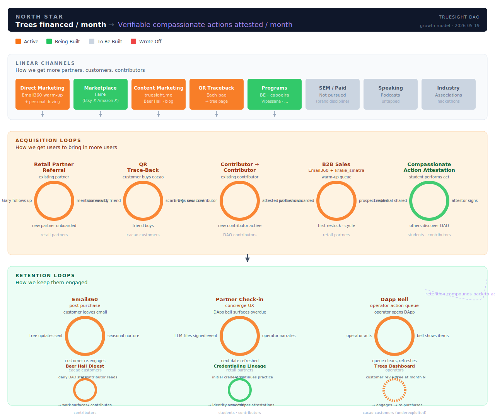
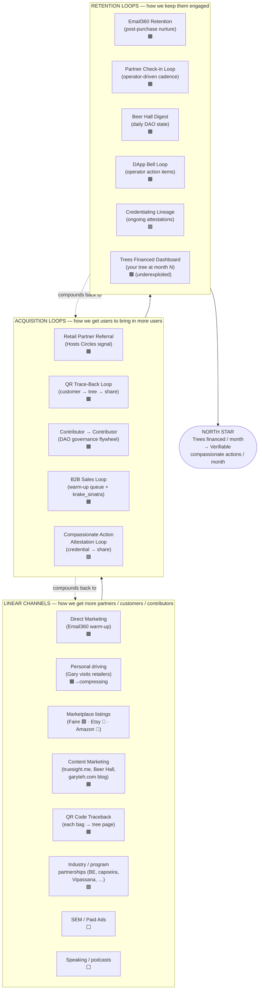

# TrueSight DAO — Growth Model



This document is the canonical growth picture for TrueSight DAO. It uses
the three-band Reforge-style shape (Linear Channels → Acquisition Loops →
Retention Loops) Gary previously used at GetData.IO, applied to the
TrueSight context.

It is intentionally machine-readable as well as visual: any LLM agent
(Claude, ChatGPT, Grok, Gemini, autopilot, krake_sinatra, etc.) reading
this file should be able to reason about which loops are load-bearing
today and which are aspirational, without needing the operator to
re-explain. Humans landing on the doc should be able to get the
structural picture from the SVG above in ~10 seconds, then drill into
the loops below.

---

## North star

**Today:** *Trees financed per month*

**Aperture widening (forthcoming):** *Verifiable compassionate actions
attested per month*

A tree financed is a verifiable compassionate action — the most legible
subset of it today because cacao is the surface that already produces a
clean unit (one bag → one tree). The transition is not a metric *swap*;
it is a *widening of the aperture* on the same underlying north star.

When credentialing volume (capoeira rodas, butterfly conservatory
attestations, future programs) reaches enough mass that "trees" no longer
captures the bulk of attested action, the headline number is relabelled
without redrawing the loops. The loops keep working. Only the *label*
moves. This is captured concretely in `CREDENTIALING_PLATFORM.md` §13.

**Why this choice (over alternatives):**

- *"Bags of cacao moved per month"* — operational and legible, but
  treats credentialing as a side project rather than the future of the
  org. Risk: incentivises optimising cacao at credentialing's expense.
- *"Active monthly DAO contributors"* — governance-health proxy, but too
  far from the customer-facing surfaces that drive growth.
- *"Verifiable compassionate actions"* (today) — directionally correct
  but the surface is too small today to anchor weekly decisions.

Picking trees → compassionate-actions keeps both surfaces (cacao retail
+ credentialing) pulling on the same rope. Anything that grows trees
also grows attested actions. No conflict.

---

## Status legend

| Marker | Meaning |
|---|---|
| 🟧 **Active** | Shipping, producing measurable signal today |
| 🟩 **Being Built** | Code or process landing this quarter |
| ⬜ **To Be Built** | Concept identified, not yet scoped |
| 🔻 **Wrote Off** | Tried and abandoned; documented for future sessions to not retry |

---

## The picture



The bands feed each other: linear channels seed the acquisition loops;
acquisition loops produce users who then enter retention loops; retention
loops compound back (referrals re-enter acquisition; engaged contributors
become channel-builders).

---

## Linear Channels — *how we get more partners / customers / contributors*

| Channel | Status | What it does today | Where it lives |
|---|---|---|---|
| Direct Marketing — warm-up email | 🟧 | Cold outreach to retail venues via `warmup_review.html` queue, drafts generated by Email360 + reviewed by operator | `dapp/warmup_review.html`, `RETAILER_FUNNEL_PROPOSAL.md` |
| Personal driving | 🟧 → compressing | Historical wedge; now graduating into LLM-managed surface (Partner Check-in concierge UX) | `project_partner_check_in_2026-05-12.md` |
| Marketplace listings — Faire | 🟩 | New v0 inventory-sync + drift-detection landing now; orders → ledger via `[INVENTORY MOVEMENT EVENT]` with `channel=Faire` | (forthcoming) `sync_faire_listings.py` |
| Marketplace listings — Etsy | 🔻 | App banned by Etsy 2026-05-19; passive listings only, no integration | (this doc) |
| Marketplace listings — Amazon | 🔻 | Dormant; brand-flattening concern; no engineering investment | (this doc) |
| Content Marketing | 🟧 | truesight.me, Beer Hall daily digest, garyteh.com long-form | `LLM_DISCOVERY_SURFACE.md`, `EDITORIAL_TONE.md` |
| QR Code traceback | 🟧 | Each cacao bag QR scan → tree-financed page on truesight.me, customer reveal of supply-chain lineage | `AGROVERSE_QR_CODE_BATCH_GENERATION.md` |
| Industry / program partnerships | 🟩 | BE / capoeira / Vipassana onboarding via credentialing platform | `CREDENTIALING_PLATFORM.md`, `BUTTERFLY_EFFECT_COHORT_ONBOARDING_PLAN.md` |
| SEM / Paid Advertising | ⬜ | Not pursued; cost discipline + brand-story preservation | n/a |
| Speaking / podcasts | ⬜ | Untapped surface; Gary has done some hackathon presence | n/a |

---

## Acquisition Loops — *how we get users to bring in more users*

Each loop is a self-referencing cycle: existing users in the system
produce signal / artefacts that bring in more users without proportional
operator labour. **A channel that doesn't compound on itself is not a
loop — it's just a channel.**

### Retail Partner Referral Loop 🟧

```
existing partner (e.g. Lulu's, FounderHaus)
   → mentions Agroverse to nearby venue (Hit List col AW "Hosts Circles")
   → Gary / Email360 follows up with referred venue
   → new partner onboarded (signed [CONTRIBUTOR ADD] + [ASSET RECEIPT])
   → new partner now in position to refer again
```

- **Population:** Retail partners
- **Telemetry:** new-partner-acquisition rate where source = "referred by partner X"
- **North-star impact (today):** each new partner increases bag throughput → trees financed
- **Aperture widening:** each new partner is also a potential attestor surface for future credentialing programs
- **Bottleneck:** partner density per metro — referrals saturate after ~10 venues per region
- **Reference:** `project_hit_list_circles_filter.md`

### QR Trace-Back Loop 🟧

```
customer buys cacao at retail / agroverse.shop
   → scans QR on the bag
   → lands on truesight.me/<sku>/<tree-id>  (the tree-financed page)
   → sees the actual tree planted with their purchase
   → shares with a friend (Instagram, WhatsApp, in-person)
   → friend visits agroverse.shop or asks a partner about it
   → friend buys → new QR scan → cycle
```

- **Population:** Cacao customers
- **Telemetry:** QR scan rate, share rate from tree pages, repeat-customer rate
- **North-star impact (today):** direct — each cycle iteration plants another tree
- **Aperture widening:** the tree page is the early prototype of credential pages; same shape applied to compassionate actions
- **Bottleneck:** QR-page UX freshness, customer remembering / wanting to scan
- **Reference:** `AGROVERSE_QR_CODE_BATCH_GENERATION.md`, `agroverse_shop` repo

### Contributor → Contributor Loop 🟧

```
existing DAO contributor (governance, attestor, operator)
   → produces visible attested work (Beer Hall digest, public credential page)
   → brings in new contributor (partner operator, attestor, governance member)
   → new contributor onboarded via [CONTRIBUTOR ADD EVENT]
   → new contributor produces their own attested work
   → cycle
```

- **Population:** DAO contributors
- **Telemetry:** new-contributor rate, attestation density per contributor, governance-vote participation
- **North-star impact (today):** indirect — more contributors → more surfaces → more trees
- **Aperture widening:** direct — each new contributor is themselves a potential attestor for credentialing
- **Bottleneck:** onboarding friction for non-technical contributors; Edgar-key-management UX
- **Reference:** `CREDENTIALING_PLATFORM.md`, `dapp/governor_contributor_admin.html`

### B2B Sales Loop 🟧

```
warm-up email queue surfaces qualified lead
   → operator (Gary) or krake_sinatra reviews + sends
   → prospect replies / books call
   → relationship developed (Partner Check-in cadence)
   → partner onboarded → first restock → ongoing volume
   → partner becomes a referral source (feeds Loop 1)
```

- **Population:** Retail partners (acquisition)
- **Telemetry:** warm-up queue depth, reply rate, prospect-replied → onboarded conversion
- **North-star impact (today):** direct — each onboarded partner adds bag throughput
- **Aperture widening:** partners become attestors for the credentialing program if they host program activities (capoeira at a retail venue, e.g.)
- **Bottleneck:** operator review capacity on the warm-up queue (currently ~98 drafts pending per bell snapshot 2026-05-19)
- **Reference:** `RETAILER_FUNNEL_PROPOSAL.md`, `HIT_LIST_STATE_MACHINE.md`

### Compassionate Action Attestation Loop 🟩

```
student / contributor performs verifiable compassionate action
   (butterfly rescue, capoeira roda, Vipassana sit, tree-financing purchase, …)
   → signs [PRACTICE EVENT] or [CREDENTIALING ATTESTATION EVENT]
   → attestor (Shereen, mestre, sensei, etc.) signs attestation
   → public credential lands at truesight.me/credentials/#<slug>
   → student shares to social / employer / community
   → others discover DAO via credential page or QR
   → become new contributor (donates, contributes, refers a program) → cycle
```

- **Population:** Credentialing students / DAO contributors
- **Telemetry:** attestations per attestor-month, credential-share rate, credential → contributor conversion
- **North-star impact (today):** small — credentialing surface is small. Will become dominant when aperture widens.
- **Aperture widening:** this IS the aperture-widening loop. When this loop's output exceeds tree-financing's output, the north star relabels.
- **Bottleneck:** attestor density per lineage; without a credible attestor chain, attestations are performative
- **Reference:** `CREDENTIALING_PLATFORM.md`

---

## Retention Loops — *how we keep them engaged*

### Email360 Retention Loop 🟧

Customer leaves email at QR-scan or agroverse.shop checkout → Email360
sends seasonal cacao + tree-status content → customer re-engages /
re-purchases → cycle. Underexploited dimension: each Email360 retention
touch could include "your tree at month N" content from the tree-traceback
data, deepening the QR Loop into a multi-touch retention surface.

### Partner Check-in Loop 🟧

Operator-driven cadence (the one used to close out FounderHaus + Love of
Ganesha on 2026-05-19). DApp bell surfaces overdue partners → operator
narrates the offline event to LLM → signed `[PARTNER CHECK-IN EVENT]`
filed → `Next Check-in Date` refreshed → cycle. Captures the
concierge-UX pattern that lets one operator manage a wide partner network.
Reference: `PARTNER_CHECK_IN_IMPLEMENTATION.md`, `project_partner_check_in_2026-05-12.md`.

### Beer Hall Digest Loop 🟧

Contributor reads daily / weekly Beer Hall digest → engagement with DAO
state → contribution (vote, attestation, work) → digest reflects it →
contributor reads next digest seeing their own work surface → cycle.
Reference: `LLM_DISCOVERY_SURFACE.md`, `truesight_me_beta/scripts/build_stats_current.py`.

### DApp Notification Bell Loop 🟧

Operator opens DApp → bell surfaces pending action items (Outbound
Review · Partner Check-in follow-ups · Partner Stock attention · soon:
Faire attention) → operator acts on highest-friction item → cycle. The
core "what should I look at next" surface. Reference:
`DAPP_NOTIFICATION_BADGE.md`.

### Credentialing Lineage Loop 🟩

Student gets initial credential → continues practising / contributing →
ongoing attestations added to their CV → credential gains depth →
identity ownership deepens → retention via lineage. Pre-launches the
compassionate-action attestation loop's retention side. Reference:
`CREDENTIALING_PLATFORM.md`.

### Trees Financed Dashboard Loop 🟧 (*underexploited*)

Customer revisits truesight.me to check their tree's status → engagement
→ potential re-purchase. Currently passive: requires customer initiation.
Two cheap upgrades that would move this from passive to active:

- **Push-back via Email360**: monthly "your tree at month N — here's a
  satellite update" email tied to each tree's traceback ID.
- **Lineage credential for the customer themselves**: each cacao
  purchase mints a lightweight credential (`pk-hash` for the customer's
  optional email, "supporter #N of Fazenda Santa Ana", etc.). Customers
  who opt in become entries in the contributor lineage even without
  taking governance action.

The second upgrade would shift this from retention to *acquisition* —
satisfied customers become public lineage entries that are themselves
shareable artefacts. Probably worth a follow-up scope.

---

## Operator surfaces that power the loops

The loops aren't abstractions — they're powered by concrete plumbing
that already exists. For any LLM session orienting to TrueSight, this
table maps loop → operator surface:

| Loop | Primary operator surface | Reference doc |
|---|---|---|
| Direct Marketing (channel) | `dapp/warmup_review.html` | `RETAILER_FUNNEL_PROPOSAL.md` |
| Personal driving (channel) | `dapp/partner_check_in.html` | `project_partner_check_in_2026-05-12.md` |
| QR Code traceback (channel) | each `truesight.me/<sku>/<tree-id>` page | `AGROVERSE_QR_CODE_BATCH_GENERATION.md` |
| Retail Partner Referral | Hit List col AW "Hosts Circles" sorted | `project_hit_list_circles_filter.md` |
| B2B Sales Loop | DApp bell "Outbound Review" + `warmup_review.html` | `DAPP_NOTIFICATION_BADGE.md` |
| Contributor → Contributor | `dapp/governor_contributor_admin.html` + `[CONTRIBUTOR ADD EVENT]` | `CREDENTIALING_PLATFORM.md` |
| Compassionate Action Attestation | `lineage-credentials/programs/*/manifest.json` + program sites | `CREDENTIALING_PLATFORM.md` |
| Email360 Retention | Email360 platform + `tokenomics/google_app_scripts/.../*.gs` (TBD: confirm exact dir) | `RETAILER_FUNNEL_PROPOSAL.md` (related) |
| Partner Check-in | `dapp/partner_check_in.html` + DApp bell | `PARTNER_CHECK_IN_IMPLEMENTATION.md` |
| Beer Hall Digest | `truesight.me/llms.txt` + `stats/*.json` + `truesight.me/beerhall/*.html` | `LLM_DISCOVERY_SURFACE.md` |
| DApp Bell Loop | `dapp/js/notifications.js` + GAS endpoints | `DAPP_NOTIFICATION_BADGE.md` |
| Credentialing Lineage | `truesight.me/credentials/#<slug>` + `lineage-engine` | `CREDENTIALING_PLATFORM.md` |
| Trees Financed Dashboard | `truesight.me/<sku>/<tree-id>` + treasury cache | `AGROVERSE_QR_CODE_BATCH_GENERATION.md` |

When a new loop is added to the model, **its operator surface must exist
or be in flight**. If you find yourself drawing a loop without a concrete
operator surface to anchor it, it's a wish-list item, not a loop.

---

## Anti-patterns deliberately not in the model

Several growth-tactics are intentionally absent. Recording them here so a
future session doesn't try to add them by accident:

- **Influencer / paid creator marketing.** Brand-story preservation
  argument: paid endorsements flatten the lineage thesis. Free / earned
  mentions from contributors (e.g. capoeira mestres talking about it
  organically) are fine; paid placement is not.
- **Marketplaces beyond Faire (Etsy, Amazon).** Algorithm-driven
  flattening + integration gating make them wrong-shape. See the 🔻
  entries in the channels table.
- **Aggressive email retention sequences ("we miss you!" reactivation
  campaigns).** Email360 retention is purposeful + low-frequency. The
  anti-pattern doc `feedback_check_tracking_before_recommending_action.md`
  applies: don't nag users about activity they're already doing.
- **Founder-personality marketing (Gary on stage, Gary on podcasts as
  founder).** Public-facing positioning frames Gary as long-time
  contributor, not founder. See
  `feedback_gary_teh_supporter_not_founder.md` and
  `feedback_no_founding_member_term.md`.
- **Gamification of compassionate actions** (points, leaderboards,
  streaks for butterfly rescues). The lineage thesis depends on the
  attestor chain being credible; gamification produces performative
  attestations and erodes the chain.

---

## How to extend this model

When you notice a new loop forming in the org's behaviour:

1. **Identify the cycle.** It must self-reference — output produces
   input for the next iteration. A non-cyclic flow is a channel, not a
   loop.
2. **Identify the operator surface that powers it.** If there is no
   concrete surface (sheet, GAS, page, event type), the loop is
   conceptual until the surface ships.
3. **Pick the right band.** Acquisition loop = brings in new entities.
   Retention loop = keeps existing entities engaged. Some loops do both
   — pick the dominant effect.
4. **Set status honestly.** 🟧 only if it's producing measurable
   signal today. 🟩 only if code / process is actively landing this
   quarter. ⬜ for everything else.
5. **Update this doc.** Add an entry in the table + the relevant
   section + the operator-surfaces table. Append a one-line entry to
   `CONTEXT_UPDATES.md`. Update `PROJECT_INDEX.md` if cross-references
   change.
6. **Re-render the Mermaid block** at the top to match.

When a loop's status changes (e.g. 🟩 → 🟧 when it starts shipping
signal), edit in place rather than appending. The doc is current-state.

---

## Open questions

These shape the model but don't block its current state:

1. **Where exactly does Email360's data flow plug into the DAO ledger?**
   The retention loop is real and shipping, but its integration with
   the rest of the operator infrastructure (Edgar events, DApp bell)
   isn't fully captured. Worth a separate doc / cross-link.

2. **Is the "trees financed dashboard" upgrade (per-customer credential
   on opt-in) worth scoping as a Q3 build?** It would convert a passive
   retention surface into an acquisition loop. Decision deferred to
   when capoeira / BE attestor patterns prove out.

3. **Marketplace channel residue — keep Etsy listings live as
   passive surface or delist entirely?** Open ops question; tabled
   until Faire + agroverse.shop are stronger.

4. **krake_sinatra as a meta-loop.** Once operational, krake_sinatra
   isn't a loop per se — it's an *executive function* that amplifies
   the operator's effective bandwidth across multiple loops. May warrant
   its own section once shipped.

---

*This doc is the source of truth for TrueSight DAO's growth picture. A
public render at `truesight.me/growth-model.html` should mirror the
Mermaid block + status table — same data, hand-styled for visual
clarity. The markdown source here stays canonical for LLM consumption.*
