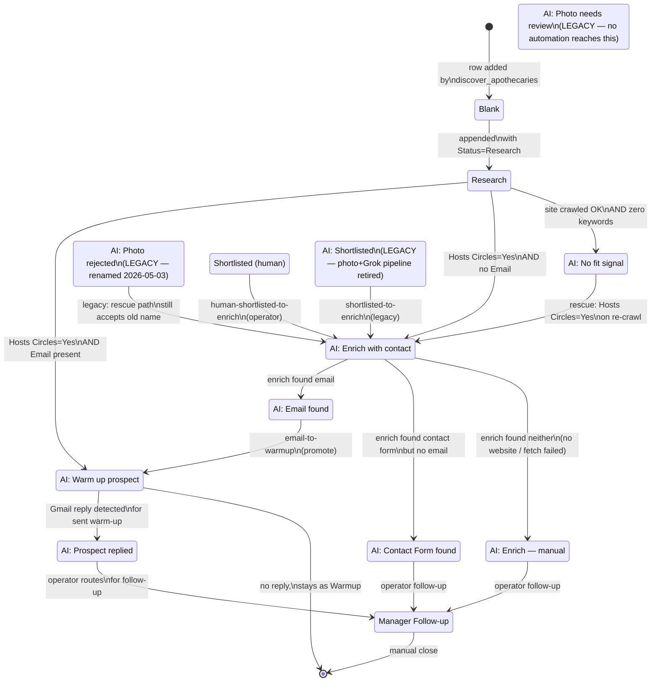

# Hit List state machine — states, transitions, and what each one means

_Last updated 2026-05-03 by Claude (Anthropic)._

The "Hit List" tab in
[spreadsheet 1eiqZr3LW-…](https://docs.google.com/spreadsheets/d/1eiqZr3LW-qEI6Hmy0Vrur_8flbRwxwA7jXVrbUnHbvc/edit?gid=0#gid=0)
holds every retail-prospect row the DAO is tracking. The **Status**
column drives a 13-state machine. This doc enumerates every state and
every transition so humans (and future LLMs) can reason about a row at
a glance.

## TL;DR

A row's life cycle:

```
(blank) → Research → AI: Enrich with contact → AI: Email found → AI: Warm up prospect → AI: Prospect replied → Manager Follow-up
```

with branches off `Research` for rejection (`AI: No fit signal`),
fast-tracking to warm-up (`AI: Warm up prospect` directly when the
Email column is already populated), and from Enrich for manual triage
(`AI: Contact Form found` / `AI: Enrich — manual`).

**Three states are LEGACY** — no automation writes them any more:

- **`AI: Photo rejected`** — renamed to `AI: No fit signal` on 2026-05-03 (PR #104) since the photo+Grok pipeline that originally produced it is retired. Existing rows in this state are still re-evaluated by the rescue path; once they cycle through, they end up either at `AI: Enrich with contact` (positive signal found) or migrated to `AI: No fit signal` (still no signal). The `scripts/rename_legacy_photo_rejected_status.py` one-off bulk-renames whatever's left.
- **`AI: Photo needs review`** — photo+Grok rubric was ambiguous. No replacement; manual triage only.
- **`AI: Shortlisted`** — photo+Grok said "looks like a fit." Operator-managed.

## Flow chart



## State definitions

| State | Meaning | Who reads it (consumer scripts) | Who writes it (writer scripts) |
|---|---|---|---|
| _(blank / new)_ | Just added; not yet evaluated. | `detect_circle_hosting_retailers.py` (only when Status==Research; blank rows ignored). | `discover_apothecaries_la_hit_list.py` (sets `Research` immediately, so blank is transient). |
| **Research** | Awaiting site-crawl qualification. Has at least Shop Name + Address. | `detect_circle_hosting_retailers.py` cron at :50. | `discover_apothecaries_la_hit_list.py` (Nearby Search appends new rows). |
| **AI: No fit signal** | Site crawled successfully and found **no** qualifying keywords (cacao ceremony / women's circle / sound bath / etc.). Recoverable: a re-crawl that later finds keywords promotes back to Enrich (rescue path, default-on). Renamed from legacy `AI: Photo rejected` on 2026-05-03 (PR #104) since the photo+Grok pipeline that originally produced the legacy name is retired. | `detect_circle_hosting_retailers.py` rescue path (reads both new + legacy names). | `detect_circle_hosting_retailers.py` (when crawl returns OK + zero matches). |
| ~~AI: Photo rejected~~ _(LEGACY)_ | Old name for the same condition as `AI: No fit signal` — renamed 2026-05-03 (PR #104). Rescue path still reads this name for back-compat. Operator can run `scripts/rename_legacy_photo_rejected_status.py` to bulk-migrate any remaining rows. | `detect_circle_hosting_retailers.py` rescue path. | _(legacy_; nothing new produces this name). |
| **AI: Enrich with contact** | Qualified. Needs Place Details lookup + email harvesting. | `hit_list_enrich_contact.py` cron at :35. | `detect_circle_hosting_retailers.py` (Hosts Circles=Yes + no email yet); `hit_list_promote_status.py` (`shortlisted-to-enrich`, `human-shortlisted-to-enrich`). |
| **AI: Email found** | Email harvested. Awaiting promotion to warm-up. | `hit_list_promote_status.py` (`email-to-warmup`). | `hit_list_enrich_contact.py` (when website crawl + Grok pick produced an email). |
| **AI: Contact Form found** | Only a contact form URL surfaced; no email. **Terminal automation state** — manual follow-up only. Never auto-promoted to warm-up. | None (operator). | `hit_list_enrich_contact.py`. |
| **AI: Enrich — manual** | Enrich couldn't find a website *or* a place_id (or both). Operator triage required. | None (operator). | `hit_list_enrich_contact.py`. |
| **AI: Warm up prospect** | Ready for warm-up Gmail draft. Email present. Drafts staged in `Email Agent Drafts` tab with `status='pending_review'` until operator sends from Gmail; review-time triage uses `preview_warmup_drafts.py` (see [Operator review loop](#operator-review-loop-warm-up-drafts) below). | `suggest_warmup_prospect_drafts.py` cron (creates drafts; doesn't change Hit List status); `preview_warmup_drafts.py` (read-only triage view). | `detect_circle_hosting_retailers.py` (Hosts Circles=Yes + email already present, fast-track); `hit_list_promote_status.py` (`email-to-warmup`). |
| **AI: Prospect replied** | Gmail detected an inbound reply to our warm-up. Operator should triage. | None directly (operator); `backfill_warmup_reply_remarks.py` for audit logging. | `backfill_warmup_reply_remarks.py` / `backfill_all_warmup_replies.py` when reply detected. |
| **Manager Follow-up** | Operator-claimed row needing follow-up Gmail draft. | `suggest_manager_followup_drafts.py` cron (creates drafts). | Operator (manual) or downstream operator process. |
| **Shortlisted** _(human)_ | Human-confirmed fit during manual triage. | `hit_list_promote_status.py` (`human-shortlisted-to-enrich`). | Operator (manual). |
| ~~AI: Shortlisted~~ _(LEGACY)_ | Old: photo+Grok rubric said "looks like a fit." | `hit_list_promote_status.py` (`shortlisted-to-enrich`) still consumes; nothing produces. | _(legacy_; `hit_list_research_photo_review.py` cron retired in PR #101). |
| ~~AI: Photo needs review~~ _(LEGACY)_ | Old: photo+Grok ambiguous, manual triage required. | None (operator). | _(legacy_; same retired cron). |

## Transitions

### From `(blank / new)`
| → State | Trigger | Condition |
|---|---|---|
| `Research` | `discover_apothecaries_la_hit_list.py` (manual `workflow_dispatch`) | Nearby Search returned a new place_id; row appended. |

### From `Research`
| → State | Trigger | Condition |
|---|---|---|
| `AI: Warm up prospect` | `detect_circle_hosting_retailers.py` (cron `:50 * * * *`) | Hosts Circles=Yes (positive site signal) **AND** Email column already populated. Fast-tracks past Enrich since email is the only thing Enrich would have produced. |
| `AI: Enrich with contact` | `detect_circle_hosting_retailers.py` (cron `:50`) | Hosts Circles=Yes **AND** Email column empty. |
| `AI: No fit signal` | `detect_circle_hosting_retailers.py` (cron `:50`) | Site crawled OK + zero keyword matches. Default ON; pass `--no-reject-no-signal` to opt out. Renamed from legacy `AI: Photo rejected` on 2026-05-03. |

### From `AI: No fit signal` _(or legacy `AI: Photo rejected`)_
| → State | Trigger | Condition |
|---|---|---|
| `AI: Enrich with contact` | `detect_circle_hosting_retailers.py` (cron `:50`, default-on rescue) | Re-crawl found qualifying keywords (signal appeared after the original rejection — e.g. site updated). Rescue path reads BOTH the new name and the legacy `AI: Photo rejected` for back-compat. |

### From `Shortlisted` (human) / `AI: Shortlisted` (legacy)
| → State | Trigger | Condition |
|---|---|---|
| `AI: Enrich with contact` | `hit_list_promote_status.py` (manual or scheduled) | Has Website OR place_id in Notes (so Enrich has something to work with). Pass `--skip-contact-guardrail` to bypass. |

### From `AI: Enrich with contact`
| → State | Trigger | Condition |
|---|---|---|
| `AI: Email found` | `hit_list_enrich_contact.py` (cron `:35 * * * *`) | Place Details lookup + website crawl + Grok email pick produced a confirmed email. |
| `AI: Contact Form found` | `hit_list_enrich_contact.py` (cron `:35`) | No email surfaced, but a contact form URL did. **Terminal** — manual follow-up only. |
| `AI: Enrich — manual` | `hit_list_enrich_contact.py` (cron `:35`) | No website, no place_id, or all crawls failed. Manual triage. |

### From `AI: Email found`
| → State | Trigger | Condition |
|---|---|---|
| `AI: Warm up prospect` | `hit_list_promote_status.py email-to-warmup` (cron `:20 * * * *`) | Email column non-empty + has reasonable structure. Lower default `--limit` than the other promotion modes since this triggers actual outbound drafts downstream. |

### From `AI: Warm up prospect`
| → State | Trigger | Condition |
|---|---|---|
| `AI: Prospect replied` | `backfill_warmup_reply_remarks.py` / `backfill_all_warmup_replies.py` (manual / scheduled) | Gmail detected an inbound reply from the prospect's address to our warm-up thread. |
| _(stays)_ | `suggest_warmup_prospect_drafts.py` (cron) | Creates Gmail draft + appends row to `Email Agent Drafts` (`status='pending_review'`, `gmail_label='AI/Warm-up'`). Hit List status **does not change** here — operator review + send happens out-of-band. |
| _(stays — review loop)_ | `preview_warmup_drafts.py` (manual) | Generates a tiered HTML triage view of all `pending_review` warm-up drafts (linter flags risky ones, surfaces Hosts Circles=Yes prospects, clusters clean drafts for batch send). Read-only — operator still sends from Gmail. |

### From `AI: Prospect replied`
| → State | Trigger | Condition |
|---|---|---|
| `Manager Follow-up` | Operator (manual) | Operator routes the reply for follow-up Gmail drafting. |

### Manual triage states
`AI: Contact Form found`, `AI: Enrich — manual`, `AI: Photo needs review` (legacy) — these are operator endpoints. Cron does not move them anywhere; operator decides whether to find an email manually, switch to a different shop, or close the row.

## Cron schedule that drives the machine

| Cron | Workflow | What it does | Reads | Writes |
|---|---|---|---|---|
| `:00 * * * *` | _(disabled — was photo review)_ | Retired in PR #101. Workflow kept as `workflow_dispatch` for manual debugging only. | — | — |
| `:20 * * * *` | `hit_list_promote_status.py` | `shortlisted-to-enrich` + `email-to-warmup` promotions. | `AI: Shortlisted`, `Shortlisted`, `AI: Email found` | `AI: Enrich with contact`, `AI: Warm up prospect` |
| `:20 * * * *` | `field_agent_location_places_pull.py` | Pulls Place Details for new field-agent-logged locations. | other sheet (Recent Field Agent Location) | appends new `Research` rows to Hit List |
| `:35 * * * *` | `hit_list_enrich_contact.py` | Enrich queue + fill-gap sweep. | `AI: Enrich with contact` (queue) + any row with field gaps | `AI: Email found` / `AI: Contact Form found` / `AI: Enrich — manual` |
| `:50 * * * *` | `detect_circle_hosting_retailers.py` | Site crawl, Hosts Circles writeback, Research promotion + rescue + reject. | `Research`, `AI: No fit signal`, legacy `AI: Photo rejected` | `AI: Warm up prospect` / `AI: Enrich with contact` / `AI: No fit signal` |
| Manual | `discover_apothecaries_la_hit_list.py` | Nearby Search across centroids → appends new `Research` rows. | — | new rows with Status=`Research` |
| Manual | `suggest_warmup_prospect_drafts.py` | Creates Gmail drafts for `AI: Warm up prospect` rows with Email. | `AI: Warm up prospect` | _none_ (drafts only — appends rows to `Email Agent Drafts` for review) |
| Manual | `preview_warmup_drafts.py` | Renders an HTML triage view of all `pending_review` warm-up drafts. Linter flags risky ones; clean cohort gets a glance + send, flagged cohort gets opened individually. Read-only — output to `scripts/output/warmup_batch_preview/<timestamp>.html` (gitignored). | `Email Agent Drafts` (`status='pending_review'`, `gmail_label='AI/Warm-up'`), Hit List (Hosts Circles, City/State, Notes), DApp Remarks (history count). | _none_ (read-only) |
| Manual | `suggest_manager_followup_drafts.py` | Creates Gmail follow-up drafts. | `Manager Follow-up` | _none_ (drafts only) |

## Operator review loop (warm-up drafts)

When `suggest_warmup_prospect_drafts.py` runs (manual trigger), drafts pile
up in two places that the operator interacts with:

1. **Gmail** — every draft is created in the operator's mailbox and labeled
   `AI/Warm-up`. The drafts are visible at
   [`https://mail.google.com/mail/u/0/#label/AI%2FWarm-up`](https://mail.google.com/mail/u/0/#label/AI%2FWarm-up).
2. **`Email Agent Drafts` tab** of the Hit List spreadsheet — one row per
   draft, `status='pending_review'`, holding `gmail_draft_id`,
   `body_preview` (~500 chars), and metadata.

The loop **before 2026-05-03** was: open every draft in Gmail, skim,
send. Uniform attention across a non-uniform population (some drafts
are clean boilerplate, others have real failure modes — generic `info@`
recipient, body falls back to `"your shop"`, foreign-script venue, etc).

The loop **after 2026-05-03** (PR [`go_to_market#106`](https://github.com/TrueSightDAO/go_to_market/pull/106)):

```
$ cd market_research
$ python3 scripts/preview_warmup_drafts.py
```

This:

- Reads every `pending_review` warm-up draft from `Email Agent Drafts`.
- Fetches the full subject + body of each from the Gmail API.
- Cross-references the Hit List for **Hosts Circles=Yes** (high-leverage
  prospect — gets a blue badge), City/State, Notes.
- Looks up DApp Remarks count per shop name (cold first touch vs prior
  history).
- Runs a 12-rule linter:
  - **Red** (review): `subject_empty`, `body_empty`, `body_too_short`,
    `fallback_shop_name`, `generic_inbox` (`info@`/`sales@`/`hello@`/…),
    `no_first_name` ("Hi there" salutation), `foreign_script` (Cyrillic /
    CJK / Arabic), `unrendered_placeholder`.
  - **Yellow** (glance worthwhile): `no_city_state`, `no_hit_list_notes`,
    `no_dapp_history`.
  - **Blue** (informational): `hosts_circles`.
- Renders a single static HTML page sorted **red-first**, opens in
  default browser, writes to
  `market_research/scripts/output/warmup_batch_preview/<timestamp>.html`
  (gitignored).

**What to expect in the inbox after running this:**

- The HTML shows each draft with: recipient + shop + city, subject (1
  line bold), flag badges (color-coded), "Open in Gmail" deep-link, and
  a collapsed body (`<details>` toggle) for inline read.
- The summary at top breaks down: `N pending` / `R flagged red` /
  `Y flagged yellow only` / `C clean` / `Z Hosts Circles=Yes`.
- Scan top-to-bottom: the reds and AW=Yes float up. Open those in Gmail
  (one click), edit if needed, send.
- The clean cohort (no red, no yellow flags) at the bottom is the
  glance-and-send batch — open the `AI/Warm-up` label in Gmail, scan
  the row, hit Send.
- **Send action stays manual** in Gmail — the script is read-only by
  design. It catches known failure modes; net-new failure modes need a
  human eye until a rule is added.

After sending, run `sync_email_agent_followup.py` to log sent messages
to the `Email Agent Follow Up` tab. Reply detection then flows through
the existing `Warm up prospect → Prospect replied` transition above.

A pairing follow-up is parked in `OPEN_FOLLOWUPS.md` (entry: "Warm-up
email A/B read-out") for **2026-05-11** to validate whether the new
default payload (PDF + 2 packaging photos, [`go_to_market#74`](https://github.com/TrueSightDAO/go_to_market/pull/74))
moved reply rate vs the PDF-only baseline. If reply rate stays healthy
AND no pattern of bad copy in the lint-reviewed sample, that's the
signal to drop the unflagged tier to fully auto-send.

## Anti-patterns / common gotchas

- **A row stuck in `Research` with no Website**: `detect_circle_hosting_retailers.py` skips rows without a Website, so they never get qualified. Operator should backfill Website manually (or run a discovery script that finds it).
- **A row in `AI: Email found` with empty Email**: `email-to-warmup` skips it. Either the email got cleared by accident (recoverable: edit Email cell, next cron picks it up) or Enrich set the wrong status (rare).
- **A row in `AI: Warm up prospect` for weeks with no draft**: `suggest_warmup_prospect_drafts.py` is manual-trigger-only. Operator should run it explicitly. After running it, run `preview_warmup_drafts.py` to triage the batch before opening Gmail.
- **A draft sitting at `pending_review` for days**: review with `preview_warmup_drafts.py`; the draft is in the operator's Gmail under label `AI/Warm-up`. If the linter flags it red and you don't trust the copy, edit in Gmail or delete the draft (next cron will re-suggest after the cadence window).
- **A row in `AI: Photo needs review` from old data**: legacy state. No automation will move it. Manually re-set to `Research` to re-qualify under the new pipeline.
- **The Hosts Circles column (col AW)** is the canonical "did we crawl this site for cacao-ceremony keywords yet" signal. Empty = not crawled. `Yes (...)` = positive. `Not detected` = crawled, no keywords. The state machine relies on this column being honest.

## See also

- [`PLACES_API_CACHING.md`](./PLACES_API_CACHING.md) — how Place Details caching works, including the `place_id` lookup that Enrich does.
- [`PARTNER_OUTREACH_PROTOCOL.md`](./PARTNER_OUTREACH_PROTOCOL.md) — manual partner-outreach playbook (orthogonal to the cron pipeline).
- [`HIT_LIST_CONTACT_ENRICHMENT.md`](./HIT_LIST_CONTACT_ENRICHMENT.md) — deeper dive on the Enrich step.
- `market_research/scripts/hit_list_promote_status.py --help` — modes for the promotion cron.
- `market_research/scripts/detect_circle_hosting_retailers.py --help` — qualification cron.
