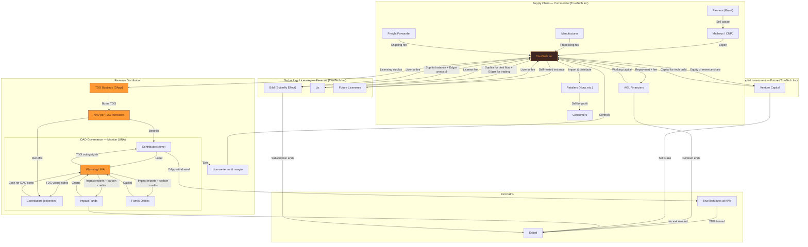

# Legal Entity Structuring Proposal — TrueSight DAO

**Prepared:** 2026-06-22
**Context:** SVH Capital cacao circle — June 26
**Author:** Sophia (TrueSight DAO Autopilot)

---

## The Problem

Two signals turning from grey to red:

| Signal | Why |
|--------|-----|
| **No DAO legal wrapper** | No member liability shield, no clear answer for "what entity do TDG holders govern?" |
| **Personal bank account** | Gary's personal account is the bottleneck — more volume = more personal risk |

---

## The Solution

**Form a Wyoming UNA via OtoCo this week. Cost: ~$50 gas.**

That's it. The UNA is a legal entity with:
- Liability protection for members
- A clear answer for TDG holders: "you govern the UNA"
- **No bank account needed** — TrueTech Inc handles all money flows

If we later hit 100+ members by mutual consent under a governing agreement, we can elect to form a DUNA. But the UNA works today.

---

## The Structure

```
Wyoming UNA (nonprofit, DAO legal wrapper) — formed this week for ~$50
    ├── No bank account needed — TrueTech Inc handles all money flows
    ├── TDG holders govern the UNA (pseudonymous — wallet only)
    └── Contractual relationship with TrueTech Inc

TrueTech Inc (Delaware C-corp, independent entity)
    ├── Own cap table and shareholders (Gary)
    ├── Own bank account (ALL money flows: commercial, partner contributions, buybacks)
    ├── May buy back TDG at NAV using operating cash reserves (discretionary)
    └── Buyback reserve formula published on truesight.me

Brazilian LTDA (CNPJ) = export facility (eventual future goal)
```

### Key decisions (already resolved)

| Decision | What |
|----------|------|
| TrueTech Inc | Independent entity, not a DUNA subsidiary. Separate cap table. Contractual relationship. Avoids UBIT. |
| Bank accounts | **One account** — TrueTech Inc handles everything. UNA doesn't need its own. |
| TDG buyback | TrueTech may buy back at NAV using operating cash. Formula on truesight.me. Discretionary, not guaranteed. |
| Wise | Primary banking platform. $0 to open, no minimum deposit. Handles standard transfers + PIX. Venmo/Zelle/Western Union executed manually. |
| Withdrawal flow | Member submits DApp request → TrueTech issues cash → TDG deducted from ledger → burned |

---

## Ecosystem Map



---

## Capital Channels: How Partners Inject Resources, What They Get, How They Exit

### Channel 1: Contributors (Time / Labor)

**Who:** Individuals like Nora, Kirsten, Matheus, developers, community members

| Step | What Happens |
|------|-------------|
| **Inject** | Contribute time, labor, expertise, or in-kind resources |
| **Get** | TDG voting rights in the UNA — governance over mission, budget, partnerships |
| **Exit** | Submit DApp withdrawal request → TrueTech Inc buys back at NAV from operating cash → TDG burned |

**Constraints:** Buyback is discretionary, subject to available reserves per the formula on truesight.me. No guaranteed exit.

---

### Channel 2: Shipment Financiers (AGL Contracts)

**Who:** Individuals or entities financing cacao shipments

| Step | What Happens |
|------|-------------|
| **Inject** | Working capital to purchase cacao shipment |
| **Get** | Repayment + fee from shipment sale proceeds |
| **Exit** | Contract ends when shipment sells — capital returned with fee |

**Counterparty:** TrueTech Inc (commercial entity). Not the UNA.

**Why this works:** Self-liquidating — capital comes in, shipment sells, capital goes back out. No retained asset base needed.

---

### Channel 3: Impact Funds / Family Offices (Mission-Aligned Capital)

**Who:** Foundations, family offices, HNWIs who want to fund tree planting

| Step | What Happens |
|------|-------------|
| **Inject** | Grant or donation to the UNA |
| **Get** | Impact reports, verified tree-planting data, future carbon credit rights, naming rights |
| **Exit** | No financial exit needed — pure impact. If 501(c)(3) obtained later, contribution can convert to tax-deductible status. |

**Counterparty:** UNA (nonprofit). Not TrueTech Inc.

**Current NAV reality check:** Total DAO assets ~$4,126 ÷ 2,306,000 TDG issued = **~$0.0018/TDG**. Any fund buying TDG at $1/TDG would be paying 555x NAV — irrational. Impact funds should grant to the UNA for mission outcomes, not buy TDG for financial return.

**When this channel activates:** When a genuine donation-type funder appears. At that point, the UNA gets its own bank account.

---

### Channel 4: Venture Capital (Future Optionality)

**Who:** VCs who want to fund technology development

| Step | What Happens |
|------|-------------|
| **Inject** | Capital to build DApp, oracle, QR tracking, carbon credit system |
| **Get** | Equity or revenue share in TrueTech Inc (not the UNA — avoids nonprofit conflict) |
| **Exit** | Sell equity stake, revenue-share buyout, or secondary sale |

**Counterparty:** TrueTech Inc (for-profit). Not the UNA.

**Why this is future optionality, not now:**
- TrueTech Inc currently has **no retained asset base** — it's a pass-through trading company. Capital comes in, shipment sells, 80% returns to financier, 20% retained as thin reserve.
- No IP, no hard assets, no growing balance sheet to invest in.
- **If** a licensing model emerges (e.g. Bilal from Butterfly Effect Club wants his own Sophia instance for his investment fund), TrueTech Inc would have recurring licensing revenue + IP assets — making it VC-investable.

**Licensing scenario:**
```
TrueTech Inc builds software stack (Edgar, DApp, oracle, QR system)
    → Licenses to orgs like Butterfly Effect Club who want their own instance
    → Licensing revenue feeds buyback reserve
    → TrueTech Inc now has an asset base → VC-investable
```

**Skepticism:** In the age of AI, anyone can spin up a basic DApp. The real moat isn't the code — it's the **network and data flywheel**:

```
Ecosystem (farmers, partners, shipments)
    ↓ Generates raw operational data
DAO operations (QR scans, contributions, governance votes, supply chain events)
    ↓ Feeds
Sophia (autopilot) + Edgar (API)
    ↓ Learns and improves
Better automation, better decisions, better protocols
    ↓ Gets licensed back to
New orgs who want their own instance
```

The code can be cloned. The network of verified farmers, provenance data, and governance trust cannot. And that network lives in the **UNA** — governed by TDG holders — not in TrueTech Inc.

---

### Channel 5: Technology Licensors (Future Optionality)

**Who:** SMEs, cooperatives, other DAOs who want the operational infrastructure without building it

| Step | What Happens |
|------|-------------|
| **Inject** | Licensing fee to TrueTech Inc |
| **Get** | Self-hosted instance of the DAO stack (Edgar, DApp, oracle, QR system) — their data stays with them |
| **Exit** | Subscription ends, they keep their data |

**Counterparty:** TrueTech Inc (for-profit).

**Why this matters:** Bilal (Butterfly Effect Club) wants to use Sophia for his investment fund to support a team of 5. Liz wants to use Sophia for deal flow management and Edgar's protocol for her own trading operations. Both want their own instance — their data stays with them. A self-hosted licensing model solves this.

---

## Revenue Distribution Model

### The Principle

The DAO is the **proving ground** — it surfaces bugs, edge cases, and feature gaps through real operations. The technology gets battle-tested here, then the polished product gets licensed out.

### The Flow

```
Licensing revenue → TrueTech Inc (collects)
    → TrueTech Inc margin (operational costs, support, hosting)
    → Surplus → TDG buyback from DApp → burned
    → All TDG holders benefit via NAV growth
```

### Who Governs the Terms

| What | Who Decides |
|------|-------------|
| Minimum license fee | DAO governance (TDG vote) |
| TrueTech Inc margin cap | DAO governance (TDG vote) |
| Buyback allocation % | DAO governance (TDG vote) |
| Licensee approval | DAO governance (TDG vote) |

### Why This Works

- **TrueTech Inc** handles the commercial side (contracts, invoices, support, liability) — it's a for-profit C-corp, so it can do this cleanly
- **The UNA** never touches the money directly — avoids UBIT and 501(c)(3) jeopardy
- **TDG holders** benefit through NAV growth (buyback → burned → deflationary pressure) — not through direct revenue distribution
- **DAO governance** controls the economics without touching the money — sets the terms, TrueTech Inc executes

### The Data Flywheel Moat

```
Ecosystem → raw operational data → DAO operations
    → Sophia + Edgar learn and improve
    → Better automation, better protocols
    → Licensed back to new orgs
    → More data from licensees (anonymized) → flywheel accelerates
```

The code can be cloned. The network of verified farmers, provenance data, and governance trust cannot. And that network lives in the **UNA** — governed by TDG holders — not in TrueTech Inc.

---

## Design Constraint: Ecosystem Stability

Any new capital channel must not destabilize the TDG buyback mechanism. TrueTech Inc's buyback capacity is finite — it comes from operating cash flow.

**Guardrails:**
1. **Lockups for capital-injected TDG** — funds that buy in with money get vesting schedules (e.g. 2-year cliff). Contributors who earned TDG through labor have priority exit.
2. **Published reserve cap** — formula on truesight.me explicitly states maximum redemption capacity. If TDG issuance exceeds it, new issuances pause.
3. **NAV self-limits capital channels** — at current NAV ($0.0018/TDG), no rational fund would buy TDG above NAV. The channel is naturally self-limiting.

---

## What We're Doing This Week

| Action | Cost | Timeline |
|--------|------|----------|
| Form UNA via OtoCo (2 wallets sign) | ~$50 gas | 1 day |
| Open TrueTech Inc Wise Business account | **$0** (no fees, no minimum deposit) | 1-2 days |

**Total cost: ~$50.** We have ~$4,126 in the Main Ledger.

---

## The One Question for SVH Capital

> "We're forming a Wyoming UNA via OtoCo this week. TDG is issued to contributors for work and grants governance rights. An independent affiliated C-corp (TrueTech Inc) may, at its discretion, buy back TDG at net asset value (total DAO assets ÷ total TDG issued) from its own operating cash. Does TDG constitute a security under Howey?"

The structure is resolved. We just need a narrow legal opinion on whether TDG — including the buyback feature — is a security.

---

## What We're NOT Doing (Yet)

| Thing | Why Not | When |
|-------|---------|------|
| Impact fund channel | No committed backend | When a donation-type funder appears |
| UNA bank account | TrueTech handles all flows | Only if impact fund capital requires it |
| 501(c)(3) application | $2K-10K | 6-12 months |
| Brazilian CNPJ ownership | $1K-3K + counsel | Future |
| DUNA formation | Need 100+ members by consent | When eligible |
| Multi-entity accounting | $2K-5K/yr | When revenue grows |
| VC investment | No retained asset base yet | If licensing revenue materializes |

---

*Prepared by Sophia Truesight (admin+sophia@truesight.me)*
*TrueSight DAO Autopilot*