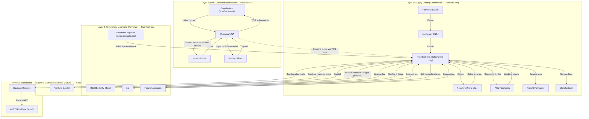

# Legal Entity Structuring Proposal v2 — Full Capital Channels Map

**TrueSight DAO** | Internal Reference Document

---

## Ecosystem Overview



---

## Capital Channels

### Channel 1: Contributors (Time / Labor)

**Who:** Individuals like Nora, Kirsten, Matheus, developers, community members

| Step | What Happens |
|------|-------------|
| **Inject** | Contribute time, labor, expertise, or in-kind resources |
| **Get** | TDG voting rights in the UNA — governance over mission, budget, partnerships |
| **Exit** | Submit DApp withdrawal request → TrueTech Inc buys back at NAV from operating cash → TDG burned |

**Constraints:** Buyback is discretionary, subject to available reserves per the formula on truesight.me. No guaranteed exit.

---

### Channel 2: Shipment Financiers (AGL Contracts)

**Who:** Individuals or entities financing cacao shipments

| Step | What Happens |
|------|-------------|
| **Inject** | Working capital to purchase cacao shipment |
| **Get** | Repayment + fee from shipment sale proceeds |
| **Exit** | Contract ends when shipment sells — capital returned with fee |

**Counterparty:** TrueTech Inc (commercial entity). Not the UNA.

**Why this works:** Self-liquidating — capital comes in, shipment sells, capital goes back out. No retained asset base needed.

**Note for counsel:** This pattern (individuals financing shipments for a return from sale proceeds) may raise a separate securities question under Reves (promissory note / investment contract). It is not covered by the TDG Howey analysis.

---

### Channel 3: Impact Funds / Family Offices (Mission-Aligned Capital)

**Who:** Foundations, family offices, HNWIs who want to fund tree planting

| Step | What Happens |
|------|-------------|
| **Inject** | Grant or donation to the UNA |
| **Get** | Impact reports, verified tree-planting data, naming rights |
| **Exit** | No financial exit needed — pure impact. If 501(c)(3) obtained later, contribution can convert to tax-deductible status. |

**Counterparty:** UNA (nonprofit). Not TrueTech Inc.

**Important:** Carbon credit rights are NOT granted to donors. Credits have fair market value and would reduce deductibility. Credits go to commercial funders (Channel 2/5) only.

**Current NAV reality check:** Total DAO assets ~$4,126 ÷ 2,306,000 TDG issued = **~$0.0018/TDG**. Any fund buying TDG at $1/TDG would be paying 555x NAV — irrational. Impact funds should grant to the UNA for mission outcomes, not buy TDG for financial return.

**When this channel activates:** When a genuine donation-type funder appears. At that point, the UNA gets its own bank account.

---

### Channel 4: Venture Capital (Future Optionality)

**Who:** VCs who want to fund technology development

| Step | What Happens |
|------|-------------|
| **Inject** | Capital to build DApp, oracle, QR tracking, carbon credit system |
| **Get** | Equity or revenue share in TrueTech Inc (not the UNA — avoids nonprofit conflict) |
| **Exit** | Sell equity stake, revenue-share buyout, or secondary sale |

**Counterparty:** TrueTech Inc (for-profit). Not the UNA.

**Why this is future optionality, not now:**
- TrueTech Inc currently has **limited retained asset base** — the cacao trading side is pass-through (capital in, shipment sells, 80% returns to financier).
- However, TrueTech Inc **already has IP** — the **Sentiment Importer** at purge.truesight.me is a live codebase with paying subscribers generating recurring subscription revenue.
- This subscription revenue already flows into the buyback reserve, boosting NAV per TDG.
- If the licensing model expands (Bilal, Liz), TrueTech Inc would have multiple recurring revenue streams + IP assets — making it VC-investable.

---

### Channel 5: Technology Licensors (Future Optionality)

**Who:** SMEs, cooperatives, other DAOs who want the operational infrastructure without building it

| Step | What Happens |
|------|-------------|
| **Inject** | Licensing fee to TrueTech Inc |
| **Get** | Self-hosted instance of the DAO stack (Edgar, DApp, oracle, QR system) — their data stays with them |
| **Exit** | Subscription ends, they keep their data |

**Counterparty:** TrueTech Inc (for-profit).

**Why this matters:** Bilal (Butterfly Effect Club) wants to use Sophia for his investment fund to support a team of 5. Liz wants to use Sophia for deal flow management and Edgar's protocol for her own trading operations. Both want their own instance — their data stays with them. A self-hosted licensing model solves this.

---

## Revenue Distribution Model

```
Subscription revenue (Sentiment Importer) → TrueTech Inc (collects)
Licensing revenue (future) → TrueTech Inc (collects)
    → TrueTech Inc margin (operational costs)
    → Surplus → Buyback reserve → Boosts NAV per TDG
    → All TDG holders benefit

DAO governance (TDG holders) sets:
    - Minimum license fee
    - TrueTech Inc margin cap
    - Buyback allocation percentage
```

The UNA never touches the money directly (nonprofit constraint). But TDG holders control the economics through governance. The surplus from subscription and licensing revenue directly increases the NAV calculation (total assets ÷ total TDG), making every holder's TDG more valuable.

**This is already happening.** The Sentiment Importer's subscription revenue is live and flowing into the buyback reserve today.

---

## The Data Flywheel Moat

The ecosystem isn't just a customer of the technology — it's the **training ground** for it.

```
Ecosystem (farmers, partners, contributors, shipments)
    ↓ Generates raw operational data
TrueSight DAO operations (QR scans, contributions, governance votes, supply chain events)
    ↓ Feeds
Sophia (autopilot) + Edgar (API) + Sentiment Importer
    ↓ Learns and improves
Better automation, better decisions, better protocols
    ↓ Gets licensed back to
New orgs (Bilal, Liz) who want their own instance
```

The moat isn't the code — it's the **data flywheel**. Every cacao bag scanned, every contribution logged, every governance vote cast makes the system smarter. A new org licensing the tech gets the software, but they start with zero data. The ecosystem's data is what makes the AI useful.

And that data lives in the **UNA/DUNA** — governed by TDG holders — not in TrueTech Inc. So even if someone licenses the tech, they're licensing a tool, not the network intelligence that the tool runs on.

---

## Design Constraints

### NAV Is the Natural Lockup

If a fund buys TDG at $1/TDG and current NAV is ~$0.0018/TDG, they're already locked by economics — cashing out would mean a 99.8% loss. No artificial vesting schedules needed. The NAV itself is the natural lockup.

### Buyback Capacity

TrueTech Inc's buyback capacity is its available operating cash flow (including subscription revenue from Sentiment Importer), published as a formula on truesight.me. Buybacks are discretionary, not guaranteed. If reserves are insufficient, redemptions are queued and filled as new revenue comes in.

### NAV Reality Check

Current NAV: **~$0.0018/TDG** ($4,126 ÷ 2,306,000 TDG). No rational fund would buy TDG at $1/TDG (555x NAV). The capital channels are naturally self-limiting — the NAV is too low for anyone to inject meaningful capital through TDG.

---

## Productization Signals

| Lead | Wants | Product |
|------|-------|---------|
| **Sentiment Importer** (purge.truesight.me) | Already live with subscribers | Subscription revenue → NAV |
| **Bilal** (Butterfly Effect Club) | Sophia for investment fund mgmt (team of 5) | Self-hosted Sophia instance |
| **Liz** | Sophia for deal flow + Edgar protocol for trading ops | Self-hosted Sophia + Edgar |

---

## Questions for Counsel

1. **TDG Howey analysis:** TDG is issued to contributors for work and grants governance rights. TrueTech Inc may buy back TDG at NAV from operating cash. Does TDG constitute a security under Howey?

2. **AGL securities question:** Individuals finance cacao shipments for a return from sale proceeds. Does this pattern raise a separate securities question under Reves (promissory note / investment contract)?

3. **Revenue distribution:** If subscription and licensing revenue flows to TrueTech Inc and surplus boosts NAV via the buyback reserve, does this create any securities or tax concerns for the UNA?

4. **Carbon credits:** Can the UNA grant future carbon credit rights to commercial funders without jeopardizing its nonprofit status or creating UBIT?

---

*Prepared by Sophia Truesight (admin+sophia@truesight.me)*
*TrueSight DAO Autopilot*
