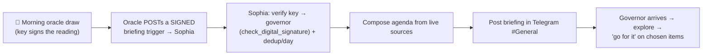

# Morning Oracle Standup — plan

**Status:** HANDED OFF to Sophia 2026-06-08 · **Owner:** Sophia (autopilot) · **Sponsor:** Gary

Turn the morning oracle draw into the day's ignition: when a **governor** casts
their morning reading, the oracle fires a signed trigger to Sophia, who composes
a personalized agenda from live sources and posts it in Telegram **#General** —
so when the governor arrives, the day's action items are already waiting to
explore together (and flow straight into the GO convention).

## Design

**Trigger — browser-side (chosen).** In the oracle (`oracle-draw-submit.js` or a
small new module), *after* a reading is submitted, IF the drawing key maps to a
governor, **POST a signed briefing-request** to a Sophia endpoint. Reuse the
oracle's existing WebCrypto signing (same key that signs the reading).
- **Fire-and-forget / non-blocking:** the trigger must never block or break the
  reading/submit flow — if Sophia is unreachable, the draw still completes.
- **Dedup:** once per governor per day. Authoritative dedup is **server-side**
  (Sophia keys on contributor + date); the oracle may also send the local date.

**Sophia endpoint (e.g. `POST /daily-briefing`).**
- **Verify** the signature → resolve the key via `check_digital_signature`; only
  proceed if it maps to a **governor**. (A random visitor's draw must NOT brief.)
- **Dedup** per contributor per day.
- **Compose the agenda** from live sources (below).
- **Post to Telegram #General** (chat `-1003919341801`, no `message_thread_id`).

**Agenda sources (personalized to whoever drew):**
- **Parked handoffs awaiting "go for it"** — `SOPHIA_HANDOFFS.md` rows, status
  active / GO-ready (the highest-value line).
- **Open PRs needing review/merge** (the gated ones).
- **Due `OPEN_FOLLOWUPS.md` items** (e.g. npm token rotation ~2026-09-06).
- **In-flight status** (what's unblocked / in progress).
- *(flavor)* the **hexagram as the day's framing** — pass the reading in the
  trigger payload so the briefing opens with the reading's theme, not a bare list.

**Interaction.** In #General the governor explores, then authorizes items with
the GO convention ("go for it") or spins new handoffs.

## Pre-flight checklist

- [ ] Confirm Sophia's FastAPI can add a route (`/daily-briefing`) and that
      **CORS allows the oracle origin** (`https://oracle.truesight.me`) — the
      trigger is a browser `fetch`, unlike CLI `ping_sophia`.
- [ ] Define the **signed request shape** the endpoint expects (mirror the
      `ping_sophia` / `/chat-blocking` signing so the oracle can reproduce it in
      WebCrypto).
- [ ] Decide the **dedup store** (contributor+date) on Sophia.
- [ ] Confirm the bot can post to **#General** (it can — send without
      `message_thread_id`).

## Sequenced PRs

| Unit | Scope | Repo |
|---|---|---|
| **PR0** | This plan (baton) | agentic_ai_context |
| **PR1** | **Sophia `/daily-briefing` endpoint** — governor-verify + dedup/day + compose agenda from the live sources + post to #General. CORS for the oracle origin. | dao_protocol / truesight_autopilot |
| **PR2** | **Oracle browser trigger** — after a governor's reading, POST the signed briefing-request (fire-and-forget, non-blocking, must not affect the reading). | oracle |

## Gates / Definition of Done

1. **Governor-check before briefing** — non-governor draws never trigger a post.
2. **Dedup** — once per governor per day.
3. **Non-breaking trigger** — the oracle reading/submit path must be unaffected if
   the briefing endpoint errors or is slow (fire-and-forget).
4. **Privacy** — #General is group-visible; if any item is sensitive (treasury /
   security), post a pointer there and keep detail in the relevant topic. Flag
   for the governor if unsure.
5. **Open PR, do NOT auto-merge** the oracle change (deploys from `main`); include
   a runtime/browser check that the draw still works.
6. `Generated-by: Sophia (TrueSight Autopilot)` on every commit + PR.

## Resume tracker

> **RESUME HERE →** PR1 (Sophia `/daily-briefing` endpoint). PR2 (oracle trigger)
> depends on it (the endpoint must exist + CORS-allow the oracle origin first).

| Unit | Repo | Blocked on | Merged | Contribution |
|---|---|---|---|---|
| PR0 plan | agentic_ai_context | — | ☑ | — |
| PR1 briefing endpoint | dao_protocol / autopilot | — | ☐ | ☐ |
| PR2 oracle trigger | oracle | PR1 | ☐ | ☐ |

## Acceptance

- Gary casts a morning reading → within seconds a **personalized agenda** appears
  in **#General**: parked handoffs + open PRs + due follow-ups (+ hexagram
  framing).
- A **non-governor** draw triggers **nothing**.
- Re-drawing the same day does **not** re-post (dedup).
- The oracle reading/submit flow is **unaffected** whether or not the briefing
  endpoint responds.
