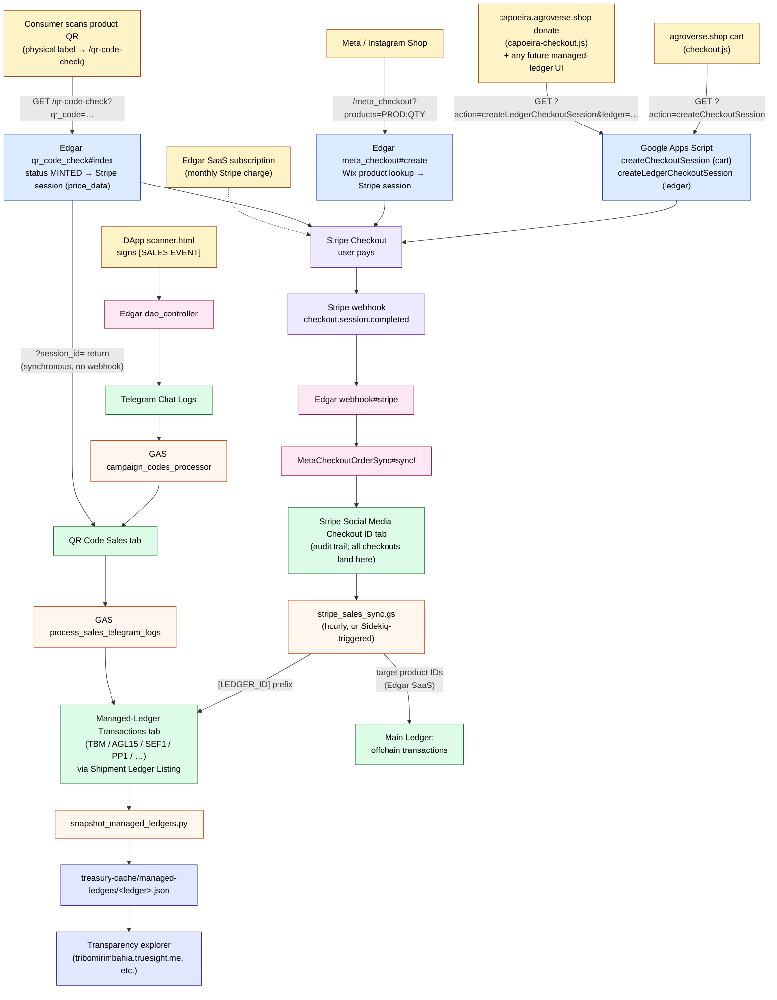

# Stripe Transaction Routing — All Flows

> **Where the code lives:**  
> Webhook handler: `sentiment_importer/app/controllers/webhook_controller.rb`  
> Meta checkout: `sentiment_importer/app/services/meta_checkout_order_sync.rb`  
> Stripe tab writer: `sentiment_importer/app/models/gdrive/stripe_checkout_log.rb`  
> GAS poller: `tokenomics/google_app_scripts/tdg_asset_management/stripe_sales_sync.gs`  
> Session creation GAS: `tokenomics/clasp_mirrors/1ovx-Hq5L5MgzF32qB_cPV_G5Hc6XshKMAYOmiJY8tZ355gzWUqvFCPvn/Code.js`  
> **Registry:** Shipment Ledger Listing (Main Ledger, Col A = Ledger ID, Col AB = Resolved URL)

---

## End-to-end overview (all flows on one canvas)



**How to read it:**

- **Yellow blocks** — entry points (where a Stripe transaction originates).
- **Blue blocks** — session creation. **Two engines create Stripe sessions:** Google Apps Script (cart + managed-ledger/donate flows) and **Edgar Rails** (`meta_checkout#create` for Meta/Instagram, *and* `qr_code_check#index` for the consumer product-QR scan). So: **cart/donate session creation is GAS; Meta and consumer-QR session creation is Edgar.** All post-payment webhooks land in Edgar regardless of who created the session (except the consumer-QR flow, which reconciles synchronously via a `?session_id=` return rather than a webhook).
- **Purple blocks** — Stripe itself + the resulting webhook.
- **Pink blocks** — Edgar Rails (receives the webhook, writes to the audit-trail sheet).
- **Green blocks** — Google Sheets (audit log + per-ledger Transactions tab).
- **Orange blocks** — Apps Script + Python routing / sync processes.
- **Indigo blocks** — Public output: `treasury-cache` JSON + transparency explorer pages.

The DApp path (bottom-left) doesn't pass through Stripe — `[SALES EVENT]` posts directly to Edgar and lands in a different audit tab (QR Code Sales), but converges to the same managed-ledger Transactions tab via `process_sales_telegram_logs`.

For the deep-dive on each numbered flow, scroll to **Flow 1–4** below.

---

## Flow 1: Meta/Instagram Checkout (agroverse.shop)

**Trigger:** Stripe `checkout.session.completed` webhook with `metadata.channel == 'meta'`  
**Latency:** Real-time (webhook → Sidekiq worker, seconds)

```
Instagram/Facebook Shop → Stripe Checkout → webhook_controller.rb#stripe
                                                    │
                                          MetaCheckoutOrderSyncWorker
                                                    │
                                          MetaCheckoutOrderSync#sync!
                                          │
                                          ├── eligible_session? → metadata.channel == 'meta' ✓
                                          ├── parse Wix products from metadata.wix_products
                                          ├── create Wix order via WixStoreService
                                          └── append_checkout_log → Gdrive::StripeCheckoutLog
                                              │
                                              ▼
                                         Stripe Social Media Checkout ID tab
                                         (Main Ledger gid=1787371190)
                                              │
                                              ▼
                                         [ENDS — no further routing]
```

**Code:** `met»_checkout_order_sync.rb:20-45` (sync!), `:49-51` (eligible_session?), `:325-336` (append_checkout_log)

---

## Flow 2: QR Code Checkout (DApp scanner)

**Trigger:** User scans QR code on `dapp.truesight.me/scanner.html`, signs `[SALES EVENT]`  
**Latency:** Near real-time (DApp POST → Edgar → GAS processing, seconds to minutes)

```
DApp scanner.html → scan QR code → submit [SALES EVENT]
                    │
                    ▼
              Edgar dao_controller.rb
                    │
                    ▼
              Telegram Chat Logs tab (signed event text)
                    │
                    ▼
              campaign_codes_processor.gs (GAS trigger)
                    │
                    ▼
              QR Code Sales tab (Telegram sheet)
                    │
                    ▼
              process_sales_telegram_logs.gs (GAS trigger)
              │
              ├── reads Shipment Ledger Listing for ledger lookup
              ├── writes to target AGL ledger Transactions tab
              └── fires treasury-cache-publisher notification
                    │
                    ▼
              treasury-cache/dao_offchain_treasury.json (main DAO)
```

**Code:** `process_sales_telegram_logs.gs` (main orchestrator), `qr_code_web_service.gs` (QR lookup), `sales_update_managed_agl_ledgers.gs` (ledger writes)

---

## Flow 3: Edgar SaaS Subscriptions

**Trigger:** Stripe charges with specific product IDs (Edgar market sell-off dashboard)  
**Latency:** Hourly poll (`stripe_sales_sync.gs` timer trigger)

```
stripe_sales_sync.gs (runs every hour)
          │
          ├── fetchStripeTransactions() → Stripe API charges
          ├── isChargeInQrCodeSales() → skip if QR code flow handled
          ├── isChargeInStripeCheckoutLog() → skip if Meta flow handled
          ├── matches TARGET_PRODUCT_IDS? (prod_K9i..., prod_K7d..., prod_JvD...)
          │       │
          │       ▼
          │   write to offchain transactions tab (Main Ledger)
          │   - Date, Description, Amount, Currency, Is Revenue
          │   - Also writes Stripe fee as separate negative row
          │
          ▼
      [ENDS — writes to Main Ledger directly]
```

**Code:** `stripe_sales_sync.gs:161-418` (fetchStripeTransactions), `:31-45` (TARGET_PRODUCT_IDS)

**Real-time option:** Deploy GAS as web app with `doPost`, POST from `webhook_controller.rb` after processing. Current hourly poll is acceptable since SaaS billing isn't time-critical.

---

## Flow 4: Managed-Ledger Stripe Inflows (capoeira.agroverse.shop → TBM, generic pattern)

**Trigger:** Any Stripe checkout whose "Items Purchased" starts with a known Ledger ID
**Latency:** Hourly poll (`stripe_sales_sync.gs` timer, or immediate via Sidekiq trigger)

**Generic, not donation-specific.** Future managed ledgers doing Stripe inflows
(sales, contributions, deposits, fees, etc.) all share this flow — capoeira →
TBM is just the first concrete instance.

**Session creation:** Frontend calls the same Google Apps Script that
`agroverse_shop` uses for cart checkout, with a new action:

```
GET <GOOGLE_SCRIPT_URL>/exec?action=createLedgerCheckoutSession
    &ledger=TBM
    &amount=50
    &currency=usd
    &description=Donation+to+Tribo+Bahia+Mirim
    &environment=development|production
    &success_url=...
    &cancel_url=...
    &source=capoeira.agroverse.shop
```

Response: `{ status: 'success', checkoutUrl: 'https://checkout.stripe.com/...', sessionId: '...' }`.
Frontend does `window.location.href = checkoutUrl`. **No Edgar code path** for
session creation — Edgar only handles the webhook after payment.

**The Stripe product name carries the routing signal:** `[TBM] — Donation to
Tribo Bahia Mirim`. When the checkout completes, the webhook writes to the
Stripe tab as usual. `stripe_sales_sync.gs` detects the `[LEDGER_ID]` prefix
and routes.

**Implementation references:**
- GAS: `tokenomics/clasp_mirrors/1ovx-Hq5L5MgzF32qB_cPV_G5Hc6XshKMAYOmiJY8tZ355gzWUqvFCPvn/Code.js#createLedgerCheckoutSession`
- Frontend: `capoeira/assets/js/capoeira-checkout.js`

**Implementation:** Add to `stripe_sales_sync.gs`, after the existing product-ID check (line ~407):

```javascript
// After existing product-ID routing...
// NEW: Check Stripe Social Media Checkout ID for ledger-routed purchases
routeStripeCheckoutPurchasesToLedgers();
```

New function `routeStripeCheckoutPurchasesToLedgers()`:
1. Read "Stripe Social Media Checkout ID" tab
2. Read Shipment Ledger Listing for all Ledger IDs + Resolved URLs
3. For each row in Stripe tab:
   - Extract `Items Purchased` (col F)
   - Match `/^\[([A-Z0-9]+)\]/` to extract Ledger ID (e.g. `[TBM]`)
   - If matched and not already processed (check new col P "Ledger Routed"):
     - Open the ledger's sheet via Resolved URL
     - Write to Transactions tab: Date, Description=Items Purchased, Amount, Currency, Type="Sale"
     - Mark col P = the Ledger ID (prevents re-processing)
     - Also fire treasury-cache-publisher notification

```
capoeira.agroverse.shop  (capoeira-checkout.js)
        │  GET /exec?action=createLedgerCheckoutSession&ledger=TBM&amount=N&...
        ▼
Google Apps Script   (Code.js#createLedgerCheckoutSession)
        │  creates Stripe Checkout Session, line item:
        │  product_data.name = "[TBM] — Donation to Tribo Bahia Mirim"
        │  returns { checkoutUrl }
        ▼
window.location.href = checkoutUrl
        │
        ▼
Stripe-hosted checkout → user pays (4242 4242 4242 4242 in test mode)
        │
        ▼
Stripe webhook → Edgar /stripe_webhook
        │
        ▼
MetaCheckoutOrderSync#sync!
├── eligible_session? → no 'channel: meta' → skip Wix
└── append_checkout_log
        │
        ▼
Stripe Social Media Checkout ID tab
Items Purchased: "[TBM] — Donation to Tribo Bahia Mirim"
        │
        ▼
stripe_sales_sync.gs (hourly, or Sidekiq-triggered)
├── routeStripeCheckoutPurchasesToLedgers()
│       ├── regex /^\[([A-Z0-9]+)\]/ extracts "TBM"
│       ├── Shipment Ledger Listing lookup → TBM sheet URL
│       ├── Writes to TBM Transactions tab
│       └── Marks col P = "TBM"
└── snapshot_managed_ledgers.py → TBM.json → explorer
```

**Implementation notes:**
- The GAS `createLedgerCheckoutSession` action is intentionally generic — accepts `ledger`, `amount`, `currency`, `description`, `success_url`, `cancel_url`, `source`, `environment`. Future managed ledgers (e.g. AGL15 operational-fund contributions, SEF1 tree-planting pledges) reuse the same action with their own `ledger=` value.
- Routing is by the bracketed product-name prefix only — **no Stripe metadata changes needed** on either Edgar or GAS sides. The session metadata also carries `ledger`/`source` defensively for ad-hoc lookups.
- The frontend at `capoeira/assets/js/capoeira-checkout.js` does env-aware switching (`environment=development` on localhost, `production` otherwise) so Stripe test mode flows naturally for local integration testing.
- The `routeStripeCheckoutPurchasesToLedgers()` function in `stripe_sales_sync.gs` is the missing piece that closes the loop — once it lands, the [LEDGER_ID] prefix routing is fully automatic.

---

## Flow 5: Consumer Product-QR Scan → Stripe (Edgar `/qr-code-check`)

**Trigger:** A consumer scans the QR code printed on a physical product (chocolate bar,
pouch). The label encodes `GET edgar.truesight.me/qr-code-check?qr_code=<CODE>`.
**Latency:** Synchronous — **no webhook**. Edgar creates the session and, on return,
reconciles the sale inside the same request.
**Distinct from Flow 2:** Flow 2 is the *operator* signing a `[SALES EVENT]` in
`scanner.html`. Flow 5 is a *consumer* buying the specific item their QR points at, with
Edgar acting as the storefront. Both converge on the **QR Code Sales** tab.

```
Consumer scans product QR  →  GET /qr-code-check?qr_code=CODE
        │
        ▼
Edgar qr_code_check_controller#index
        │  Gdrive::QrCodeLookup.lookup(qr_code)
        │
        ├── status SAMPLE / GIFT / SOLD / CONSIGNMENT  → redirect to landing page (no Stripe)
        │
        └── status MINTED → Stripe::Checkout::Session.create
                              mode: 'payment', price_data from sheet `Price`
                              metadata.qr_code = CODE
                              success_url = /qr-code-check?qr_code=CODE&session_id={CHECKOUT_SESSION_ID}
              │
              ▼
        Stripe-hosted checkout  →  consumer pays
              │
              ▼
        Stripe 302 back to  /qr-code-check?qr_code=CODE&session_id=...   (NOT a webhook)
              │
              ▼
        Edgar qr_code_check_controller#index  (session_id branch)
        ├── Stripe::Checkout::Session.retrieve (expand payment_intent.charges)
        ├── guard: payment_status == 'paid' && metadata.qr_code == qr_code
        ├── dedup: skip if qr_code already in QR Code Sales (col E)
        ├── Agroverse QR codes tab → status = SOLD, buyer email → col L
        ├── compute net / fee / total from BalanceTransaction
        ├── append row to QR Code Sales (cols A–R; A/B/M = stripe_<session.id>)
        ├── AgroverseInventorySnapshotPublishWorker.perform_async   (refresh inventory JSON)
        └── redirect to landing page with UTM (utm_source=edgar, utm_medium=qr)
              │
              ▼
        QR Code Sales tab  →  process_sales_telegram_logs.gs  →  AGL ledger Transactions tab
        (converges with Flow 2 downstream routing via Shipment Ledger Listing)
```

**Code:** `sentiment_importer/app/controllers/qr_code_check_controller.rb#index`
(session_id reconciliation `:31–165`, MINTED session creation `:167–214`,
`build_redirect_url_with_utm` UTM helper). Also `#register_email` (POST email → col L).
**Service account:** `config/agroverse_qr_code_gdrive_key.json` (direct `GoogleDrive::Session`,
not the `Gdrive::*` model layer for the write side).

**Extraction note:** This endpoint is **not** read-only — the MINTED branch creates a
Stripe session and the `session_id` branch writes the sale + flips inventory. When porting
`/qr-code-check` to the Python service it must move alongside `/meta_checkout` and the
`/stripe_webhook` handler, since all three are Edgar's server-side Stripe surface and share
the Stripe secret key.

---

## All flows summary

| Flow | Trigger | Latency | Writes to | Ledger routing |
|---|---|---|---|---|
| 1. Meta Checkout | Webhook (channel:meta) | Real-time | Stripe tab + Wix order | None (ends at tab) |
| 2. QR Code (operator) | DApp [SALES EVENT] | Near real-time | Telegram + AGL ledger | Shipment Ledger Listing |
| 3. Edgar SaaS | Hourly GAS poll | Hourly | offchain transactions | Hardcoded product IDs |
| 4. Managed-ledger inflows | `[LEDGER_ID]` prefix (via GAS `createLedgerCheckoutSession`) | Hourly (or trigger) | `<ledger>` Transactions tab | Shipment Ledger Listing |
| 5. Consumer product-QR scan | `GET /qr-code-check` (MINTED) | **Synchronous (no webhook)** | Agroverse QR codes (SOLD) + QR Code Sales | Shipment Ledger Listing (via `process_sales_telegram_logs`) |

---

## `[LEDGER_ID]` routing pattern

Any Stripe product whose name starts with `[LEDGER_ID] — ` is auto-routed. The GAS matches `/^\[([A-Z0-9]+)\]/` and looks up the Ledger ID in Shipment Ledger Listing.

| Stripe product name | Extracts | Routes to |
|---|---|---|
| `[TBM] — Donation to Tribo Bahia Mirim` | TBM | TBM Transactions tab |
| `[AGL15] — Operational fund contribution` | AGL15 | AGL15 Transactions tab |
| `[SEF1] — Tree planting pledge` | SEF1 | SEF1 Transactions tab |
| `Organic Cacao Beans — Bahia` | (no bracket) | No routing (legacy flow) |

This works for any future merchant — just create a Stripe product named `[LEDGER_ID] — <description>`, and the GAS handles the rest. No metadata, no webhook changes, no Edgar code. The Shipment Ledger Listing is the single registry.

---

## Real-time GAS trigger

`stripe_sales_sync.gs` (Flow 3) normally runs hourly. To trigger it immediately after a webhook, call its `doGet` web app endpoint.

**GAS web app URL:** `https://script.google.com/macros/s/AKfycbwauCMu-3Es0s4rB7Cr-fsP2JuEnebyPS8W-ecXG6RUi_zhqpLfG71bramoEwtk54drfg/exec`

**Edgar side** — Sidekiq worker:

```ruby
# app/workers/stripe_sales_sync_trigger_worker.rb
class StripeSalesSyncTriggerWorker
  include Sidekiq::Worker

  STRIPE_SYNC_URL = 'https://script.google.com/macros/s/AKfycbwauCMu-3Es0s4rB7Cr-fsP2JuEnebyPS8W-ecXG6RUi_zhqpLfG71bramoEwtk54drfg/exec'

  def perform
    HTTP.get(STRIPE_SYNC_URL)
  end
end
```

**Trigger from webhook controller:**

```ruby
# app/controllers/webhook_controller.rb
when "checkout.session.completed"
  session_id = event_json.dig("data", "object", "id")
  MetaCheckoutOrderSyncWorker.perform_async(session_id) if session_id.present?
  StripeSalesSyncTriggerWorker.perform_in(30.seconds)
```

---

## Stripe Social Media Checkout ID tab role

Written exclusively by `Gdrive::StripeCheckoutLog.append_record` (called from `MetaCheckoutOrderSync#sync!`). Never written by GAS. Serves as:

- **Audit trail:** Every Stripe checkout lands here regardless of routing
- **Duplicate guard:** `stripe_sales_sync.gs` (Flow 3) and `process_sales_telegram_logs.gs` (Flow 2) read it to skip already-handled charges
- **Shipping updates:** `process_qr_code_updates.gs` writes shipping provider + tracking number back into this tab
