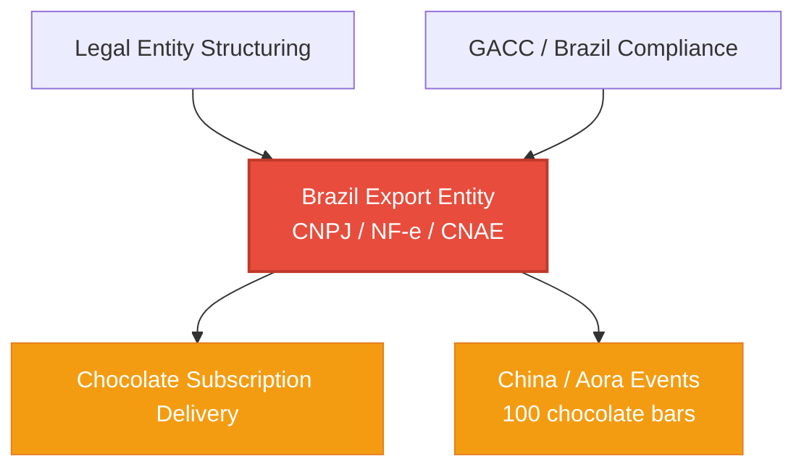

# TrueSight DAO — Active Track Map

> **Live dependency map.** Updated as tracks shift. Tracks 1–4 (Vault & Key Registry, Chocolate Subscriptions Phase 1, Edgar/Perch Separation, Partner Onboarding) are **completed** and removed from this map.

---

## Dependency Overview

---

## Track Details

### Legal Entity Structuring

| Field | Detail |
|-------|--------|
| **Status** | 🟡 Offline research |
| **Owner** | Gary / Paloma |
| **Goal** | Choose holding entity structure (DUNA vs Próspera) for DAO-owned Brazilian export CNPJ |
| **Key docs** | [`BRAZIL_EXPORT_ENTITY_BRIEF.md`](./BRAZIL_EXPORT_ENTITY_BRIEF.md) — full structuring brief with two paths (Próspera HoldCo vs Wyoming UNA/DUNA), ownership mapping to TDG holders, and questions for counsel Layon Costa |
| **Dependencies** | None — parallel work |
| **Blocks** | Brazil Export Entity (entity must exist to own the new CNPJ) |

---

### GACC / Brazil Compliance

| Field | Detail |
|-------|--------|
| **Status** | 🟡 Offline prep |
| **Owner** | Gary / Paloma |
| **Goal** | Regulatory filing prep for Brazil-to-China cacao export (GACC registration) |
| **Key docs** | [`BRAZIL_TO_CHINA_GACC_REGISTRATION_GUIDE.md`](./BRAZIL_TO_CHINA_GACC_REGISTRATION_GUIDE.md) — GACC registration requirements and process |
| **Dependencies** | None — parallel work |
| **Blocks** | Brazil Export Entity (export entity must exist to register with GACC) |

---

### Brazil Export Entity (CNPJ / NF-e / CNAE) ← THE GATE

| Field | Detail |
|-------|--------|
| **Status** | 🔴 Critical blocker |
| **Owner** | Matheus / Paloma / Gary |
| **Goal** | Create new Brazilian CNPJ with correct CNAE (46.23-1/04 — wholesale cacao trade), Inscrição Estadual (IE) at SEFAZ-BA, and NF-e model 55 credentialing. Replace Black King's personal CNPJ as the export vehicle. |
| **Expected timeline** | **5–20 business days** to change/add CNAE for a Microempresa (ME). Cost: R$400–R$2,100 depending on state and accounting services. [Source: Matheus, 2026-06-19](https://github.com/TrueSightDAO/.github/blob/main/attachments/2026-06-19_matheus_cnae_timeline.jpg) |
| **Next check-in** | **~2026-06-26** (5 business days from 2026-06-19) — earliest possible completion |
| **Key docs** | [`BRAZIL_EXPORT_ENTITY_BRIEF.md`](./BRAZIL_EXPORT_ENTITY_BRIEF.md) — explains why Black King's current CNPJ (service CNAEs only, no IE, no NF-e model 55) cannot legally issue export invoices. See §4 for the full diagnosis. |
| **Context** | Current state: Black King (CNPJ 50.042.585/0001-80) is an Empresário Individual with only service CNAEs (82.30-0-01). Cannot issue export NF-e. New entity needs CNAE 46.23-1/04 + IE + NF-e model 55 credentialing at SEFAZ-BA. |
| **Dependencies** | Legal Entity Structuring (holding entity must own the new CNPJ) |
| **Blocks** | Chocolate Subscription Delivery, China / Aora Events |

---

### Chocolate Subscription Delivery

| Field | Detail |
|-------|--------|
| **Status** | 🟡 Blocked |
| **Owner** | Gary / Linda (first subscriber) |
| **Goal** | Fulfill chocolate bar subscriptions. Phase 1 (subscribe engine + PDPs + homepage card) is built and merged. Phase 2 (fulfillment automation) deferred until export entity clears. |
| **Key docs** | [`CHOCOLATE_SUBSCRIPTION_PLAN.md`](./CHOCOLATE_SUBSCRIPTION_PLAN.md) — full subscription plan with Phase 1/2 split |
| **Dependencies** | 🔴 **Blocked by** Brazil Export Entity — cannot ship bars without legal export |

---

### China / Aora Events (100 chocolate bars)

| Field | Detail |
|-------|--------|
| **Status** | 🟡 Blocked |
| **Owner** | Gary / Elizabeth Wong (Liz) / Jerri |
| **Goal** | Aora pilot in China with GO/Nucleus network. 100 chocolate bars (50g, 81% cacao) for experiential learning events. Gary backpack-carry to China. |
| **Key docs** | [`AORA_EXPERIENCE_PLAN.md`](./AORA_EXPERIENCE_PLAN.md) — full execution roadmap with PERT chart, critical path, revenue model ($10 retail, $6 back to DAO), and blocker table |
| **Dependencies** | 🔴 **Blocked by** Brazil Export Entity — bars must be produced in Brazil and exported legally |

---

## Quick Reference

| Track | Status | Owner | Next Check-in | Blocked By |
|-------|--------|-------|---------------|------------|
| Legal Entity Structuring | 🟡 Offline | Gary / Paloma | — | — |
| GACC / Brazil Compliance | 🟡 Offline | Gary / Paloma | — | — |
| Brazil Export Entity (CNPJ/NF-e/CNAE) | 🔴 Gate | Matheus / Paloma / Gary | ~2026-06-26 | Legal Entity Structuring |
| Chocolate Subscription Delivery | 🟡 Blocked | Gary | — | Brazil Export Entity 🔴 |
| China / Aora Events (100 bars) | 🟡 Blocked | Gary / Liz / Jerri | — | Brazil Export Entity 🔴 |

---

*Last updated: 2026-06-19. Update this file when track statuses change.*
