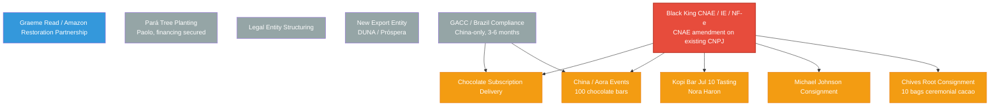

# TrueSight DAO — Active Track Map

> **Live dependency map.** Updated as tracks shift. Tracks 1–4 (Vault & Key Registry, Chocolate Subscriptions Phase 1, Edgar/Perch Separation, Partner Onboarding) are **completed** and removed from this map.

---

## Dependency Overview

---

## Track Details

### Legal Entity Structuring {#legal-entity-structuring}

| Field | Detail |
|-------|--------|
| **Status** | 🟡 Offline research |
| **Owner** | Gary / Paloma |
| **Goal** | Choose holding entity structure (DUNA vs Próspera) for DAO-owned Brazilian export CNPJ. This is the **long-term structural solution** — a DAO-owned entity that will eventually own the export operation. |
| **Key docs** | [`BRAZIL_EXPORT_ENTITY_BRIEF.md`](./BRAZIL_EXPORT_ENTITY_BRIEF.md) — full structuring brief with two paths (Próspera HoldCo vs Wyoming UNA/DUNA), ownership mapping to TDG holders, and questions for counsel Layon Costa |
| **Next milestone** | Mon Jun 22, 2026 · 11am PDT — call with Layon Costa (counsel), Breno, Paloma. [Google Meet](https://meet.google.com/eht-bdgp-tdh) |
| **Dependencies** | None — parallel work |
| **Blocks** | None — parallel to all other tracks |

---

### New Export Entity (DUNA / Próspera) {#new-export-entity}

| Field | Detail |
|-------|--------|
| **Status** | 🟡 Offline research — parallel to Black King CNAE fix |
| **Owner** | Gary / Paloma / Layon Costa |
| **Goal** | Incorporate a new DAO-owned entity (DUNA or Próspera HoldCo) that will eventually own the Brazilian export operation. This is the **long-term structural solution** — separate from the immediate CNAE fix on Black King. |
| **Key docs** | [`BRAZIL_EXPORT_ENTITY_BRIEF.md`](./BRAZIL_EXPORT_ENTITY_BRIEF.md) — two paths: Próspera HoldCo ($5K-15K+, 2-6 months) vs Wyoming UNA/DUNA (~$50, this week) |
| **Next milestone** | Mon Jun 22, 2026 · 11am PDT — call with Layon Costa (counsel), Breno, Paloma. [Google Meet](https://meet.google.com/eht-bdgp-tdh) |
| **Dependencies** | None — parallel to [Black King CNAE / IE / NF-e](#black-king-cnae-ie-nf-e) |
| **Blocks** | None — long-term, not blocking current cargo |

---

### GACC / Brazil Compliance {#gacc-brazil-compliance}

| Field | Detail |
|-------|--------|
| **Status** | 🟡 Offline prep |
| **Owner** | Gary / Paloma / BoQiang |
| **Goal** | GACC registration for Brazil-to-China cacao export. BoQiang has sorted documents for both cooperatives. Coopercabruca preferred (more complete product line, mature freight forwarders). Cycle: **3–6 months**. Required before any commercial cargo can clear Chinese customs. |
| **Key docs** | [`BRAZIL_TO_CHINA_GACC_REGISTRATION_GUIDE.md`](./BRAZIL_TO_CHINA_GACC_REGISTRATION_GUIDE.md) — GACC registration requirements and process |
| **Dependencies** | None — parallel to [Black King CNAE / IE / NF-e](#black-king-cnae-ie-nf-e) |
| **Blocks** | [China / Aora Events](#china-aora-events), [Chocolate Subscription Delivery](#chocolate-subscription-delivery) (China subscribers) — GACC is one of two parallel gates for China-bound cargo |

---

### Black King CNAE / IE / NF-e {#black-king-cnae-ie-nf-e}

| Field | Detail |
|-------|--------|
| **Status** | 🔴 Critical blocker — single source feeding all export channels |
| **Owner** | Matheus / Paloma / Gary |
| **Goal** | Change Black King's existing CNPJ (50.042.585/0001-80) from service CNAE (82.30-0-01) to wholesale cacao trade CNAE (46.23-1/04), obtain Inscrição Estadual (IE) at SEFAZ-BA, and credential for NF-e model 55 emission. **No new CNPJ needed** — just a CNAE amendment on the existing Empresário Individual. |
| **Expected timeline** | **5–20 business days** to change/add CNAE for a Microempresa (ME). Cost: R$400–R$2,100 depending on state and accounting services. [Source: Matheus, 2026-06-19](https://github.com/TrueSightDAO/.github/blob/main/attachments/2026-06-19_matheus_cnae_timeline.jpg) |
| **Next check-in** | **~2026-06-26** (5 business days from 2026-06-19) — earliest possible completion |
| **Key docs** | [`BRAZIL_EXPORT_ENTITY_BRIEF.md`](./BRAZIL_EXPORT_ENTITY_BRIEF.md) — explains why Black King's current CNPJ (service CNAEs only, no IE, no NF-e model 55) cannot legally issue export invoices. See §4 for the full diagnosis. |
| **Context** | Current state: Black King (CNPJ 50.042.585/0001-80) is an Empresário Individual with only service CNAEs (82.30-0-01). Cannot issue export NF-e. Needs CNAE 46.23-1/04 + IE + NF-e model 55 credentialing at SEFAZ-BA. |
| **Downstream chain** | Matheus (CNAE/IE/NF-e) → Omega Services (logistics) → SeaCoast Logistics (freight) → Kirsten (receives) |
| **Dependencies** | None — parallel to [Legal Entity Structuring](#legal-entity-structuring), [New Export Entity](#new-export-entity), and [GACC / Brazil Compliance](#gacc-brazil-compliance) |
| **Blocks** | **USA-bound:** [Chives Root Consignment](#chives-root-consignment), [Michael Johnson Consignment](#michael-johnson-consignment), [Kopi Bar Jul 10 Tasting](#kopi-bar-jul-10-tasting) — US import already live via TrueTech Inc (Delaware C-Corp, FDA-registered, Customs importer-of-record). **China-bound:** [China / Aora Events](#china-aora-events), [Chocolate Subscription Delivery](#chocolate-subscription-delivery) — needs both CNAE fix + GACC |

---

### Chocolate Subscription Delivery {#chocolate-subscription-delivery}

| Field | Detail |
|-------|--------|
| **Status** | 🟡 Blocked |
| **Owner** | Gary / Linda (first subscriber) |
| **Goal** | Fulfill chocolate bar subscriptions. Phase 1 (subscribe engine + PDPs + homepage card) is built and merged. Phase 2 (fulfillment automation) deferred until export channels clear. |
| **Key docs** | [`CHOCOLATE_SUBSCRIPTION_PLAN.md`](./CHOCOLATE_SUBSCRIPTION_PLAN.md) — full subscription plan with Phase 1/2 split |
| **Dependencies** | 🔴 **Blocked by** [Black King CNAE / IE / NF-e](#black-king-cnae-ie-nf-e) **and** [GACC / Brazil Compliance](#gacc-brazil-compliance) — China subscribers need both. USA subscribers only need the CNAE fix. |

---

### China / Aora Events (100 chocolate bars) {#china-aora-events}

| Field | Detail |
|-------|--------|
| **Status** | 🟡 Blocked |
| **Owner** | Gary / Elizabeth Wong (Liz) / Jerri |
| **Goal** | Aora pilot in China with GO/Nucleus network. 100 chocolate bars (50g, 81% cacao) for experiential learning events. Gary backpack-carry to China. |
| **Key docs** | [`AORA_EXPERIENCE_PLAN.md`](./AORA_EXPERIENCE_PLAN.md) — full execution roadmap with PERT chart, critical path, revenue model ($10 retail, $6 back to DAO), and blocker table |
| **Event plan** | Jerri shared a 40-page detailed event plan (Jul 2026 beta + Autumn public launch). [Full PDF](https://github.com/TrueSightDAO/.github/blob/main/attachments/2026-06-19_aora_agroverse_event_plan.pdf) · [Venue Layout](https://github.com/TrueSightDAO/.github/blob/main/attachments/2026-06-19_aora_event_flow_and_venue_layout.pdf) |
| **July beta** | 10-15 seed families (ages 6-12), co-invited by Teacher Evan + Liz. 90-min immersive experience. Gary as "Guardian of the Cacao Rainforest." 4-tier technical plan (1C recommended: 1 projector + 6 scenes). 15-item risk register. |
| **Dependencies** | 🔴 **Blocked by** [Black King CNAE / IE / NF-e](#black-king-cnae-ie-nf-e) **and** [GACC / Brazil Compliance](#gacc-brazil-compliance) — both must clear for commercial cargo. July event samples may use separate fast path via BoQiang (cooperative docs + courier to Dongguan Airport). |

---

### Chives Root Consignment (10 bags ceremonial cacao) {#chives-root-consignment}

| Field | Detail |
|-------|--------|
| **Status** | 🟡 Blocked |
| **Owner** | Chives Root / Gary |
| **Goal** | Ship 10 bags of ceremonial cacao to Chives Root for consignment-based sales |
| **Dependencies** | 🔴 **Blocked by** [Black King CNAE / IE / NF-e](#black-king-cnae-ie-nf-e) — USA-bound, only needs the CNAE fix (US import already live via TrueTech Inc) |

---

### Michael Johnson Consignment {#michael-johnson-consignment}

| Field | Detail |
|-------|--------|
| **Status** | 🟡 Blocked |
| **Owner** | Michael Johnson / Gary |
| **Goal** | Ship ceremonial cacao to Michael Johnson for consignment-based sales |
| **Dependencies** | 🔴 **Blocked by** [Black King CNAE / IE / NF-e](#black-king-cnae-ie-nf-e) — USA-bound, only needs the CNAE fix |

---

### Kopi Bar Jul 10 Tasting (Nora Haron) {#kopi-bar-jul-10-tasting}

| Field | Detail |
|-------|--------|
| **Status** | 🟡 Blocked |
| **Owner** | Nora Haron / Gary |
| **Goal** | Organize a chocolate tasting event at Kopi Bar on July 10. Nora wants to host. |
| **Dependencies** | 🔴 **Blocked by** [Black King CNAE / IE / NF-e](#black-king-cnae-ie-nf-e) — USA-bound, only needs the CNAE fix |

---

### Pará Tree Planting (Paolo) {#para-tree-planting}

| Field | Detail |
|-------|--------|
| **Status** | 🟡 Offline — waiting on planting |
| **Owner** | Paolo / Gary |
| **Goal** | Deploy funds to start planting trees in the state of Pará. Paolo has financing secured for the trees — waiting for planting to commence. |
| **Dependencies** | None — parallel to all other tracks |
| **Blocks** | None — independent operational track |

---

### Graeme Read / Amazon Restoration Partnership {#graeme-read}

| Field | Detail |
|-------|--------|
| **Status** | 🔵 New / Exploratory |
| **Owner** | Gary / Graeme Read / Jonathan Hakem |
| **Goal** | Explore partnership with Graeme Read — fellow contributor restoring 10,000 hectares of Amazon rainforest through single-estate cacao, QR traceability, and community dashboard at truesight.me. Nearly identical mission. |
| **Key docs** | [Introduction screenshot](https://github.com/TrueSightDAO/.github/blob/main/attachments/2026-06-19_graeme_read_introduction.jpg) — Jonathan Hakem intro via WhatsApp |
| **Dependencies** | None — exploratory |

---

## Quick Reference

| Track | Status | Owner | Next Check-in | Blocks |
|-------|--------|-------|---------------|--------|
| Legal Entity Structuring | 🟡 Offline | Gary / Paloma | Jun 22 call w/ Layon | — |
| New Export Entity (DUNA/Próspera) | 🟡 Offline | Gary / Paloma / Layon | Jun 22 call w/ Layon | — |
| GACC / Brazil Compliance | 🟡 Offline | Gary / Paloma / BoQiang | 3–6 month cycle | China cargo (with CNAE fix) |
| Black King CNAE / IE / NF-e | 🔴 Gate | Matheus / Paloma / Gary | ~Jun 26 | All cargo (USA alone, China with GACC) |
| Chocolate Subscription | 🟡 Blocked | Gary | — | CNAE fix (USA) / CNAE+GACC (China) |
| China / Aora Events | 🟡 Blocked | Gary / Liz / Jerri | Jul beta | CNAE fix + GACC |
| Chives Root Consignment | 🟡 Blocked | Chives Root / Gary | — | Black King CNAE fix |
| Michael Johnson Consignment | 🟡 Blocked | Michael Johnson / Gary | — | Black King CNAE fix |
| Kopi Bar Jul 10 Tasting | 🟡 Blocked | Nora Haron / Gary | Jul 10 | Black King CNAE fix |
| Pará Tree Planting | 🟡 Offline | Paolo / Gary | — | — |
| Graeme Read Partnership | 🔵 New | Gary / Graeme / Jonathan | — | — |

---

> **July event samples — separate fast path:** BoQiang has arranged an alternative channel for July event samples. Various cacao raw material samples (sensory teaching aids) can be sent via courier to Dongguan Airport. Required docs: plant inspection certificates, certificates of origin, organic qualifications, formal invoices, packing lists, cooperative Brazilian CNPJ registration docs. BoQiang will arrange freight forwarder to handle customs clearance. This path does **not** require the full CNAE fix or GACC — it uses the cooperative's existing docs.
