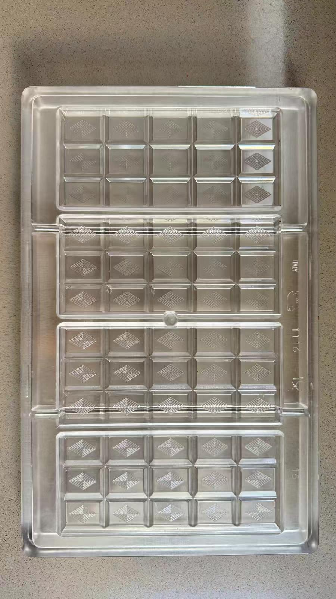

# USA Production — Chocolate Bar Production Specification

**For:** Santos (Brazil production) — via Fatima Toledo
**From:** Gary Teh · TrueTech Inc
**Re:** Recurring conversion of Agroverse cacao into finished 81% chocolate bars for the USA market
**Status:** **PLANNING PHASE — do not begin production.** Draft requirement spec for Fatima to review with Santos.

---

> ## ⚠️ Planning phase only — please do not execute yet
>
> **Fatima — this is a planning document, not a production order.** Please share
> it with Santos so he can review feasibility, capacity, and pricing, **but he
> should NOT begin producing anything yet.**
>
> We are still waiting on **last year's bars to arrive in San Francisco** so we
> can **inspect their condition** (survival of transit, quality, shelf state).
> Only after that inspection will we know whether this recurring arrangement is
> viable. This spec defines *what it would look like if we proceed* — it is for
> alignment and quoting, not a green light.

---

## 1. Purpose

This document is the **requirement specification** for a proposed recurring
chocolate production arrangement between TrueTech Inc and Santos,
supplying the **USA market**. Fatima Toledo relays this to Santos as the
definition of what we would need him to produce, what we supply, and what he
returns to us on each cycle.

Bars are **81% cacao, 50g**, in the Cabrellon mold — the same format Kirsten
produces in San Francisco.

> **Note on volume visibility.** We expect to gain USA-side visibility by
> observing how the current freight pallets pan out on arrival. This spec sets a
> **standing per-batch target of 100 kg of finished chocolate (≈2,000 bars)** so
> Santos can plan capacity around a fixed, predictable cycle. Actual per-cycle
> quantity may be confirmed ahead of each batch.

---

## 2. Product specification

| Attribute | Specification |
|---|---|
| Product | Dark chocolate bar |
| Cacao content | **81% cacao / 19% cane sugar** — two ingredients only, nothing else |
| Bar weight | **50 g** per bar |
| Mold | **Cabrellon Italian polycarbonate** — 27.5 × 17.5 cm, 4 cavities × 50 g (supplied by us) |
| Finished-chocolate target per batch | **100 kg** |
| Bar count per batch | **≈ 2,000 bars** (2,000 × 50 g) |
| Internal wrap | **Food-grade foil** — provided by Santos, holds each bar |
| External packaging | **Agroverse-branded** — provided by us to Santos at the time of production |

The recipe is **two ingredients only — 81% cacao and 19% cane sugar, nothing
else**. The cacao percentage may be adjusted in future cycles once we have
market feedback. **81% is the current standing recipe.**

*Cabrellon Italian polycarbonate mold (27.5 × 17.5 cm, 4 cavities × 50 g) — supplied by us for each cycle.*

---

## 3. Production cadence

Production would run **twice per year**, aligned to the equinoxes (Brazil):

| Cycle | Date (Brazil) | Season |
|---|---|---|
| Cycle 1 | **March 20** | Spring Equinox |
| Cycle 2 | **September 20** | Autumn Equinox |

- Cadence: **once every six months** (two batches per year).
- Each cycle produces the standing target of **100 kg / ≈2,000 bars** unless a
  different quantity is confirmed in advance of the batch.

---

## 4. What we supply (each cycle)

Delivered by **Matheus** at the start of each production cycle. Matheus operates
**Black King (CNPJ)** and is the **logistics coordinator and exporter for
Brazil** — he handles moving the beans and mold to Santos and exporting the
finished bars.

| Item | Supplied by | Notes |
|---|---|---|
| Cacao beans | Matheus / Black King (Agroverse warehouse, Ilhéus) | Enough for the target batch of finished chocolate |
| Chocolate mold | Matheus / Black King (delivered with the beans) | Cabrellon mold — **on loan for the cycle; returned to us** |
| External branding packaging | TrueTech Inc | Agroverse-branded packaging provided to Santos at the time of production |

Matheus brings **both the cacao beans and the chocolate mold** each time a
conversion is needed. The mold is our property, provided per cycle.

---

## 5. What Santos provides

| Item | Provided by Santos |
|---|---|
| Conversion / production labor | Bean-to-bar processing into finished 50g bars |
| Internal foil | Food-grade foil that wraps and holds each individual bar |

Santos provides the **internal foil** only. He does **not** supply the external
branded packaging — we provide the Agroverse-branded packaging to him at the time
of production for him to apply.

---

## 6. Expected output (returned to us each cycle)

At the end of each production cycle, Santos returns:

| Output | Quantity / detail |
|---|---|
| **Finished chocolate bars** | **≈ 2,000 × 81% cacao, 50 g bars** (100 kg total), each in internal foil |
| **Residue cacao tea** | All cacao-tea by-product generated during processing |
| **Chocolate mold** | The Cabrellon mold, **returned to us** at the end of each cycle |

All three are expected back each cycle: the finished bars, the cacao-tea residue,
and our mold.

---

## 7. Commercial reference

| Item | Reference |
|---|---|
| Prior Santos quote | **R$130/kg for 70% bars**; Santos indicated willingness to try 50g bars |
| This spec | **81% cacao, 50 g** format — final per-cycle pricing to be confirmed with Santos |

Pricing for the 81% / 50g format at the 100 kg cadence should be confirmed with
Santos through Fatima. The R$130/kg figure is a prior reference point (70% bars),
not a locked price for this arrangement.

---

## 8. Summary — the arrangement in one view

| Question | Answer |
|---|---|
| **What** | 81% cacao, 50g chocolate bars for the USA market |
| **How much** | 100 kg (≈2,000 bars) per cycle |
| **How often** | Every 6 months — Mar 20 & Sep 20 (equinoxes, Brazil) |
| **We provide** | Cacao beans + mold (via Matheus / Black King) + Agroverse-branded packaging delivered at production time |
| **Santos provides** | Production labor + internal foil |
| **Santos returns** | ≈2,000 finished bars + cacao-tea residue + our mold |

---

## 9. Open items to review with Santos (via Fatima)

**These are for review during the planning phase — not a production start.**

1. **Viability gate** — pending inspection of last year's bars once they arrive
   in San Francisco. No production begins until that inspection confirms the
   approach works.
2. **Capacity confirmation** — could Santos meet 100 kg (≈2,000 bars) within a
   single equinox cycle?
3. **Pricing** — per-cycle price for the 81% / 50g format at 100 kg volume.
4. **Foil** — confirm Santos sources food-grade internal foil suitable for
   50g bars.
5. **Lead time** — how far ahead of each equinox must beans + mold arrive for
   on-time completion?
6. **Mold count** — whether one Cabrellon mold is sufficient for the throughput,
   or additional molds are needed to hit 2,000 bars per cycle.

---

*Related: `PRODUCT_DEVELOPMENT_SPECS.md` (physical product specs),
`SUPPLY_CHAIN_AND_FREIGHTING.md` (freight + processing cost),
`AORA_EXPERIENCE_PLAN.md` (Santos production context).*
