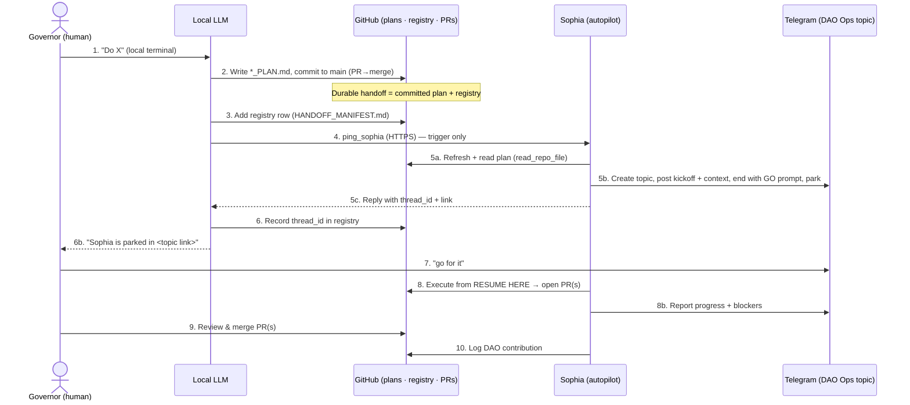
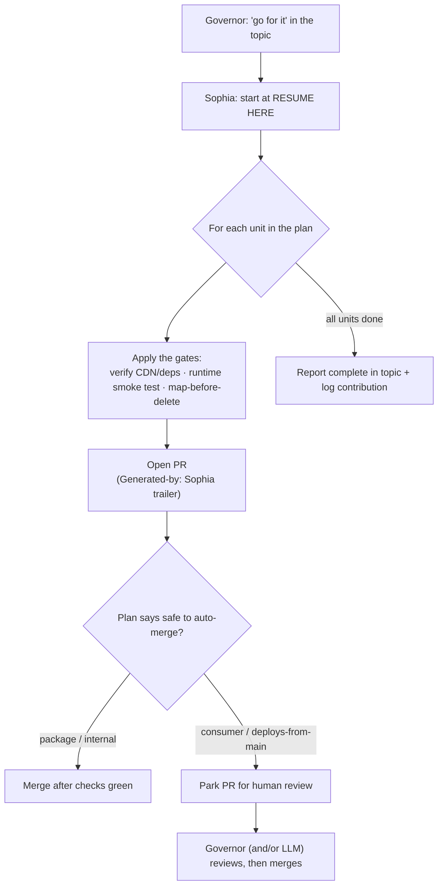
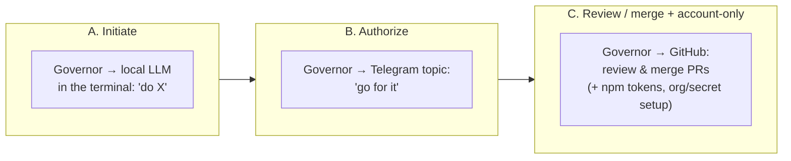

# Handoff protocol — overview (LLMs ↔ Sophia ↔ humans)

**What this is.** The big-picture map of how work flows between the **local
LLMs** (Claude Code, Cursor, Kimi, Codex…), **Sophia** (the autopilot), and the
**human governors** — across the interfaces they share (local terminal, GitHub,
Telegram). For the **live registry** (status, resume tracker, Telegram
topic/thread_id per handoff) see **`HANDOFF_MANIFEST.md`** — the single source
of truth (consolidated 2026-07-18, see `../plans/HANDOFF_REGISTRY_CONSOLIDATION_PLAN.md`).
For the **Sophia trigger protocol** (ping template, the GO convention, thread
rules) see **`SOPHIA_HANDOFFS.md`**; this doc is the human-readable orientation.

---

## Actors & interfaces

| Actor | What they are | Primary interface |
|---|---|---|
| **Governor** (e.g. Gary) | Human. Initiates work, authorizes, reviews/merges, does account-only actions. | Local terminal (to an LLM) + Telegram + GitHub |
| **Local LLM** | Claude Code / Cursor / Kimi / Codex on the governor's machine. Plans, commits, triggers Sophia, reviews. | Local terminal/IDE + GitHub + `ping_sophia` (HTTPS) |
| **Sophia** | The autopilot (FastAPI on EC2). Executes handed-off plans, opens PRs, reports. | GitHub + Telegram + her tools (ssh/git/gh) |
| **Edgar / DAO ledger** | Contribution + identity backend. | `submit_contribution` (peripheral to handoffs) |

| Interface | Role | Key property |
|---|---|---|
| **GitHub** (`agentic_ai_context` + code repos) | **Durable source of truth** — plans, the registry, and PRs all live here. | Every actor reads/writes it; survives restarts. **This is the real handoff.** |
| **`ping_sophia` → HTTPS `/chat-blocking`** | **Trigger** that wakes Sophia for a handoff. | Returns the reply to the *caller*; it is **NOT** a Telegram bridge and does not share memory with the Telegram-facing Sophia. |
| **Telegram** (DAO Ops forum topics) | **Live coordination** — Sophia posts kickoffs + progress; the governor authorizes + reviews. | One topic per handoff. The **GO convention** lives here. |

> **The one mental model that matters:** the **committed plan + registry on
> GitHub is the durable handoff**; the **ping is just a trigger**; **Telegram is
> where the human says "go" and watches progress.**

---

## The full flow

## What happens on "go for it"

## Where humans get involved (only three touchpoints)

- **A — Initiate:** the governor describes the work to a local LLM in the
  terminal. The LLM turns it into a committed plan and triggers Sophia.
- **B — Authorize:** the governor opens the Telegram topic (where Sophia is
  already parked with context) and says **"go for it"** — full authorization for
  the whole plan (see the GO convention in `SOPHIA_HANDOFFS.md`). **Exception:**
  a plan marked `Auto-start: yes` skips this touchpoint entirely — Sophia posts
  her kickoff and starts executing without waiting for it (§5c gates still
  apply). Opt-in per plan; see "Auto-start" in `SOPHIA_HANDOFFS.md`.
- **C — Review / merge:** PRs that touch production / deploy-from-main are
  **opened, not auto-merged** — the governor (optionally with an LLM reviewing the
  diff against the plan's checklist) reviews and merges. Account-only actions
  (npm tokens, org creation, GH secrets) are governor-only and happen here too.

---

## The gates (Definition of Done — every handoff)

Carried in each plan and enforced by Sophia on "go for it":

1. **Verify external deps in-PR** (e.g. the exact CDN URL returns 200; pinned
   version).
2. **Runtime smoke test, not just `node --check`** — load the actual artifact and
   assert behavior (syntax-checking can't catch API-shape/runtime mismatches).
3. **Map-before-delete** when swapping inline code for a library.
4. **Open PR, do NOT auto-merge** anything that deploys from `main`.
5. **`Generated-by: <agent>` trailer** on every commit + PR (so any agent's work
   is attributable — git author is the human operator).
6. **Log a DAO contribution** after each merged unit.

---

## Notes / current limitations

- **Sophia posts only into topics she creates** (via `create_telegram_topic`) or
  threads where she's captured the `chat_id`/`thread_id` from an incoming message
  — she has no blind "post to any existing thread" tool. So handoffs **let her
  create + report the topic** rather than targeting a pre-existing thread.
- The `ping_sophia` reply is the *HTTP* Sophia, which is **not** automatically the
  same session as the Telegram-facing Sophia. Trust the **committed artifacts**
  (plan, registry, PRs), not the ping reply, as the record of truth.

See also: `HANDOFF_MANIFEST.md` (the live registry — status, resume tracker, Telegram
topic/thread_id), `SOPHIA_HANDOFFS.md` (GO convention + trigger template),
`GITHUB_AGENTIC_AI_SSH.md` (agent attribution + PR workflow),
`OPERATING_INSTRUCTIONS.md` §5 (the plan/roadmap requirement).
