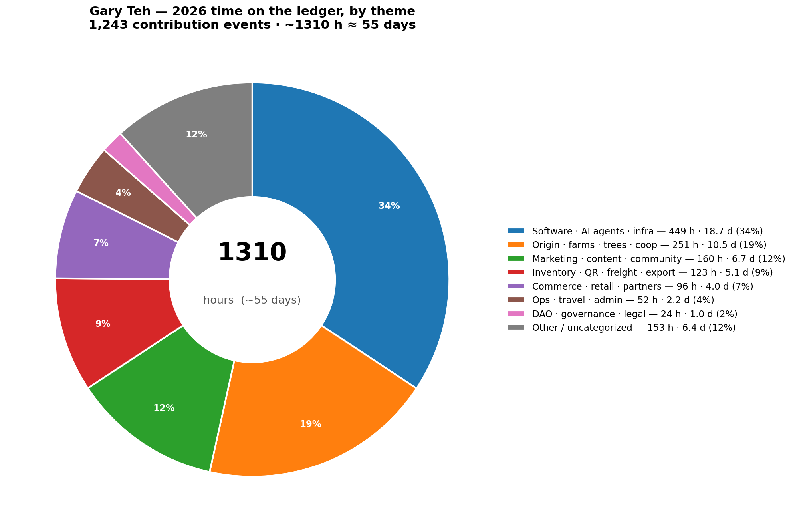
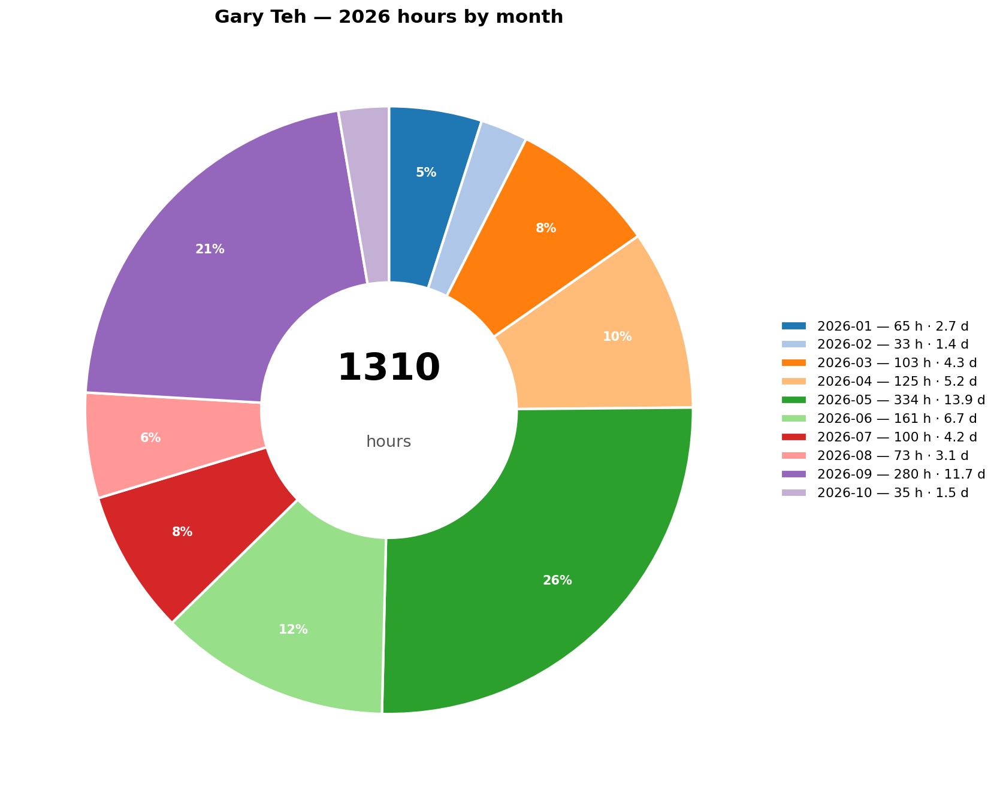

# Gary Teh — 2026 Year in Review

_The year on the books. Compiled 2026-10-09 (Sophia, thread 780) directly from the DAO's signed contribution ledger — not a re-count, just the record assembled in one place._

**Period covered:** 2026-01-01 → 2026-10-09
**Source:** `TrueSightDAO/verify_public_signatures` → 1,680 `[CONTRIBUTION EVENT]` files in range, filtered to those naming **Gary Teh** as contributor → **1,243 events**.
**Every figure below is traceable to a signed event** (each row carries a `message_id_url` in the ledger index).

---

## 1. The year at a glance

| Metric | 2026 to date |
|---|---|
| Contribution events naming Gary Teh | **1,243** |
| Logged time | **~1,310 hours** (78,571 minutes) |
| Out-of-pocket spend booked | **$8,932.42** (121 USD events) |
| Months covered | 10 (Jan → Oct) |
| Co-contributors named alongside him | **60+ distinct people** |

> **Read this line slowly:** ~1,310 hours is roughly **one full-time person-year** — logged, signed, and on a ledger. That is the "I have done a lot this year" feeling, with receipts.

---

## 2. Month by month

| Month | Events | Hours | Out-of-pocket | What the month was |
|---|---:|---:|---:|---|
| Jan 2026 | 84 | 64.7 | $165.02 | Skooliepalooza / cacao ceremony circuit begins |
| Feb 2026 | 49 | 32.9 | $308.53 | Vehicle + retail driving; Java/Bali tasting research |
| Mar 2026 | 96 | 102.7 | **$2,100.71** | **SXSW (Austin) → Natural Products Expo (Anaheim) → New Orleans & Rochester apothecary runs** |
| Apr 2026 | 146 | 125.4 | $468.43 | US retail store-visit push; solar rig for the car |
| May 2026 | 331 | **334.0** | $865.02 | Peak operational month (331 events); Places-API prospecting |
| Jun 2026 | 182 | 160.9 | **$2,806.96** | **Supply-chain coordination; return flight from China** |
| Jul 2026 | 96 | 100.3 | $1,523.15 | **China cacao-distribution expansion trip** |
| Aug 2026 | 81 | 73.4 | $64.40 | Groundwork |
| Sep 2026 | 149 | 280.2 | $619.60 | **Brazil ops + China-partner meetings; Ilhéus** |
| Oct 2026 (1–9) | 29 | 35.1 | $10.60 | **AGL16 load; warehouse wind-down; cooperative-first decision** |
| **Total** | **1,243** | **~1,310** | **$8,932.42** | — |

Two spike-months bookend the year's two biggest pushes: **March** (the US trade-show / apothecary tour) and **May** (peak ops). **June** was the heaviest cash month ($2,807 out-of-pocket — flights + hotel for the supply-chain summit).

---

## 3. The arc of the year, in four movements

**I. Jan–Apr — Serving cacao in person (US circuit).** Skooliepalooza, the cacao circle, then the trade-show run: SXSW (Austin) → Natural Products Expo (Anaheim) → New Orleans → Rochester → LA. Driving his own car, gas and parking out-of-pocket, visiting apothecaries and metaphysical shops one by one. This is the offline distribution engine that fed the Hit List.

**II. May–Jun — Building the machine behind the visits.** Peak month (331 events) as agentic tooling, the Places-API prospect pipeline, and the ledger infrastructure matured — then the June supply-chain summit with Gary flying in from China to coordinate the whole Brazil→US→China flow.

**III. Jul — China.** The cacao-distribution expansion trip (LAX→Shanghai), with the China-partner discussions that later anchored the 40 kg lane.

**IV. Sep–Oct — Brazil ground truth + closing the era.** On the ground in Ilhéus: CEPLAC introductions, CIC cacao-sample drop-offs, equipment sourcing for the mold/insect issues, the **108 kg load of Oscar's 2026 harvest into AGL16 (2026-10-07)**, then the **warehouse clear-up and shut-for-the-year**, and the **cooperative-first sourcing decision** recorded 2026-10-09.

---

## 4. The freight — what moved

The three flagship moves of the year:

- **375 kg cacao → USA** — the year's headline shipment (consolidated US stock).
- **40 kg cacao → China** — the China-lane expansion.
- **108 kg — Oscar's 2026 harvest → AGL16** (loaded 2026-10-07, Matheus warehouse) — the beans whose route the cooperative-first decision then resolved (Oscar → Coopercabruca).

_(Freight weights as cited in Gary's own 2026-10-09 thread-780 note; each shipment has a ledger trail under its shipment code / AGL record.)_

---

## 5. Where the hours actually went

Keyword-classified across the year's 1,243 descriptions and **weighted by each event's logged minutes** (a description can match several themes; it's credited to the strongest match):

| Theme | Hours | Days | Share |
|---|---:|---:|---:|
| Software · AI agents · infra | 449 | 18.7 | 34% |
| Origin · farms · trees · coop | 251 | 10.5 | 19% |
| Marketing · content · community | 160 | 6.7 | 12% |
| Inventory · QR · freight · export | 123 | 5.1 | 9% |
| Commerce · retail · partners | 96 | 4.0 | 7% |
| Ops · travel · admin | 53 | 2.2 | 4% |
| DAO · governance · legal | 25 | 1.0 | 2% |
| Other / uncategorized | 153 | 6.4 | 12% |
| **Total** | **~1,310** | **~55** | **100%** |

**Read:** the mission itself (origin / farms) carries ~19% of the year, and the software/AI machine plus the marketing engine that feed the funnel carry the rest. *(Buckets are keyword-approximate; the per-event minute record is the ground truth behind every slice.)*

---

## 6. Who he carried the year with

Gary is named alongside **60+ distinct co-contributors** across 2026 — a partial showing of the network the year built and served:

- **Brazil / origin:** Matheus Reis · Paloma Lecheta · Júlio Almeida · Juliano Sakai · Vivi · Oscar
- **US / retail & freight:** Kirsten Ritschel · Elizabeth Wong · Val Lapidus · Shena Davenport · Fatima Toledo
- **Structure / capital:** Ken Nim · Jerry Luk · Tiffine Wang · Kaon Krasniqi · Stanley Li · Lucas Root
- **Community / programs:** Mulan Teh · Sonya Gorski · June Jo · Philip Lee · Ivy / yoga & capoeira cohorts
- **The agents:** Sophia Truesight · Envoy TrueSight · Edgar · Claude · DeepSeek

---

## 7. Why this is on a ledger

Every row above came from a **signed `[CONTRIBUTION EVENT]`** — cryptographically signed, timestamped, and permanently verifiable at `dapp.truesight.me` and the **Ledger Explorer** (`truesight.me/ledger/explorer/`). Nothing here is a claim; it's a reading of the record.

> "Feels like I have done a lot this year" is not a feeling. It's a fact with 1,243 signatures behind it.

---

_Compiled by Sophia Truesight (agentic_ai_context — thread 780). Read-only; no ledger writes._
